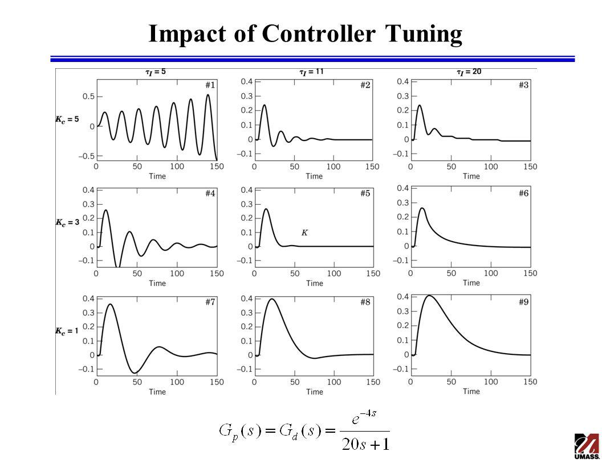
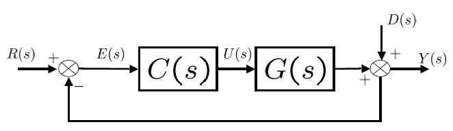
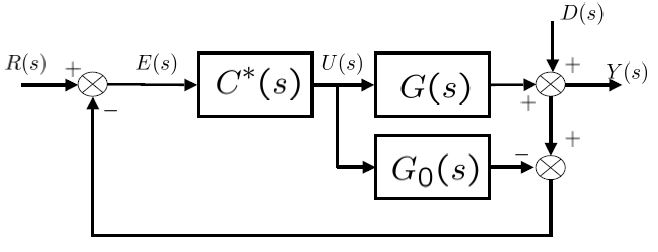
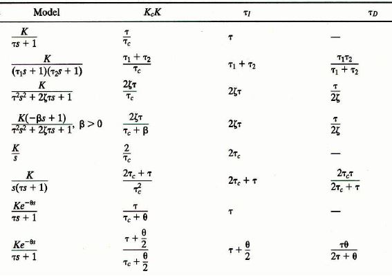
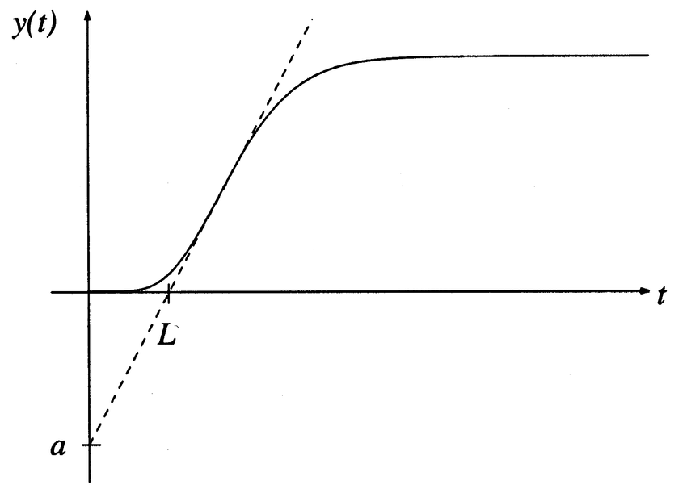
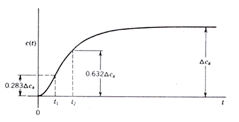
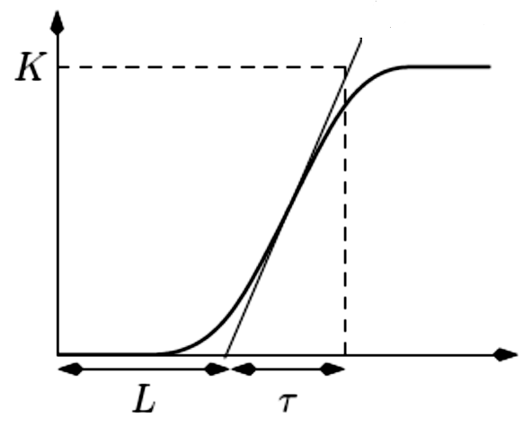
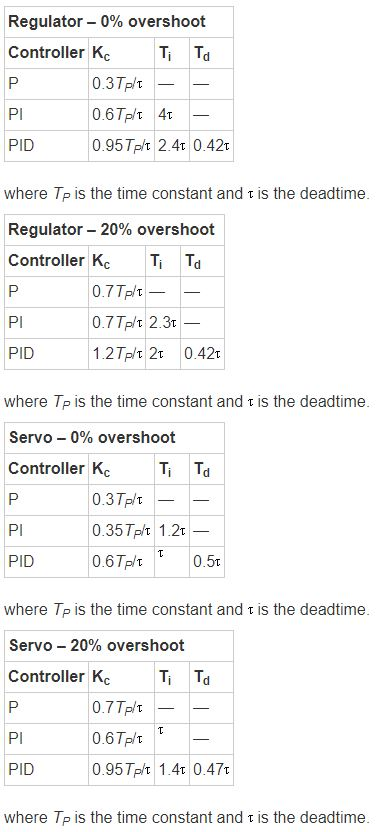
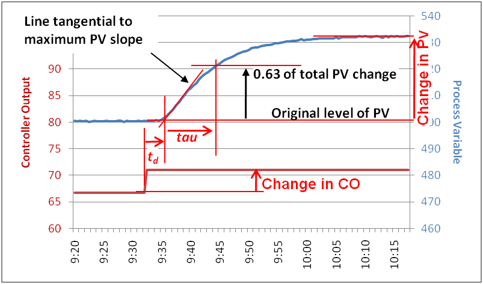

# Afstelregels: procedures en tabellen

In het afstellen van regelaars is het kennen van het verschil tussen *setpoint-respons* en *verstoring-respons* zeer belangrijk. Afhankelijk van de eisen zal het afstellen specifiek gebeuren om betrouwbaar van setpoint te veranderen of om het proces bestand te maken tegen externe krachten. 

Wanneer de ontwerptijd een rol speelt steunt men snel op hun eigen *intuïtie*. Het is ironisch dat dit niet altijd de snelste manier van werken is maar het vergt weinig voorkennis en kan uitgevoerd worden zonder bijkomende tools. 

Als de ontwerper wel voorkennis heeft van zowel regeltechnische theorie als van het proces dan kunnen *afsteltabellen* zoals die van Z-N, C-C, IMC,... handige hulpmiddels zijn. 

## Empirisch afstellen a.d.h.v. intuïtie

Eenvoudige processen (van lage orde) laten toe om op een informele manier met beperkte kennis en tijdsinvestering respectabele prestaties te bekomen. Door de bijdrage en het effect van de P, I en D parameter te bestuderen is het mogelijk manuele afstellingen uit te voeren (zonder garanties op stabiliteit).

Enkele vuistregels:

* De proportionele versterking vergroten zal de stabiliteit verlagen.
  
* De error zal sneller verkleinen wanneer de integratietijd vergroot.
  
* De $T_i$ (= integratietijd) verlagen zal de stabiliteit verlagen.

* De $T_d$ (= afgeleidetijd) verhogen zal de stabiliteit verhogen.
  
* Elimineer alle componenten die onnodige fasevertraging kunnen veroorzaken, want deze hebben een groot effect op de fasemarge. Enkele voorbeelden zijn filters en versterkers.
  
* In een **cascade** systeem regelen we eerst de binnenlus en dan pas de buitenlus. De binnenlus werkt op een hogere frequentie en is vergelijkbaar met een laag-doorlaat filter.

Samengevat:

* Start met een proportionele (P) controller.
$$G_c = K_c$$

* Is de offset te groot met een P-controller? Voeg een integrator (I) toe.
$$G_c = K_c(1+\frac{1}{\tau_I s})$$

* Reageert het systeem te traag? Voeg een derivatieve term (D) toe.
$$G_c = K_c(1+\frac{1}{\tau_I s}+\tau_D s)$$

**NOTE:** Basiskennis van Laplace transformaties en tranferfuncties is sterk aangeraden!

## Empirisch afstellen a.d.h.v. procedures

Deze procedures zijn pas handig in een gesloten lus schema. Het uitgangssignaal van het systeem is dus verbonden met het referentiesignaal om een errorsignaal te bekomen. Dit errorsignaal is de input van de controller.

### P procedure
  
1. Begin met een lage $K_p$ waarde
2. Creëer een blokgolf welke ongeveer 10% van de gewenste bandbreedte beslaat. Gebruik een zo groot mogelijke amplitude zonder saturatie te veroorzaken.
3. Verhoog $K_p$ totdat er weinig tot geen overshoot te zien is in het uitgangssignaal.
4. Ondervindt het signaal te veel ruis?
   1. Neen, ga naar stap 5.
   2. Ja, bekijk deze punten en ga terug naar stap 3.
      * Reduceer ruis uit mogelijke bronnen zoals sensoren en versterkers
      * Vergroot de sensorresolutie
      * Verlaag de $K_p$ waarde
5. Tevreden met regelprestaties?
  
### PI procedure

1. Zet $K_p$ op een lage waarde, $K_I$ op nul.
2. Creëer een blokgolf welke ongeveer 10% van de gewenste bandbreedte beslaat. Gebruik een zo groot mogelijke amplitude zonder saturatie te veroorzaken.
3. Verhoog $K_p$ totdat er weinig tot geen overshoot te zien is in het uitgangssignaal.
4. Ondervindt het signaal te veel ruis?
   1. Neen, ga naar stap 5.
   2. Ja, bekijk deze punten en ga terug naar stap 3.
      * Reduceer ruis uit mogelijke bronnen zoals sensoren en versterkers
      * Vergroot de sensorresolutie
      * Verlaag de $K_p$ waarde
5. Verhoog de $K_I$ waarde om meer overshoot te bekomen, indien nodig.
6. Tevreden met regelprestaties?

### PID procedure
  
1. Zet $K_p$ op een lage waarde, $K_I$ en $K_d$ op nul.
2. Creëer een blokgolf welke ongeveer 10% van de gewenste bandbreedte beslaat. Gebruik een zo groot mogelijke amplitude zonder saturatie te veroorzaken.
3. Verhoog $K_p$ totdat er ongeveer 10% overshoot te zien is **zonder** te oscilleren rond de setpointwaarde.
4. Verhoog $K_d$ om een groot deel van de overshoot te neutraliseren.
5. Ondervindt het signaal te veel ruis?
   1. Neen, ga naar stap 6.
   2. Ja, bekijk deze punten en ga terug naar stap 3.
      * Reduceer ruis uit mogelijke bronnen zoals sensoren en versterkers
      * Vergroot de sensorresolutie
      * Verlaag de $K_p$ waarde
      * Verlaag de $K_d$ waarde
      * Verlaag de $f_d$ waarde
6. Verhoog de $K_I$ waarde om meer overshoot te bekomen, indien nodig.
7. Tevreden met regelprestaties?

### Regelkaart

Er is interactieve software beschikbaar waarin 'tuning mapping' een overzicht geeft over het gedrag van het proces onder bepaalde instelparameters. $G_p(s)$ is hier het procesmodel.

[6]

### Voorbeeld

Stel dat we het volgende procesmodel hebben.
$$G (s) = \frac{2e^{- 1s}}{20s^2 + s +1}$$
De staprespons (of reactie op het blokgolfsignaal) geeft aan dat het proces (in open lus) eerst oscilleert vooraleer dat deze een vaste waarde aanneemt.

* Volg de P procedure.
  * Stel $K_p$ = 0,1. Het uitgangssignaal vertoont veel overshoot en oscillaties.
  * Stel de $K_p$ waarde in tot het systeem een gewenste overshoot heeft. 
  * Als het systeem niet aan de eisen voldoet, dan is er een andere controller nodig.
  
* Volg de PI procedure.
  * Stel $K_p$ = 0.1. Het uitgangssignaal heeft een significante overshoot en offset (verschil tussen de gestabiliseerde waarde en de referentiewaarde).
  * Stel een hogere $K_p$ waarde in. De offset zal, tot op een bepaald punt, kleiner worden. Het onstabiel gedrag van het systeem zal echter blijven stijgen bij een grotere $K_p$ waarde. Het is dus een kwestie om een evenwicht te zoeken. We gaan verder met $K_p$ = 0.5.
  * Verhoog de $K_i$ waarde lichtjes (bv. 0,001). De I-parameter werkt de offset weg maar die stap duurt langer. Het resultaat is een trage respons naar de referentiewaarde.
  * Verhoog de $K_i$ waarde (bv. 0,01). De oscillaties zijn (binnen de eisen) toegenomen en het uitgangssignaal gaat een stuk sneller naar de referentiewaarde.
  * Men stopt hier best als de prestaties binnen de gewenste normen liggen. Indien dit niet het geval is, kies een andere controller.
  
* Volg de PID procedure
  * Stel $K_p$ = 0.1. Het uitgangssignaal heeft een significante overshoot en offset (verschil tussen de gestabiliseerde waarde en de referentiewaarde).
  * Stel een hogere $K_p$ waarde in. De offset zal, tot op een bepaald punt, kleiner worden. Het onstabiel gedrag van het systeem zal echter blijven stijgen bij een grotere $K_p$ waarde. Het is dus een kwestie van een evenwicht te zoeken. We gaan verder met $K_p$ = 0.5.
  * Verhoog de $K_d$ waarde (bv. 0.1). Dit lijkt een goed startpunt te zijn, bij een grotere waarde zal het onstabiel gedrag alleen toenemen.
  * Verhoog de $K_i$ waarde (bv. 0.01). Dit geeft geen slecht resultaat maar produceert een trager antwoord (= grotere stabilisatietijd) dan de PI controller.
  * Verhoog de $K_i$ waarde (bv. 0.05) zodat het systeem sneller naar de referentiewaarde zal neigen, zonder onstabiel gedrag (zoals oscillaties) te vertonen.
  * Stop met parameters aan te passen als de systeemprestaties voldoen aan de vooropgestelde eisen.

## PID afstellen m.b.v. instelregels

Het is in het algemeen eenvoudiger om een regelaar te ontwerpen wanneer de eigenschappen van het proces gekend zijn. Een accuraat wiskundig model is ideaal om een controlealgoritme te testen.

**NOTE:** Een gedetailleerde uiteenzetting over procesmodellen is te vinden in het hoofdstuk 'Systeemtheorie'.

Aan de hand van het procesmodel kan een eerste inschatting van de controller gemaakt worden. Processen van een tweede orde hebben bijvoorbeeld meer integratoren (in dit geval drie) nodig om een offset naar nul te brengen.

### Douglas

**Let op:** enkel toepassen op stabiele processen.
 
1. Laat de versterking ($K_c$) toenemen tot het uitgangssignaal begint te oscilleren met een vaste amplitude en fase. 
2. Meet de frequentie ($f_c$) van dit sinusoïdaal signaal op.
3. De formule $2\pi f_c$ geeft je de hoekversnelling $\omega_c$.

$$\tau_I = \frac{5}{\omega_c}$$
$$\tau_D = \frac{1}{\omega_c}$$
$$\omega_c = 2\pi f_c$$

### Direct synthese (= DS)

**NOTE:** Ook van toepassing op onstabiele processen.

Directe synthese start vanuit de transferfunctie van de gesloten lus. Door de controller C(s) af te zonderen kan men de gewenste reactie ($\frac{Y(s)}{R(s)}$) definiëren en combineren met het procesmodel. Bij perfecte controle is  **de gewenste versterking gelijk aan één**. Zo is (in theorie) een ingaand signaal gelijk zijn aan het uitgaande signaal, wat precies is wat in de praktijk gewenst is. Op die manier volgt het systeem de referentie perfect op. In werkelijkelijkheid is dit niet mogelijk omdat er hiervoor een oneindig grote versterking voor nodig is. Daarom vervangen we dit door een eerste of twee orde met dode tijd waarvan de prestaties geaccepteerd worden.

[8]

De instelregels bij een eerste orde procesmodel met dode tijd:
$$K_c = \frac{1}{K} \frac{\tau_1}{\theta + \tau_c}$$
$$\tau_I = \tau_1$$

De instelregels bij een tweede orde model met dode tijd:
$$K_c = \frac{1}{K} \frac{\tau_1 + \tau_2}{\theta + \tau_c}$$
$$\tau_I = \tau_1 + \tau_2$$
$$\tau_D = \frac{\tau_1 \tau_2}{\tau_1 + \tau_2}$$

**Voorbeeld:**

Stel dat het volgende model het proces representeert.
$$G^* (s) =  \frac{1.2e^{-0.5 s}}{(8 s +1)(2 s +1)}$$
Hieruit valt $K = 1.2$, $\theta = 0.5$, $\tau_1 = 8$ en $\tau_2 = 2$ af te leiden. Door de instelregels van directe synthese te volgen zijn $K_c$ (afhankelijk van $\tau_c$), $\tau_I = 10$ en $\tau_D = \frac{8}{5}$ gekend. De simulaties moeten duidelijk maken welke gesloten lus tijdsconstante de beste controller versterking weergeeft.

De keuze van $\tau_c$ is essentieel maar hierover bestaat veel onduidelijkheid. Verschillende richtlijnen proberen dit op te klaren:

* $\frac{\tau_c}{\theta} > 0.8$ en $\tau_c$ > $0.1\tau$ (Rivera et al., 1986)
* $\tau > \tau_c > \theta$ (Chien and Fruehauf, 1990)
* $\tau_c = \theta$ (Skogestad, 2003)

### Internal Model Control (IMC)

[8]

Enkel eerste en tweede orde modellen vallen onder de uiteenzetting van de (S)IMC regels. Hogere orde systemen vergen meer rekenkracht waarbij een computer en de nodige software nodig zijn. Deze procedure werkt in twee stappen.

Bemachtig het eerste (of tweede) orde model met dode tijd.

$$G(s) = \frac{k}{\tau_1 s + 1} \exp^{-\theta s}$$
$$G(s) = \frac{k}{(\tau_1 s + 1)(\tau_2 s + 1)} \exp^{-\theta s}$$

Leid de controllerparameters af met de modelgebaseerde (S)IMC regels.

[8]

**Voorbeeld:**

Kies een tweede orde met dode tijd wanneer $\tau_2$ groter is dan de procesvertraging. De volgende regels zijn algemeen erkend om de parameters te berekenen:

$$k'= \frac{k}{\tau_1}$$
$$K_c = \frac{1}{k'} \frac{1}{\tau_c + \theta}$$
$$\tau_I = min{\tau_1, 4(\tau_c + \theta)}$$
De afgeleide term $\tau_D$ is pas noodzakelijk wanneer $\tau_2$ groter is dan $\theta$. $\tau_D$ krijgt dan dezelfde waarde als $\tau_2$.

Door de gesloten lus tijdsconstante ($\tau_c$) gelijk te stellen met $\tau$, blijft de reactie relatief snel samen met een behouden robuustheid. Voor een verhoging van de reactie kan men $\tau_c$ verlagen. Bij het verhogen van $\tau_c$ verlaagt men het reactief vermogen.

$$K_c \frac{d_u}{e_{max}}$$
$d_u$ staat voor de externe storingen die invloed hebben op het ingangssignaal. $e_{max}$ staat voor de maximale afwijking op het uitgangssignaal die getolereerd wordt door de ontwerper.
Bij verschillende modellen zijn aangepaste regels noodzakelijk.

## Autotuning 

Het is moeilijk om een PLC zonder 'Autotune' functie op de huidige markt te vinden. Deze heeft zeker zijn voordelen indien het in de correcte omstandigheid en met enige proceskennis wordt toegepast. Maar hoe werkt het algoritme? Waarvoor moet je opletten? We halen enkele achterliggende methodes en berekeningen aan in de volgende paragrafen. 

[Deze link](https://www.automationdirect.com/microsites/clickplcs/click-help/Content/247.htm) geeft een korte uitleg over het autotune-procédé. Het hoofdstuk 'respons methoden' vult verder aan met meer uitleg en illustratie.

## Respons methoden

<!--
zie hoofdstuk 6 Advanced PID control
-->

Door het proces te testen op zijn open lus reactie is het mogelijk om een beeld te vormen van de proceseigenschappen. Veelgebruikte ingangssignalen zijn: een stap, een impuls en een sinusoïde.

Als een respons na $8 \theta$ niet stabiliseert naar een bepaalde waarde, stop dan het experiment.

$\theta$: dode tijd

$\tau_1$: tijdconstante

De tijdconstante is de tijd die je bij de dode tijd moet voegen om 63\% van de finale waarde te bekomen.

k: steady-state toename

k': de toename na de dode tijd

$$k = \frac{\Delta y(1)}{\Delta u}$$
$$k' = \frac{k}{\tau_1}$$

### Ziegler-Nichols staprespons 

**Let op:** deze aanpak geeft oscillaties bij onstabiele processen.

Deze waarden zijn gebaseerd op een open-lus staprespons van een simpel eerste orde proces. Zoals in fig: "stap_eersteorde"  te zien is, is de staprespons met twee parameters ($\alpha$ en $L$) gekenmerkt.

| Controller | $K$ | $T_i$ | $T_d$ | $T_p$ |
|------------|:----------:|---------|---------|:-------:|
|      P     |1/$\alpha$    |   ...   |   ...   |    4L    |
|     PI     |0.9/$\alpha$    |    3L    |   ...   |   5.7L   |
|     PID    |1.2/$\alpha$    |    2L    |  $L/2$  |   3.4L   |

[3]

### Voorbeeld 3

Als $\alpha = 0.218$ en $L = 0.806$ blijken te zijn, vallen de volgende parameters uit de tabel af te leiden. $K = 5.5$, $T_i = 1.61$ en $T_d = 0.403$.

<!-- 

## Frequentieresponsmethode 
Deze methode maakt gebruik van de Nyquist curve, meer bepaald het kritische punt gekarakteriseerd door de parameters $K_u$ en $T_u$.\\

\[ K_u = \frac{1}{K_{180}} \] 
\[ T_u = \frac{2\pi}{\omega_{180}} \]
\[ T_u = \frac{2\pi}{\omega_{u}} \]

\\
Verbind een controller aan het proces en zet de parameters zodat enkel de proportionele parameter dominant is ($T_i = \infty$ en $T_d = 0$).
Verhoog traag de proportionele parameter tot het systeem oscillerend gedrag begint te vertonen. Deze waarde staat gelijk aan $K_u$. De periode van de oscillatie is $T_u$. 
\\
De volgende verhoudingen kunnen functioneren als startwaardes in het afstellen van de regelaar. 

\begin{center}
	\begin{tabular}{c| c c c c}
		Controller & $K/K_u$ & $T_i/T_u$ & $T_d/T_u$ & $T_p/T_u$ \\
		\hline
		P & 0.5 & ... & ... & 1.0 \\
		PI & 0.4 & 0.8 & ... & 1.4 \\
		PID & 0.6 & 0.5 & 0.125 & 0.85
	\end{tabular}
\end{center}
-->

## Ultieme Cyclus Methode 

[7]

### Ziegler-Nichols

...

### Tyreus-Luyben

...

### Ziegler-Nichols (aangepast)

...

## CHR Methode

Chien, Hrones en Reswich creëerde deze methode welke een aanpassing is van de open lus Ziegler-Nichols.

We onderscheiden afstelregels voor meer robuustheid of betere setpoint-tracking.

[9]

### CHR afstelregels tegen verstoringen (= disturbance rejection)

| Overshoot  |             0%            |          |            |            20%            |          |            |
|------------|:-------------:|----------|----------|:----------:|----------|----------|
| Controller | $K_c$     | $\tau_I$ | $\tau_D$ | $K_c$      | $\tau_I$ | $\tau_D$ |
| P   | 0.3/$\alpha$  |     |     | 0.7/$\alpha$ |          |       |
| PI  | 0.6/$\alpha$  | 4L   |     | 0.7/$\alpha$ | 2.3L   |   |
| PID  | 0.95/$\alpha$ | 2.4L  | 0.42L  | 1.2/$\alpha$ | 2L       | 0.42L    |

### CHR afstelregels voor setpointbenadering (= setpoint tracking)

<!--
\cite{Comparison of PID controller tuning methods}
-->

| Controller | 0% overshoot |        |        | 20% overshoot |        |         |
|------------|:------------:|--------|--------|:-------------:|--------|---------|
|            |     $K_p$    | $T_i$  | $T_d$  |     $K_p$     | $T_i$  | $T_d$   |
|      P     |    $0.3/a$   |        |        |    $0.7/a$    |        |         |
|     PI     |   $0.35/a$   | $1.2\tau$ |        |    $0.6/a$    |   $\tau$  |         |
|     PID    |    $0.6/a$   |   $\tau$  | $0.5L$ |    $0.95/a$   | $1.4\tau$ | $0.47L$ |

[3]

<!--

-->

## Cohen-Coon methode

Door een stap aan te leggen als ingangssignaal zal het proces een uitgangssignaal genereren waaruit we de verdere regelaarparameters zullen afleiden.

1. Bedien de regelaar in zijn manuele mode.
2. Wacht tot het proces stabiel wordt.
3. Leg een stapverandering aan als ingangssignaal. 
4. Wacht tot het proces stabiel rond zijn nieuwe setwaarde blijft.
5. Bereken de verandering van de procesvariabele in procent tenopzichte van het totale meetbereik.
6. Bereken de procesversterking.
   
$$K = \frac{\text{verandering van de procesvariabele in \%}}{\text{verandering van de controlevariabele in \%}}$$

7. Zoek de lijn op het stapantwoord met de grootste richtingscoëfficiënt.
8. Meet de dode tijd.
9. Meet $\tau$, het tijdsverschil na de dode tijd tot het bereiken van 63% van de totale procesverandering.
10. Herhaal de procedure en neem het gemiddelde van de bekomen waarden. 
11. Bereken de parameters aan de hand van de tabel.

| Controller | $K_p$ | $T_i$ | $T_d$ |
|------------|:----------:|---------|---------|
|      P     |$\frac{1.03}{K}(\frac{\tau}{t_d}+0.34)$| ...     | ...     |
|     PI     |$\frac{0.9}{K}(\frac{\tau}{t_d}+0.092)$|$3.33t_d\frac{\tau+0.092t_d}{\tau+2.22t_d}$|   ...   |
|     PD    |$\frac{1.24}{K}(\frac{\tau}{t_d}+0.129)$|   ...   |$0.27t_d\frac{\tau-0.324t_d}{\tau+0.129t_d}$|
|     PID    |$\frac{1.35}{K}(\frac{\tau}{t_d}+0.185)$|$2.5t_d\frac{\tau+0.185t_d}{\tau+0.611t_d}$|$0.37t_d\frac{\tau}{\tau+0.185t_d}$|

[1]

## Zone tuning

Door het proces in te delen in verschillende zones, koppelen we de invloeden van de P, I en D parameters van elkaar los waardoor instellen een stuk overzichtelijker wordt. 

Als voorbeeld nemen we een PI controller met feedback.
$$\frac{G}{1+GH}$$
$$\frac{Uitgang}{Ingang} =  \frac{sK_P+K_IK_P}{\frac{s^2}{G}+sK_P+K_IK_P}$$

Een stijging in frequentie zorgt voor een grotere waarde s met $s = j\omega = j2\pi f$. Door onze intuïtie te volgen, leiden we af welke parameters er van een lage naar een hoge frequentie dominant zijn. In dit voorbeeld is de $K_IK_P$ term dominant wanneer de frequentie naar nul benadert. Dit is de laagfrequente zone. Stijgt de frequentie (middenfrequente zone), dan is $K_P$ belangrijker. Een heel hoge frequentie (hoogfrequente zone) zorgt voor de dominantie van de procesversterking (G). Dit zien we aan de $\frac{s^2}{G}$ term in de vergelijking.

De proportionele parameter ($K_P$) nemen we als eerste onder handen terwijl we $K_I$ gelijk stellen aan nul. Start met een stap of een blokgolf met een kleine $K_P$ waarde en maak deze systematisch groter tot de overshoot van het systeem te groot wordt. Hou in het achterhoofd dat grote $K_P$ waarden voor een snellere respons en voor kleinere stabiliteitsmarges zorgen. Het is dus zoeken naar een balans.

<!--
\cite{Control system design guide}
-->

<!--
\section{Reductie en de halve regel}
Een te complex model is niet nuttig in deze methodiek dus zal deze gereduceerd moeten worden naar een eenvoudiger model. 
\begin{center}
\includegraphics[scale=0.3]{complicated_model}
\end{center}
De belangrijkste parameter is de effectieve vertraging $\theta$. 
De effectieve vertraging is de sommatie van: de werkelijke vertraging, de inverse responstijd, de helft van de grootste tijdsconstante en alle kleinere hoge orde tijdsconstanten.
\begin{center}
\includegraphics[scale=0.4]{Approach3}
\end{center} 

\section{PID tuning}
Zonder een systematische aanpak is het correct afstellen van een PID controller onbegonnen werk. Door model gebaseerd en analytisch te werken zijn de SIMC regels vastgelegd met de bedoeling simpele en breed uitvoerbare vuistregels te hanteren bij het afstemmen. 

\section{Gesloten lus P-controller setpointrespons}

\begin{figure}
\includegraphics[scale=0.7]{gesloten_lus_setpointrespons}
\end{figure}

\begin{enumerate}
\item Achterhaal de gegevens in het rood. 
\[ \Delta y_{\infty} = 0.45 (\Delta yp + \Delta yu) \]
\[ Mo = \frac{\Delta yp - \Delta y_{\infty}}{\Delta yu}  \]
Mo: overshoot percentage
\[ b = \frac{\Delta y_{\infty}}{\Delta ys} \]
\[ A = 1.152 Mo^2 - 1.607 Mo + 1 \]
\[ r = 2 A |\frac{b}{1-b}| \]
\item Bouw het eerste orde model op aan de hand van de verkregen gegevens.\\
\[ k = \frac{1}{K_{c0}} |\frac{b}{1-b}| \]
\[ \theta = tp (0.309 + 0.209 e^{-0.61 r}) \]
\[ \tau = \theta * r \] 
\end{enumerate}

Erg gelijkaardig is het Ziegler-Nichols experiment.
-->

<!--
# Samengevat

De cascade vorm van de PID controller is een veelgebruikte methode bij afstelregels.

\begin{figure}[H]
\centering
\caption{PID afstelregels}
\includegraphics[scale=0.75]{PID_tuning_formulas}
\end{figure}

(2) IMC en G-P methodes zijn op setpoint gebaseerd omdat de integraalversterking dicht aanleunt bij de 'setpoint-based optimum integral error' methode. 
Z-N en C-C methoden kunnen bekeken worden als belastingsgebaseerde methodes.
PID controllers met setpoint-gebaseerde methoden zijn vaak robuuster dan controllers met belastingsgebaseerde methodes.\\
(3) SP-gebaseerde methoden bij processen met kleine dode tijd geven kleine integraalversterkingen wat resulteert in trage belastingreacties. Load-gebaseerde methodes resulteren in grotere integraalversterkingen maar zijn niet robuust.\\
(4) C-C, Z-N, IMC, IAE, ITAE, ISE en ISTE geven vergelijkbare versterkingen voor processen met grote dode tijd. Setpointgebaseerde systemen geven over het algemeen (behalve ITAE) betere robuustheid voor processen met grote dode tijd.\\
(5) Alleen Z-N en ITAE belastingsgebaseerde systemen zijn aanvaardbaar. De rest gedraagt zich te agressief. Z-N heeft betere robuustheid bij kleine dode tijd dan bij grote. \\
Storing afwijzing en systeem robuustheid zijn criteria waarop je PID controllers kan analyseren. \cite{ComparisonWellKnownPID} 

### Prestaties meten met errorberekeningen

Om verschillende afstelregels met elkaar te kunnen vergelijken is er een maat voor nauwkeurigheid nodig. De gekwadrateerde errorwaarde ($R^2$), de integraal van de absolute errorwaarde ($IAE$) of de integraal van de gekwadrateerde errorwaarde zijn methodes om een idee te geven van de prestaties.

-->

## Bibliografie

[1]‘Cohen-Coon Tuning Rules | Control Notes’. https://blog.opticontrols.com/archives/383 (geraadpleegd feb. 18, 2021).

[2]K. J. Åström en R. M. Murray, Feedback systems: an introduction for scientists and engineers. Princeton: Princeton University Press, 2008.

[3]‘Figure 4.8 Reaction curve method of Ziegler–Nichols tuning.’, ResearchGate. https://www.researchgate.net/figure/Reaction-curve-method-of-Ziegler-Nichols-tuning_fig28_319291946 (geraadpleegd feb. 18, 2021).

[4]S. Skogestad, ‘Probably the best simple PID tuning rules in the world’, jan. 2001.

[5]‘The Unit Impulse Response’. https://lpsa.swarthmore.edu/Transient/TransInputs/TransImpulse.html (geraadpleegd feb. 08, 2021).

[6]G. Ellis, ‘Tuning a Control System’, in Control System Design Guide, Elsevier, 2012, pp. 31–60. doi: 10.1016/B978-0-12-385920-4.00003-5.

[7]Y. V. P. K. Y V Pavan Kumar, ‘Cascaded PID Controller Design for Heating Furnace Temperature Control’, IOSR-JECE, vol. 5, nr. 3, pp. 76–83, 2013, doi: 10.9790/2834-0537683.

[8]‘CHEE319 Notes 2012 Lecture5 | Control Theory | Feedback’, Scribd. https://www.scribd.com/document/105349411/CHEE319-Notes-2012-Lecture5 (geraadpleegd jul. 20, 2021).

[9]M. Shahrokhi en A. Zomorrodi, ‘Comparison of PID Controller Tuning Methods’, p. 12.
