# Systeemtheorie

Systeemtheorie omvat hoofdzakelijk de volgende onderwerpen:

* De analyse van het systeemgedrag
* Wiskundige modellen van het systeem
* Tijds- en frequentiegedrag
* Invloed van polen en nullen
* Stabiliteit

## Overzicht

Een **model** is een wiskundige representatie van een proces en/of systeem. Aan de hand van modellen zijn analyses en simulaties mogelijk om mogelijke problemen op te lossen. Afhankelijk van het probleem kan het in het voordeel van de ontwerper zijn om een specifiek model op te bouwen om zijn kans op het vinden van een antwoord te vergroten. Uit een dynamisch systeem kunnen dus verschillende modellen komen.

De sturing van een baksteenoven is bijvoorbeeld een zeer complex gegeven. Wanneer men enkel geïnteresseerd is in de invloed van een enkele parameter (bv. het zuurstofgehalte), dan kan de ontwerper een groot deel parameters die geen invloed hebben op de te onderzoeken parameter weglaten uit het model om deze te vereenvoudigen.

Uit verschillende perspectieven ontstaan verschillende methodes om procesmodellen te ontwerpen.

Een $\underline{\text{eerste visie}}$ focust zich op het input/output gedrag wat leidt tot een **input/output model**. Een gegeven ingangssignaal $u(t)$ moet volgens dit model een resulterend outgangssignaal $y(t)$ produceren. Het model geeft de eigenschappen weer van het proces. Ter vereenvoudiging gaan we uit van niet-tijdsafhankelijke en lineaire eigenschappen.

Het opstellen van een *input/output model* zien we in het stuk 'Identificatie'.

Een $\underline{\text{tweede visie}}$, die in de jaren '50 sterk beinvloed werd door het input/output perspectief, is het begrip **'state space'**. Het komt heel vaak voor in de literatuur en is van essentieel belang de betekenis te kennen. Een 'state space' beschrijft de ruimte (of de set) van alle mogelijke staten waarin het systeem zich kan bevinden. **De staat** van een dynamisch systeem is de verzameling van variabelen dat de eigenschappen van een systeem volledig beschrijft.

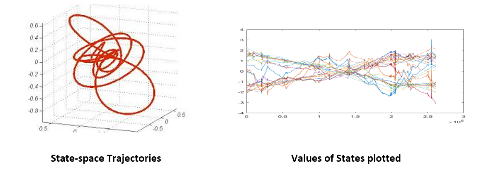

State space modellen werden ontwikkeld door de overgang van mechanische componenten, zoals sensoren en actuatoren, naar een algemene vorm van vergelijkingen.

**x** stelt de vector van 'state' variabelen voor. De staat van het systeem kan gaan over positie, snelheid, versnelling, hoekstand, hoekversnelling, temperatuur, vochtigheid, zuurstofgehalte,...  **y** stelt de vector met (sensor)metingen voor. Sommige 'state' variabelen, zoals temperatuur zijn direct meetbaar waarbij $y = x$ maar dit is niet altijd het geval. Denk aan de temperatuur in een motor waar geen plaats in voor een sensor. In dit geval schatten we de temperatuur aan de hand van andere (wel meetbare) variabelen (=y). **u** stelt de vector met controlevariabelen voor. Deze hebben een invloed op het systeem.

De staat valt visueel weer te geven met een tijd- of fasegrafiek.

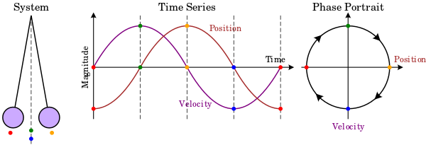

$\frac{dx}{dt}$ is de afgeleide van x in functie van de tijd. Het is dus een term die de verandering van x kan aangeven. Deze is belangrijk om later simulaties op te zetten. $f$ en $h$ zijn functies die hun argumenten in de juiste dimensies projecteren.

Gewone differentiaalvergelijkingen zijn betrouwbare hulpmiddelen om een systeem te representeren.

$$\frac{dx}{dt} = f(x,u), y = h(x,u)$$

Het gaat hier over een systeem die niet afhankelijk is van de tijd want functies $f$ en $h$ zijn niet afhankelijk van een tijdscomponent. We gaan ervan uit dat de functies lineair zijn. Zo stellen we een lineair 'state space' systeem op.

$$\frac{dx}{dt} = Ax + Bu, y = Cx + Du$$

A, B, C en D zijn constante matrices. A is de matrix met informatie over de systeemdynamica, B met controle -informatie, C is de sensormatrix en D wordt de directe term genoemd. De directe term is nul wanneer de input geen direct effect heeft op de output, wat zelden het geval is.

$\frac{d}{dt}$ $\begin{bmatrix}
                x_1\\
                x_2\\
                x_3\\
                ...\\
                x_n
                \end{bmatrix}$
            = $\begin{bmatrix}
                -a_0 & -a_2 & ... & -a_{n-1} & -a_n\\
                1 & 0 & ... & 0 & 0\\
                0 & 1 & ... & 0 & 0\\
                ... & ... & ... & ... & ...\\
                0 & 0 & ... & 1 & 0
                \end{bmatrix}$x
            + $\begin{bmatrix}
                1\\
                0\\
                0\\
                ...\\
                0
                \end{bmatrix}$u

$y =$       $\begin{bmatrix}
                b_1
                b_2
                ...
                b_n
                \end{bmatrix}$x
            $+ Du$

## Classificatie

Systemen vallen beter te beschrijven wanneer onderstaande begrippen gekend zijn door de ontwerper.

* Lineair of niet-lineair
* Continue of discrete tijd
* Tijdsvarierend of invariant
* Lumped-parameter of gedistributeerde parameter
* Statisch of dynamisch
* Deterministisch of stochastisch

**Lineariteit** komt voor wanneer de som van de ingangen een resultaat geeft dat nagenoeg gelijk is aan de optelling van de uitgangen wanneer de twee ingangen individueel worden toegepast.

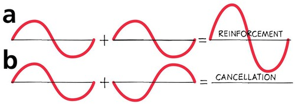

Lineariteit is een handige wiskundige vereenvoudiging, het is echter een manier om gerichte schattingen te maken in specifieke gevallen. De realiteit is echter niet-lineair.

Wrijving valt (over een klein werkgebied) te lineariseren maar vertoont snel niet-lineaire eigenschappen.

**Continue en discrete tijd** zijn verschillend in hun dataweergave. Elektromechanische, hydraulische, pneumatische en thermische systemen zijn bijvoorbeeld continue omdat deze op eender welk punt afleidbaar zijn.

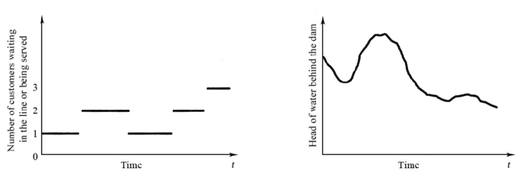

Discrete systemen zijn dit niet en zijn verdeeld in stappen welke elk een vaste waarde weergeven.
  
**Tijdsafhankelijkheid** is een andere complexiteit. Hierin zijn (enkele) parameters afhankelijk van de tijd. Tijd is dus een extra parameter die invloed heeft op de eigenschappen van het systeem. Deze laten we in de komende hoofdstuken buiten beschouwing. Een systeem is niet tijdsafhankelijk wanneer het uitgangssignaal bij een gegeven ingangssignaal niet afhangt van $\underline{\text{het moment wanneer}}$ het signaal wordt toegepast.

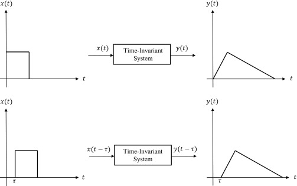

**'Lumped' of 'distributed' parameters** zijn verschillend in hun representatie van parameters in hun systeem.
Lumped parameters veranderen gelijk over heel het systeem. De temperatuur in een kamer kan bijvoorbeeld als 'lumped' bekeken worden. Dan stellen we dat de temperatuursverandering aan de vloer gelijk is aan deze op twee meter hoogte. De temperatuur is dus niet afhankelijk van ruimtelijke coördinaten wat voor een vereenvoudiging kan zorgen. 
Distributed parameters zijn niet gelijk over het volledige systeem. Met partiële differentaalvergelijkingen zijn deze parameters gemodelleerd ten opzichte van tijd en ruimte. De temperatuur in een kamer zal bij een gedistribueerde aanpak verschillende waarden hebben.

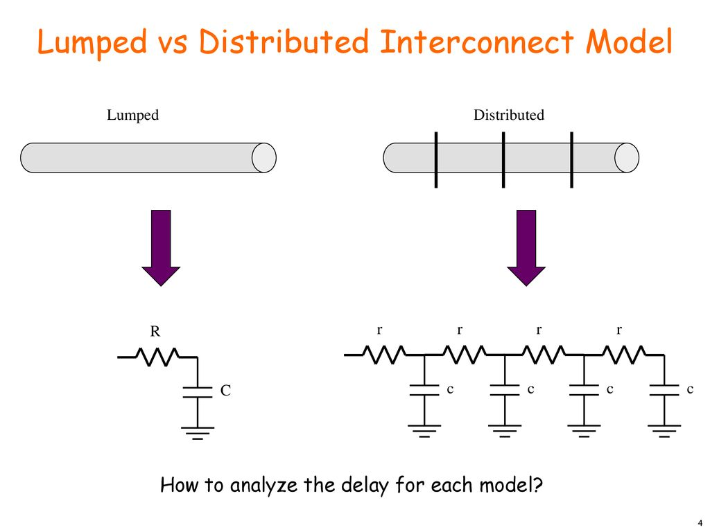

**Statische of dynamische** systemen zijn verschillend in hun gedrag, gerelateerd met de tijd. Statische systemen zijn enkel afhankelijk van hun parameters in het hier en nu. Dynamische systemen veranderen in functie van de tijd. Dus hun verleden speelt een rol in hun gedrag in het hier en nu. Een voorbeeld hiervan is het stroomverbruik van een freesmachine. Dit is een dynamisch systeem omdat, in functie van de tijd, de frees zal slijten waardoor de wrijvingskrachten groter worden. In theorie stijgt hierdoor de energie die nodig is om het materiaal te verspanen. Het gemiddelde stroomgebruik blijft dus niet hetzelfde maar is afhankelijk van events in het verleden.

**Deterministische of stochastische** systemen zijn verschillend in hun rekenwijze. Stochastische systemen houden rekening mee met kans, onzekerheid, parameterspreiding,... Deterministische systemen veronderstellen dat het antwoord vastligt. Een berekening zal dus steeds hetzelfde antwoord weergeven.

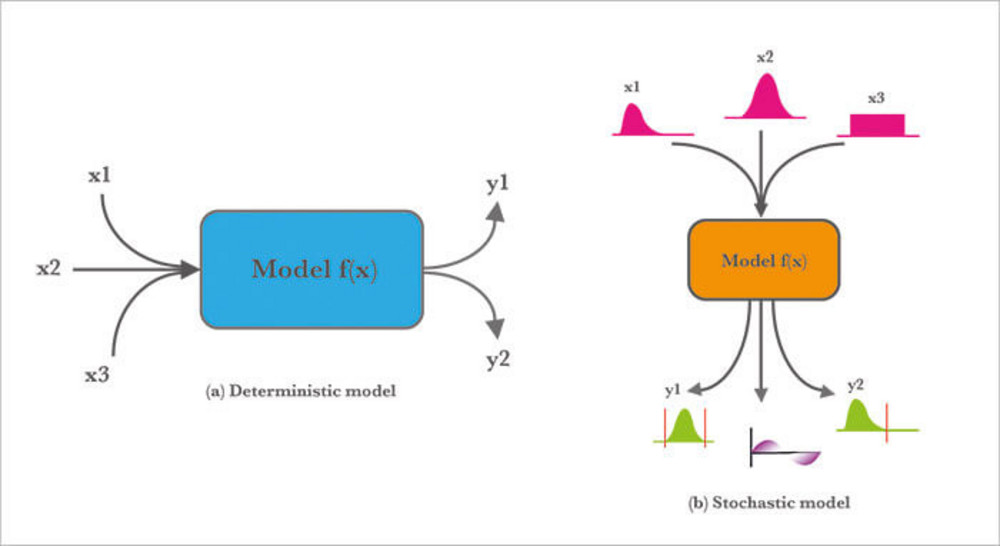

## Elementaire onderdelen

### Dode tijd

Dode tijd is één van de hoofdoorzaken van onstabiliteit in de procesindustrie. Het is de belichaming van het tijdsverschil tussen een initiële actie en het waarnemen van het effect ervan. Systemen met pure dode tijd zullen exact dezelfde initiële actie weergeven slechts na een periode van tijd.
$$y(t) = x(t - t_0)$$  
$$Y(s) = \exp^{-t_0s}X(s)$$

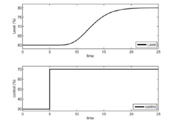

Het is interessant om te weten dat een serie van eerste orde systemen een schijnbare dode tijd kan veroorzaken. Wanneer bijvoorbeeld verschillende watervaten na elkaar verbonden worden zal een verandering van het startdebiet pas na een periode van tijd een verhoging van het waterniveau van het laatste vat veroorzaken. Veelvoorkomende processen met dode tijd: transportbanden, warmtewisselaars, logistiek, pijplijnen, etc.

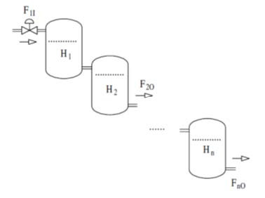

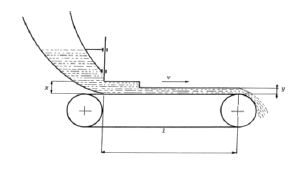

### Eerste orde

Een populaire manier om een proces weer te geven is een eerste orde model. Een eerste orde differentiaalvergelijking vormt na het gebruiken van een Laplacetransformatie de transferfunctie van het proces.
$$\tau \frac{dy(t)}{dt} + y(t) = k u(t)$$
$$\tau s Y(s) + Y(s) = k U(s)$$
$$(\tau s + 1) Y(s) = k U(s)$$
$$H(s) = \frac{Y(s)}{U(s)} = k \frac{1}{\tau s + 1}$$

In de teller bevinden zich geen 'nullen'. De pool ($s_1$), de wortel van de noemer, is te vinden door de noemer gelijk te stellen aan nul.  
$$\tau s + 1 = 0, s_1 = \frac{-1}{\tau}$$
Het vinden van de polen en nullen is van groot belang in het nagaan van het procesgedrag. Het effect van $\tau$ is te zien op figuur $\ref{fig:veranderlijketijdsconstanten}$ waarin grote tijdsconstanten een trage reactie van het systeem representeren.

### Veranderlijke tijdsconstanten

Stel een serieschakeling van verschillende eerste orde processen voor. Bijvoorbeeld het starten en stoppen van auto's voor een rood licht. Elke auto representeert een proces. Intuïtief zien we dat, hoe meer auto's er achter elkaar staan (serieschakeling), hoe langer het zal duren voor de laatste auto om vooruit te kunnen rijden na een groen licht. De eerste orde modellen mogen dan wel geen dode tijd hebben maar door de combinatie van alle tijdsconstanten induceren we een 'schijnbare' dode tijd als we het totale proces bekijken.

* De dynamica van het proces wordt vooral bepaald door het model met de grootste (dominante) tijdsconstante $\tau_d$.
  
* Kleine tijdsconstanten kunnen samengeteld gemodelleerd worden als een schijnbare tijdsvertraging $t_0$.
  
* Complexe modellen in de praktijk hebben een grote orde en worden vaak benaderd door een lagere orde met een dode tijd element.

$$\frac{1}{1+\tau s}exp^{-t_0s}$$

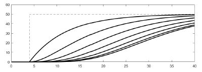

### Eerste orde stapreactie

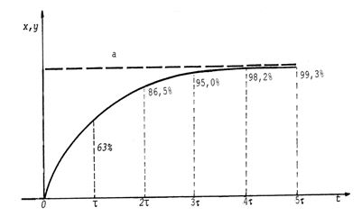

### Eerste orde impulsreactie

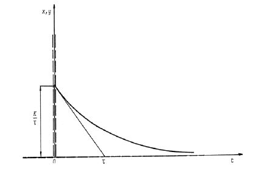

### Eerste orde taludereactie

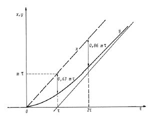

### Tweede orde

Een tweede orde model volgt dezelfde procedure als een eerste orde model maar baseert zich op een tweede orde differentiaalvergelijking. Door deze extra parameter kan het model de werkelijkheid dichter benaderen en dus meer nauwkeurige resultaten produceren. De combinatie met dode tijd komt veel voor.
$$\frac{K}{(\tau_1s + 1)(\tau_2 + 1)} \exp^{-t_0s}$$

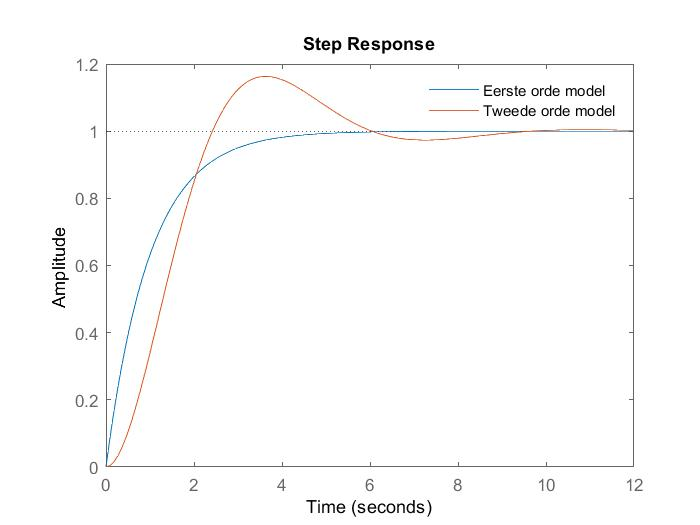

### Hogere orde

In het hoofdstuk 'Identificatie' staat beschreven hoe het capteren van data het bouwen van nauwkeurige wiskundige modellen mogelijk maakt. In deze stap is een model van hogere orde wenselijk om simulaties zo realistisch mogelijk te maken. Wat volgt is een n-de graadsveeltermvergelijking.

$$H(s) = \frac{b_N s^N + b_{N-1} s^{N-1} + ... b_0}{a_M s^M + a_{M-1} s^{M-1} + ... a_0}$$

De vergelijking heeft n wortels die complex toegevoegd kunnen worden om de volgende vergelijking te vormen.

$$H(s) = K \frac{(s-z_1)(s-z_2)...(s-z_n)}{(s-p_1)(s-p_2)...(s-p_m)}$$
De versterking ($K$), de nulpunten ($z_i$) en de polen ($p_i$) zijn duidelijk te herkennen. Ieder systeem valt dus te beschrijven als een serie van eerste en/of tweede orde systemen.

### Voorbeeld 1

Stel het systeem $H(s) = (\frac{0.25}{s^2 + 0.9s + 0.25})^5 \frac{1}{10s + 1}$
Dit systeem kan eenvoudig benaderd worden door $H'(s) = \frac{1}{11.6s + 1} \exp^{-17.5s}$

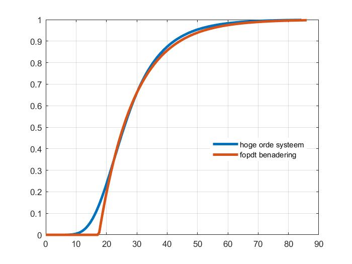

Het hoofdstuk 'Identificatie' beschrijft het creëren en selecteren van de juiste modellen om processen te representeren.

Om aan te tonen dat een hoge orde systeem een serie van eerste en/of tweede orde systemen is, geven we het volgende voorbeeld.
$$H(s) = \frac{8}{(s+1)(s^2 + 2s + 3)}$$
Door te verdelen in partieelbreuken zien we twee verschillende modellen, een eerste orde en een tweede orde model.
$$H(s) = \frac{4}{s+1} + \frac{-4s-4}{s^2+2s+3}$$
Het stap antwoord van elk afzonderlijk model ziet er als volgt uit.

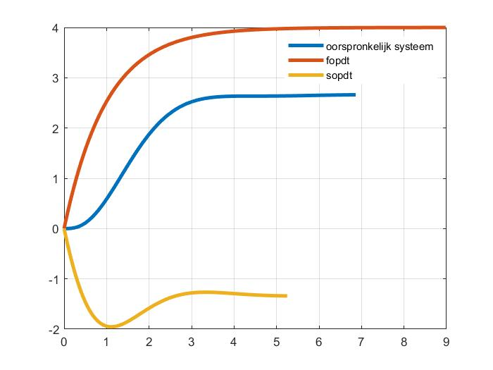

## Tijdsdomeinanalyse

In het tijdsdomein leggen we een ingangssignaal aan naar keuze en relateren deze met het uitgangssignaal dat het systeem produceert. De meestvoorkomende vorm is een stapingang.

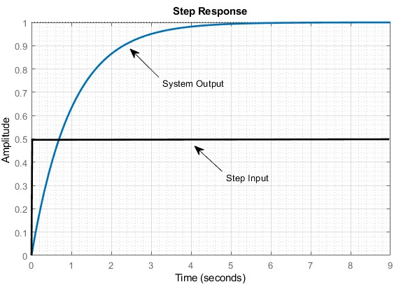

Een analyse van het tijdsdomein is relatief eenvoudig en kan inzicht geven over de proceseigenschappen. 

## Frequentiedomein analyse

In het frequentiedomein wordt hetzelfde gedaan als bij het tijdsdomein maar met een ander ingangssignaal. Een veelgebruikt type is een sinusoïdaal signaal. Het idee hierachter is het beschrijven van systeemeigenschappen door de steady-state antwoorden van verschillende sinusoïdale input (met verschillende frequenties) te bestuderen. Karakteristieken van het uitgangssignaal in functie van de frequentie kunnen we weergeven in een grafiek. Deze stellen Bodeplots voor. Zie het hoofdstuk 'Frequentie analyse'.  

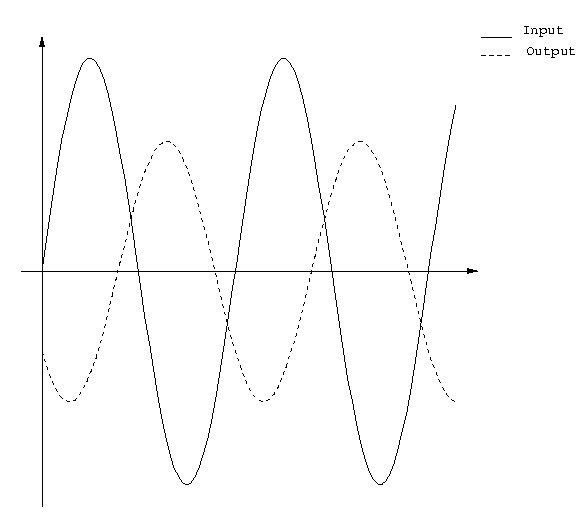

Door het systeem via een open lus perspectief te bekijken is het mogelijk om een frequentie analyse uit te voeren. De transferfunctie GH is hier van belang want dit stelt het proces (G) en de feedback (H) in serie voor.

### Frequentie antwoord

Het analyseren van de systeemreacties bij verschillende frequenties is een zeer belangrijke (bijna fundamentele) techniek voor verdere analyses en ontwerpkeuzes.

Een frequentie antwoord van een systeem is het verkregen evenwicht bij het aanleggen van een sinusoïdaal ingangssignaal. De sinus is een unieke ingang waarbij de resulterende uitgang van een lineair systeem (bij steady state) ook sinusoïdaal zal zijn **maar met verschillende amplitude en fase**. [4]

Om deze techniek ten volle te benutten is kennis van Laplace transformaties noodzakelijk.

#### Bode

Een Bode plot geeft twee grafieken weer. Versterking (in dB) en fase (in °) van het signaal in functie van de frequentie. Deze weergave is handige tool om karakteristieken van onderdelen van een systeem te analyseren en te verbeteren. Hieronder vallen versterkers, filters en vanzelfspreken ook regelaars.

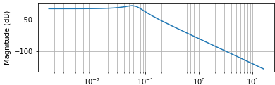

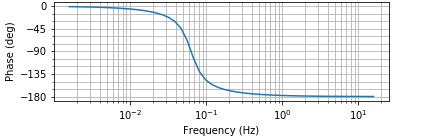

Samengevat zijn de volgende twee stellingen correct:
* Een open-lus bode plot geeft de versterkings- en fasemarge weer. 
* Een gesloten-lus bode plot geeft de bandbreedte, pieken, overshoot, rise time, et cetera van het systeem weer.

De frequentie in de Bode plots staat altijd weergegeven met een logaritmische schaal. De versterking en de fase daarentegen gebruiken een lineaire schaal. Het is mogelijk om deze curves met de hand op te stellen, wat vóór computervisualisatie veel werd gedaan. Het handmatig opstellen van Bodeplots bevordert het inzicht wat help bij het interpreteren van visualisatie in softwarepakketen. Een sinusoïdaal ingangssignaal met een specifieke frequentie werd gebruikt om een amplitude en faseverschuiving van het uitgangssignaal te bekomen. Dit komt overeen met de amplitude en fase op diezelfde frequentie op het Bode plot. Een sinusoïdaal ingangssignaal met een andere frequentie werd vervolgens aangelegd om een volgend punt te kunnen tekenen. Deze procedure werd verdergezet tot er voldoende punten gekend zijn om een idee te krijgen van de karakteristieken. Een meer nauwkeurige methodiek maakt gebruik van een 'frequency sweep' waarbij het meettoestel de versterking en fase van het uitgangssignaal opmeet voor elke frequentie in een vooraf ingesteld frequentiedomein. Het resultaat is een Bode plot.

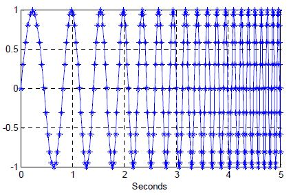[5]

Onze intuïtie vertelt ons dat de ingang meer op een DC signaal zal lijken naargelang de frequentie daalt (links op de grafiek). Regelsystemen hebben regelmatig een versterking van 0dB bij lage frequenties. 0dB komt overeen met een versterking van één. Aan de rechterkant van de grafiek (hogere frequentie) zal het systeem het 'moeilijker' krijgen om de ingang te volgen, door onder andere de traagheid van het systeem. Hoe hoger de ingaande frequentie dus wordt, hoe minder het systeem zal reageren. Wat geen interessante informatie genereert voor de analist. Als we zien dat de versterking groot blijft bij hoge frequenties valt er uit de grafiek af te leiden dat het systeem snel kan reageren op snelle ingangssignalen. 

Een belangrijk te kennen parameter is de bandbreedte. Deze beslaat het frequentie interval van 0Hz tot de frequentie waarbij de versterking met 3Hz daalt. De relatie tussen de bandbreedte ($f_{BW}$) en de tijdconstante ($\tau$) valt weer te geven met de volgende formule. Het onderbouwt het intuïtief verband tussen de versterking Bode plot en de respons van het systeem verder. 

$$\tau = \frac{1}{f_{BW}2\pi}$$

Verder zijn er **indicaties van stabiliteit** aanwezig in de Bode versterking plot. Als de versterking begint vanuit 0dB en stijgt vooraleer deze daalt, bij een stijgend verloop van frequentie, dan hebben we temaken met een (of meerdere) piek(en). In de praktijk (afhankelijk van de toepassing) is een piek tussen 0 en 4dB acceptabel. Hoe meer peiken er zijn en hoe groter ze worden, hoe minder stabiliteitsmarge er doorgaans aanwezig is.

Uit ervaring zijn marges tussen de 10dB-25dB en 35°-80° een goede startpunt. De marges zijn afhankelijk van de toepassing en het soort controller. In het hoofdstuk 'regeltechniek' bespreken we dit in meer detail onder het onderwerp 'relatieve stabiliteit'.

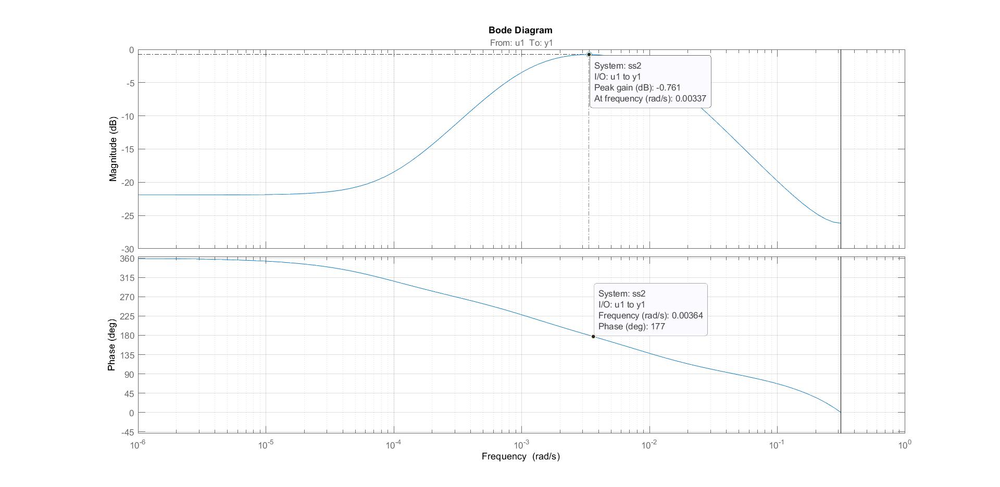

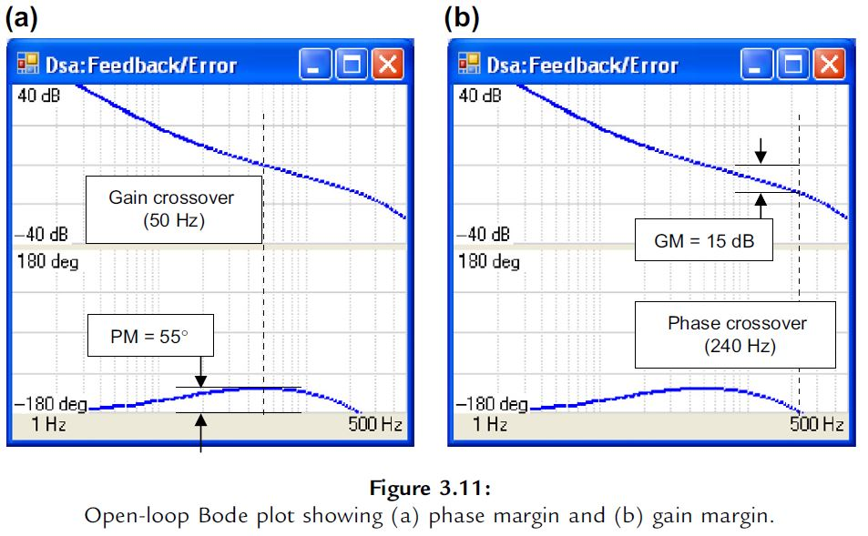

#### Nyquist

Een Nyquist plot geeft punten op een polair assenstelsel weer dat de amplitude én de fase representeren van een open lus frequentie antwoord.

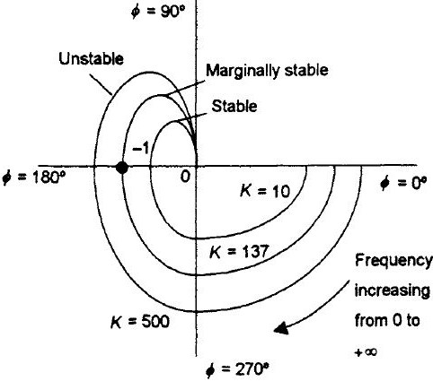

Het **kritische punt** amplitude 1 en fase -180° geeft aan wanneer een systeem zich onstabiel of stabiel zal gedragen. Als het open lus frequentie antwoord van het systeem stabiel is, dan is het daarbijhorend gesloten lus systeem ook stabiel. 
* Wanneer de Nyquistcurve (gaande van 0Hz naar $/inf$Hz) dit kritische punt niet omcirkelt, dan mogen we ervan uitgaan dat het systeem stabiel is.
* Waneer de Nyquistcurve door dit kritische punt gaat, dan is het systeem licht stabiel.
* Wanneer de Nyquistcurve dit kritische punt omcirkelt, dan is het systeem onstabiel.

In Matlab wordt dit kritische punt aangeduid met een rood kruis.

$$TF_{openloopTF}=\frac{4}{s^2 + 5s + 2}$$

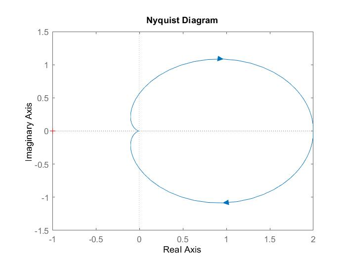

De 'gainmargin' (GM) of versterkingsmarge en de 'phasemargin' (PM) of fasemarge zijn hier visueel weergegeven. Dit zijn objectieve indicatoren voor stabiliteit.

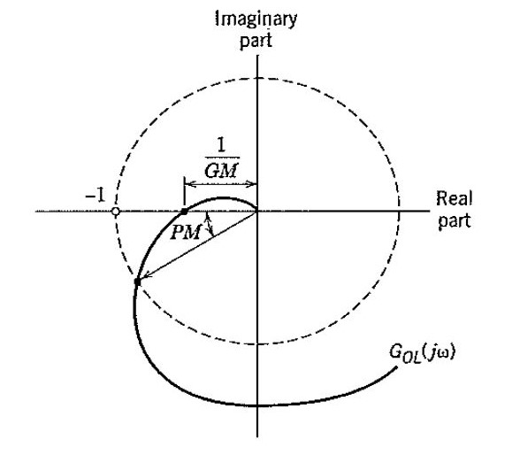

#### Nichols curve

Nichols curve is een combinatie van de versterkings- en fase curve. Hierop valt direct af te lezen over welke stabiliteit het gaat.

$$TF_{openloopTF}=\frac{4}{s^2 + 5s + 2}$$

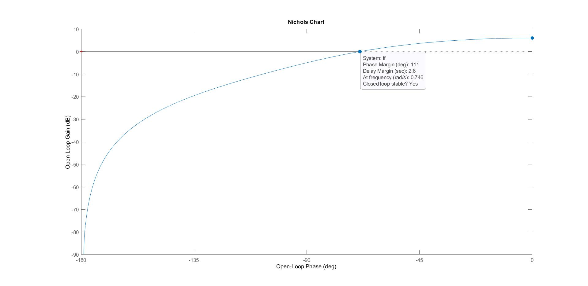

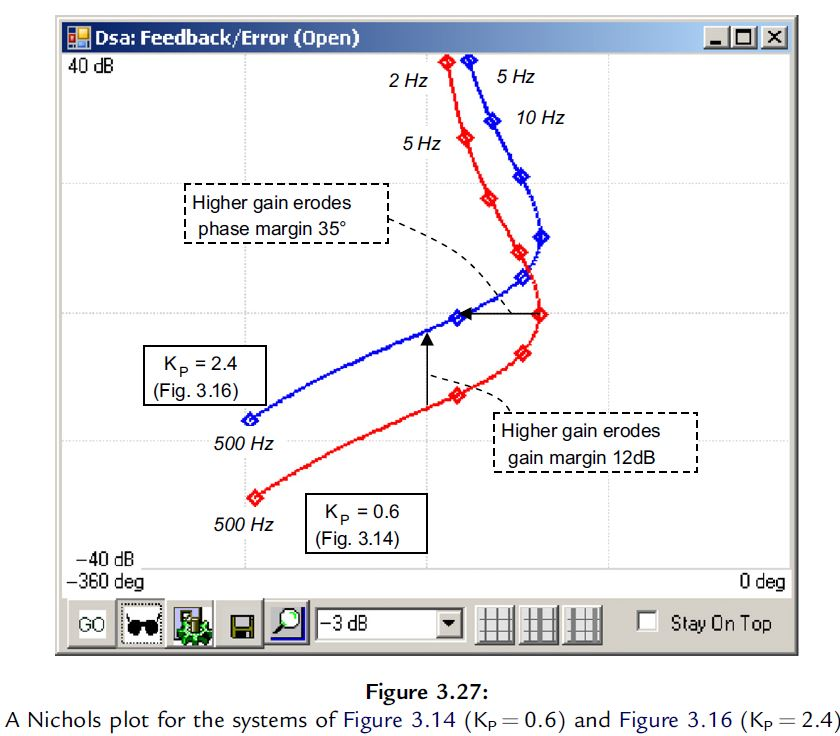

## Identificatie

### Overzicht

Systeemidentificatie is het bouwen van een wiskundig model dat een dynamisch systeem representeert. De nauwkeurigheid van het model t.o.v. de werkelijkheid bekomt men door het model te testen op data die niet werd gebruikt om het model op te bouwen. Dit wordt validatiedata genoemd. Het juiste model kiezen om een proces te representeren vraagt kennis en kunde. Door inzicht te krijgen in de verschillende modeltypes kan de controle-ingenieur gemakkelijker de juiste keuzes maken.

Er zijn drie verschillende methodes met elk voor- en nadelen ten opzichte van modeldesign. 

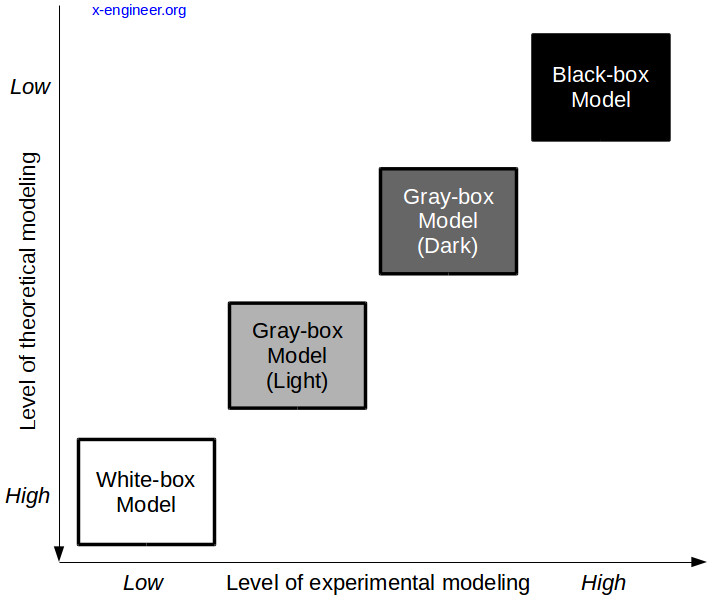

| White Box                                           |         Grey Box        | Black Box |
|-----------------------------------------------------|-----------------------|-----------|
| Gedetailleerd kennis van het proces is essentieel. |           Gedeeltelijke kennis van het proces is noodzakelijk.           |     Analyseer the fundamentele aspecten, gedetailleerde proceskennis is niet noodzakelijk   |
| De modelnauwkeurigheid is groot.                    |           Modelnauwkeurigheid is gemiddeld.              |       Modelnauwkeurigheid is miniem.    |
| De interne werking is volledig gekend.              |            De test is gebaseerd op datastromen, verschillende procesfases en kennis van het algoritme/modelstructuur             |       De test is gebaseerd op extern procesgedrag. We negeren de interne werking van het programma.    |
| Vergt (veel) tijd en energie.                         |           Vergt tijd en energie              |       Eist minder tijd/energie    |
| Goede testcondities (data domeinen en interne grenzen)                                 |         Goede testcondities (data domeinen en interne grenzen)                 |       Enkel testen a.d.h.v. trial & error   |
| Het algoritme is testbaar.                          | Niet geschikt voor algoritme testen. |   Niet geschikt voor algoritme testen.    |

#### White-box 

White-box identificatie (ookwel first principal methode genaamd) baseert zich op gekende (mechanische, fysische, biologische, chemische,...) wetten. De ontwerper stelt differentiaalvergelijkingen op van het werkelijke proces en vormt deze vergelijkingen om naar het frequentiedomein (m.b.v. de Laplace transformatie) voor verdere analyse.

Om het overzicht te bewaren en de vergelijkingen te vereenvoudigen is het belangrijk om eerst het proces te verdelen in subsystemen.

Bij het testen van white-box code, dan is er volledige kennis van de te testen broncode.

#### Grey-box

Een combinatie van white-box en black-box waarbij er kennis is van de interne werking van het algoritme en data structuren. De ontwerper bouwt aan een modelstructuur, afgeleid uit white-box modellering, maar kent niet alle parameters. Deze onbekende onderdelen vullen black-box technieken verder aan om een verbeterde fit met de realiteit te krijgen.

#### Black-box 

De data-gedreven aanpak bestaat voornamelijk uit vier verschillende onderdelen:

* de dataset
* de modelstructuur
* de criteria waarmee de fit tussen data en modellen bestudeerd worden
* de validatie (en acceptatie) van de resulterende modellen

De dataset moet voldoende informatie bevatten om een kwalitatief model te verkrijgen. Het proces in het achterhalen van een geschikte dataset staat bekend als 'experimentele ontwerp'. Standaardtechnieken uit de statistiek zoals Least Squares (=LS) en Maximum Likelihood zijn bevestigde en geaccepteerde methodieken in de systeemidentificatie.

De flowchart illustreert alle algemene handelingen die doorkomen bij systeemidentificatie aan de hand van datasets. Het is aangeraden om deze stappen altijd in het achterhoofd te houden.

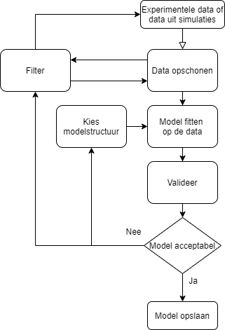

### Aanpak

Met welke fases komen we in aanraking:

1) Plug een gekend ingangssignaal in het proces.
2) Meet het daarbijhorende uitgangssignaal.
3) Bekijk de verkregen data, beslis of preprocessing noodzakelijk is.
4) Kies een modelstructuur.
5) Geef de computer de data en structuur waarmee de parameters berekend worden.
6) Evalueer de eigenschappen van het bekomen model.
7) Indien nodig, test een nieuwe modelstructuur. Ga naar stap 4.
8) Verifieer het model. Bij slechte prestaties, ga naar stap 3.

Geavanceerde fases:
* Onderzoek de moeilijkheden.
   * Onstabiele modelstructuur
   * Feedback in de data
   * Ruismodel
   * Model grootteorde
   * Aanvullende ingangssignalen
   * Niet lineaire effecten
   * Rest
     
       Onvoldoende informatie, een slechte signaal/ruis verhouding, onbekende externe verstoringen en variërende systeem eigenschappen kunnen bijkomende verklaringen zijn van slechte validatie resultaten. 

* Analyseer en verfijn
   * Modellen van lage orde krijgen de voorkeur.
   * Analyseer de fit tussen gesimuleerde en gemeten data.
   * Residu analyse
   * Polen en nullen elimineren

Veel van deze termen en technieken komen nog aan bod. Het is duidelijk dat deze procedure tot weinig succes zal leiden zonder computationele hulp. Een computer met voldoende rekenkracht is dus essentieel. 

### Praktische aanpak m.b.v. een computer met software voor systeemidentificatie:

1. Visualiseer de data
   * Filter de signalen indien dit noodzakelijk is.
   * Compenseer de gemeten signalen voor waarneembare drift.
   * Selecteer stukken uit de dataset die helpen bij het bepalen van een procesmodel.
  
2. Niet-parametrische identificatie 
     * Bereken de covariantie tussen procesparameters.
     * Stel van elk signaal de Fourier transformatie (FFT) op.
     * Stel de correlatiematrix op.
     * Doe een spectrale analyse.

3. Parametrische identificatie 
    * Bepaal de parameters voor verschillende modelstructuren.

4. Geef de modelprestaties weer
    * Simuleer de modellen.
    * Geef de polen en nullen weer.
    * Geef de Bode diagrammen weer
    * Geef de Nyquist grafieken weer.
    * Gebruik andere analyses naar persoonlijke voorkeur. 

5. Validatie van het model
    * Bereken en analyseer de verschillen tussen werkelijke en gesimuleerde waardes. (=residuals)
    * Vergelijk de modeleigenschappen.

#### Vuistregels

* Als het systeem onstabiel is of integrators heeft, kies dan de 'prediction' i.p.v. de 'simulation' optie in de SysID-software.

#### Formulering

Een algemene beschrijving van dynamische systemen ziet er als volgt uit:

$$y(t) = G(q,\theta)u(t) + H(q,\theta)e(t)$$

met,

y(t): de waarde van het uitgangssignaal op tijd t

u(t): de waarde van het ingangssignaal op tijd t

e(t): de waarde van het verstoring op tijd t

$\theta$: de modelparameters

q: de verschuifoperator

G en H: rationele transferfuncties 

Merk dat dit een lineaire tijdsonafhankelijke beschrijving is. y en u zijn meetbare signalen. De verstoring is dit niet. Metingen over een bepaald interval (de meettijd of meetfrequentie) zijn gediscretiseerde signalen. 

#### Keuze van het ingangssignaal

* Stapsignaal 
  Een signaal in het tijdsdomein.

* Filtered Gaussina White Noise

* Random Binary Noise

* Pseudo-Random Noise (PRBS)

* Multi-Sines

* Chirp Signals or Swept Sinusoids

* Periodic Inputs

#### Preprocessing 

Hoge frequenties die geen deel uitmaken van de essentiele processignalen onderdrukken we op met een laagdoorlaatfilter. Zie het hoofstuk over filters voor meer informatie.

Vervang uitschieters, lege en niet-continue datapunten met gemiddelde waardes of zorg dat deze niet in de dataset voorkomen tijdens de systeemidentificatie. 

Corrigeer de data voor offset door signalen naar nul te brengen. Lineaire systeem identificatie gebeurt steeds tenopzichte van signalen op hun operationeel punt waardoor simulaties een initiële conditie moeten meekrijgen. Vooralleer het trainen van het model is het een goede routine om elke offset tot deze nul te brengen en deze (voor simulaties) na het identificeren terug toe te voegen.

Corrigeer de data voor drift en/of laagfrequente verstoringen die (al dan niet) van herhaalbare aard zijn. 

Verstoringen maken in enkele modelstructuren een deel uit van het model waardoor corrigeren niet nodig is. 

#### Selecteer modelstructuren

* Spectrale analyse benadering, ARX en state space model frequentie functies.
* Correlatie analyse benadering, ARX en state space model transiënte resultaten.
* Gemeten validatie output data, ARX en state space model gesimuleerde outputsignalen. Ookwel 'Model Output Plot' genaamd.

#### Fit met de werkelijkheid

Bereken het verschil met de werkelijkheid:
$$ V_N(\theta) = \sum ||y(t)+y_{est}(t|\theta)||^2 $$

Is de fit kleiner dan 75% (goodness of fit) dan is het model niet acceptabel voor verder gebruik.

> Door trage veranderingen in functie van de tijd, zoals bijvoorbeeld slijtage, is het iteratief bijstellen van het model noodzakelijk om de procesregeling te verbeteren.

#### Troubleshooting

Indien de prestaties van het model de wensen overlaat, dan kunnen er verschillende verklaringen zijn.

* De orde van het model is te laag. Hoge orde systeemdynamica is moeilijk te modelleren met lage orde modellen.
* Het gebruikte ingangssignaal (of signalen) bevat te weinig informatie om de uitgang te voorspellen. 
* Er zijn niet-gemeten verstoringen die invloed hebben op het proces. Dit valt niet direct op te lossen.
* Er zijn significante niet-gemodeleerde niet-lineaire effecten aanwezig in de systeemdynamica.

## Haalbaarheid (= Reachability)

De haalbaarheid van een systeem is een fundamentele eigenschap welke cruciaal inzicht verschaft. Het geeft aan welke staat het systeem kan aannemen met een bepaalde (en vaak beperkte) set aan ingangssignalen. 

Wanneer is het haalbaar om een bepaalde 'state' (**X**) te bekomen met een beperkte input (**u**) keuze?

Met de analyse van de haalbaarheid is het mogelijk om een feedback algoritme op te stellen met gewenste gesloten lus eigenwaardes. Met de veronderstelling dat het systeem is haalbaar en dat de volledige staat (X) werd opgemeten. 

Verdere uitwerking volgt.

> Bron: HS 6 feedback systems astrom

## Observeerbaar (= Observability)

Een systeem is observeerbaar wanneer de staat (X) gekend is door de ingang (u(t)) en uitgang (u(t)) op te meten.

Verdere uitwerking volgt.

> Bron: HS 7 feedback systems astrom

## Referentie

[1]: I. Markovsky, J. C. Willems, P. Rapisarda, en B. L. M. D. Moor, ‘DATA DRIVEN SIMULATION WITH APPLICATIONS TO SYSTEM IDENTIFICATION’, IFAC Proceedings Volumes, vol. 38, nr. 1, pp. 970–975, 2005, doi: 10.3182/20050703-6-CZ-1902.00163.

[2]: ‘Ways to Prepare Data for System Identification - MATLAB & Simulink - MathWorks Benelux’. https://nl.mathworks.com/help/ident/ug/ways-to-prepare-data-for-system-identification.html (geraadpleegd mrt. 23, 2021).

[3]: M. Ehmer en F. Khan, ‘A Comparative Study of White Box, Black Box and Grey Box Testing Techniques’, International Journal of Advanced Computer Science and Applications, vol. 3, jun. 2012, doi: 10.14569/IJACSA.2012.030603.

[4]: J. Diaz, ‘Modern Control Systems, Eleventh Edition Linear Control Systems EEE 338 A’, Geraadpleegd: jul. 13, 2021. [Online]. Beschikbaar op: https://www.academia.edu/8605825/Modern_Control_Systems_Eleventh_Edition_Linear_Control_Systems_EEE_338_A

[5]: C. Ionescu, R. Keyser, F. Robayo, en M. Naumovic, ‘The Transfer Function Analyzer Revisited’, jul. 2010, pp. 1441–1446. doi: 10.1109/MED.2010.5547845.

