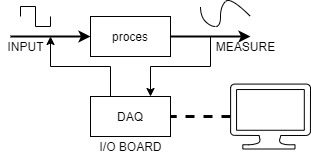
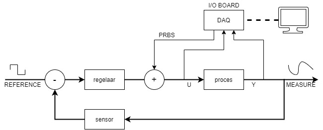
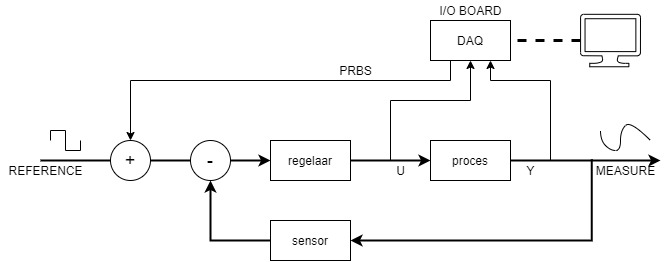
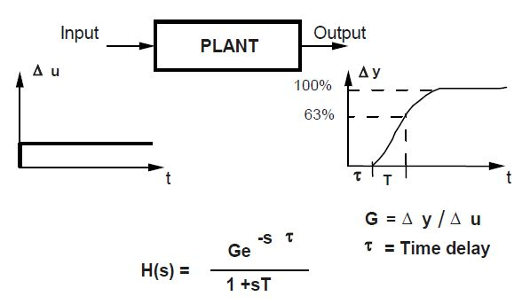

# Praktische systeem identificatie

Een weinig gekende procedure in industriële context maar met enorm veel potentieel. Het is belangrijk om te weten dat er geen globaal accurate techniek bestaat om een procesmodel op te stellen. Daarom werken ontwerpers volgens een iteratieve workflow waarin controle en eventuele aanpassing van elk model nodig is om een goede uitkomst te bekomen.

Let op: breng het proces eerst in steady-state operatie, start dan de data acquisitie.

## Data acquisitie

Gespecialiseerde DAQ kaarten zijn ontworpen om processignalen met relatief gemak te vertalen naar een computer en terug uit te sturen naar de installatie. Data acquisitie borden met ingebouwde ADC en DAC communiceren via C++ met de software.

## Opstelling 1: open lus

De meest veelvoorkomende en simpele oplossing. Wanneer het mogelijk is, maak gebruik van deze opstelling want de kwaliteit van de bekomen modellen zijn erg hoog. 

Bij het opstarten van een data acquisitie experiment, breng de installatie eerst in steady state operatie vooraleer te beginnen met injectie van het (PRBS) signaal. De reden hiervan is het uitsluiten van transiënte effecten tijdens bedrijfstelling.

Experimentele identificatie van een procesmodel:

* Capteer input/output data met een PRBS als input
  
* Verwerk de data 
  
  * DC verwijderen
  * Schalen
  * Filteren
  
* Schat de orde van het model
  
* Selecteer de modelcomponenten
  
  * Via ordeschatting
  * Via numerieke beoordeling
  
* Identificatie en validatie van verschillende modelstructuren
  
* Analyse in het frequentie- en tijdsdomein

## Opstelling 2: gesloten lus

Het doel is om een model op te stellen die de transformatie van U naar Y weergeeft. Een eerste methode voegt het PRBS signaal toe aan de PID uitgang. De tweede methode injecteert het (PRBS) signaal op het referentie signaal.

Wanneer kiezen voor identificatie bij gesloten lus?

* Als het proces onstabiel is
  
* Als het proces een langzaam verschuiven van zijn operationeel punt vertoont (=drift)
  
* Als er al een regelaar bestaat
  
* Als de regelaar opnieuw wordt ingesteld met het oog op verbeterde gesloten lus prestaties.

Er zijn twee opties in het identificeren van het proces tijdens gesloten lus operatie. 
In het eerste geval negeren we de aanwezigheid van de regelaar. Deze moet "soft" zijn om te kunnen werken. Dit wil zeggen, een zeer lage $K_d$ en een relatief lage $K_p$ waarde om de regelaar trager te maken. Het succes bij gebruik van deze methodiek varieert sterk in de praktijk.
In het tweede geval zijn meer toegewijde methodes een optie. Zie 'Identificatie algoritmes'.

De uitdagingen van gesloten lus identificatie:

* Er is een grote correlatie tussen het ingaand signaal en procesruis.
  
* Sommige technieken eisen kennis van de actuele controller

## Methodes: gesloten lus identificatie

1. Directe methode

De meest eenvoudige methode waarin de feedback wordt genegeerd. De directe methode zal een gesloten lus behandelen als open.

Meet de input en output van het proces en parametriseer hiermeer de gekozen modelstructuur met een maximale fit tussen voorspelde en opgemeten data. 

Het nadeel is echter de slechte presaties bij hoge 'signal to noise' metingen. Werk daarom enkel met de directe methode als SNR hoog is. Een goed ruismodel is sterk aanbevolen.

2. Indirecte methode

Bepaalt het model door de referentie en de output van het proces op te meten. Vind de (open lus) transfer functie voor het gesloten lus systeem. De transfer functie van het volledige systeem bevat de feedback lus en de controller, waarvan de transfer functie gekend is. Door het systeemmodel verder te ontleden blijft het procesmodel over.

Een voordeel, er is geen ruismodel nodig.

Een nadeel, kennis van de actuele controller is nodig.

3. Verbonden input output methode

Input en output zijn outputs in een cascade systeem met de referentie en ruis als 'verbonden' ingangen. 

4. Twee stages methode

Deze methode heeft weinig meerwaarde. Voor meer informatie, bekijk de referenties.

## Signaalverwerking

*Anti-aliasing* betekent concreet het toevoegen van een laagdoorlaatfilter tussen de procesuitgang en de ADC van het acquisitie instrument. Om te voorkomen dat signalen (met frequentie boven 0.5$f_s$) het gewenste signaal vervormen.

*Oversampling* bij data acquisitie komt neer op het gebruik van een samplingfrequentie die een veelvoud is van de samplingfrequentie in de controle lus. Let hierbij op bij het berekenen van frequentie verdeler (p) van de PRBS. $f_s$ van de DAQ moet steeds een integer zijn en een veelvoud van de PRBS klokfrequentie.

Elimineer *een DC component (trend)* door één van volgende methodes toe te passen. Een stationaire DC component verwijder je door de gemiddelde waarde van de I/O sets te berekenen en elke waarde in de dataset te verminderen met deze gemiddelde waarde. Om niet-stationaire DC componenten te vermijden, vervang je de huidige I/O metingen met de variaties van deze I/O metingen. Dit komt neer op het berekenen van de afgeleide, of meer eenvoudig, op het berekenen van de snelheid van verandering.

Bezit het proces een pure integrator? Vervang dan de input met zijn integraal of vervang de uitgang met zijn afgeleide.

Bezit het proces een pure differentiator? Vervang dan de input met zijn afgeleide.

Schalen van input en output is soms nodig om ongebalanceerde berekeningen te vermijden. Vergeet de uitkomsten van het bekomen model niet opnieuw te herschalen indien een geschaalde dataset werd gebruikt! 

## Validatie: gesloten lus

Validatie van experimentele identificatie bij gesloten lus operatie:

* Statistisch ('uncorrelation test')
  
* Pool-afstand: verschil tussen werkelijke gesloten lus polen en gesloten lus predictor polen
  
* Verschil tussen de sensitiviteitfuncties
  
* Tijdsdomein verschillen

Modellen uit open lus identificatie zijn handig bij het valideren van procesmodellen uit gesloten lus identificatie,indien deze beschikbaar zijn.

## Input sequentie

Het is wenselijk om in de input sequentie een breed frequentiebereik en lage amplitudes te gebruiken. Het procesgedrag valt nauwkeuriger te modelleren bij verschillende frequenties en lage amplitudes zorgen voor minimale invloed op de proceswerking. Een te hoog gekozen amplitude kan onstabiele situaties veroorzaken of bepaalde veiligheidsmarges overschrijven. 

### Stap

Nadelen van een stap antwoord experiment:

* Signalen hebben grote amplitudes, wat in industriële toepassingen niet gewenst is (en zelfs gevaarlijk kan zijn)
  
* Lage nauwkeurigheid
  
* Slechte correlaties met verstoringen
  
* Niet mogelijk om verstoringen te modelleren
  
* Duurt lang
  
* Geen modelvalidatie mogelijk

### Pseudo Willekeurige Binaire Sequentie (PRBS)

PRBS is pulssignaal met verschillende breedte met de waardevolle eigenschap witte ruis zeer goed te benaderen. Het is een signaal met een breed scala aan frequenties wat ideaal is voor systeem identificatie en daarom veel in de praktijk voorkomt. 

Er zijn enkele correcte ontwerpbeslissingen nodig om PRBS succesvol te implementeren. Een aantal belangrijke kenmerken zijn: het aantal pulsen, de maximale pulsbreedte, de pulsfrequentie, de pulsamplitude.

Om het steady state gedrag correct te observeren, moet één van PRBS pulsen langer duren dan de stijgtijd van het te identificeren proces.

$$t_{im} = NT_s > t_R$$

$$pNT_s > t_R$$

$$f_s = 1 / T_s$$

$$f_{klok} = f_s / p$$

p: frequentie deler

N: aantal cellen van het schuifregister
 
$T_s$: samplingtijd

$pT_s$: klok periode van de PRBS generator

$f_{klok}$: klokfrequentie van de PRBS generator

$t_R$: proces stijgtijd (inclusief dode tijd)

De pulsamplitude kan klein zijn maar moet steeds groter zijn dan de restruisamplitude. Als vuistregel mag de pulsamplitude nooit groter zijn dan een aantal procent van de steady state controle signaal amplitude.

$$\text{max. residual noise amp.} < \text{PRBS pulse amp.} < \text{a few \% of amp. steady state control sign.}$$

Tip: bij een kleine signaal/ruis ratio, verleng de duratie van het experiment om meer data met informatie op te slaan. Dit zal het kiezen van correcte modelparameters vergemakkelijken.

Let op: niet geschikt voor niet-lineaire processen 

## Identificatie algoritmes

* Recursive Least Squares (RLS)
  
* Extended Least Squares (ELS)
  
* Recursive Maximum Likelihood (RML)
  
* Output Error with Extended Prediction Model (OEEPM)
  
* Instrumental Variable with Auxiliary Model (IVAM)
  
* Ouput Error with Fixed Compensator (OEFC)
  
* Output Error with Filtered Observations (OEFO)
  
* Output Error with Adaptive Filtered Observations (OEAFO)
  
* Generalized Least Squares (GLS)

ELS, RML en OEEPM zijn bruikbaar in ongeveer 60% van de gevallen. IVAM, OEFC, OEFO en OEAFO in ongeveer 30% van de gevallen.

Raadpleeg de literatuur voor gedetaileerde omschrijvingen van elke techniek. Omdat alle softwarepakketten de achterliggende algoritmes gebruiken is diepgaande kennis hiervan niet noodzakelijk. Het laat wel toe vlotter en minder iteratief te werk te gaan.

## Referenties

[1]I. D. Landau en Z. Gianluca, Red., ‘Identification in Closed Loop’, in Digital Control Systems: Design, Identification and Implementation, London: Springer, 2006, pp. 375–398. doi: 10.1007/978-1-84628-056-6_9.

[2]C. Lyzell e.a., Initialization Methods for System Identification. 2009. Geraadpleegd: jun. 04, 2021. [Online]. Beschikbaar op: http://urn.kb.se/resolve?urn=urn:nbn:se:liu:diva-51688

[3]R. Mandloi en P. Shah, ‘Methods for closed loop system identification in industry’, p. 5, 2015.

[4]I. D. Landau en Z. Gianluca, Red., ‘Practical Aspects of System Identification’, in Digital Control Systems: Design, Identification and Implementation, London: Springer, 2006, pp. 279–315. doi: 10.1007/978-1-84628-056-6_7.

[5]M. Phan, J.-N. Juang, L. G. Horta, en R. W. Longman, ‘System identification from closed-loop data with known output feedback dynamics’, Journal of Guidance, Control, and Dynamics, vol. 17, nr. 4, pp. 661–669, jul. 1994, doi: 10.2514/3.21253.

[6]I. D. Landau en Z. Gianluca, Red., ‘System Identification: The Bases’, in Digital Control Systems: Design, Identification and Implementation, London: Springer, 2006, pp. 201–245. doi: 10.1007/978-1-84628-056-6_5.

[7]W. Jianhong en R. A. Ramirez-Mendoza, ‘The practical analysis for closed-loop system identification’, Cogent Engineering, vol. 7, nr. 1, p. 1796895, jan. 2020, doi: 10.1080/23311916.2020.1796895.
