# Regeltechniek

## Parameters

In 'systeemtheorie' hebben we gezien dat parameters continu of discreet kunnen zijn. Dit heeft een invloed op de verdere structuur van de regelkring. Analoge componenten gedragen zich hoofdzakelijk continu waarnaast digitale toestellen vaak werken met discrete signalen. We leggen hier de nadruk op deze twee types omdat ze een op een verschillende manier interageren met het proces.

### On / off controle

Een belangrijk type controlesysteem is een aan/uit regelaar. Deze stuurt een boolian (O/I) waarde uit naar de actuator. In de praktijk is dit bijvoorbeeld een warmte element, aangestuurd door een relais. De relais is ofwel open (geen opwarming van het element) of volledig dicht (stroom vloeit en element warmt op). Er is geen staat tussen deze twee situaties.

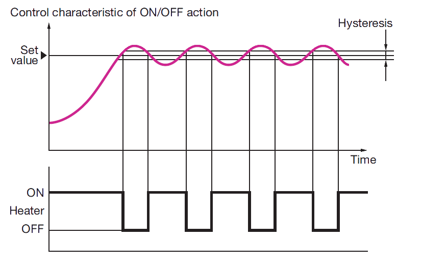

Waarom deze vorm van controle belangrijk is ligt vooral aan de kostprijs. De implementatie van deze soort regelkring is in het algemeen lager dan bij continue systemen. Door de lagere kostprijs komt deze strategie vaak voor in de praktijk. Frigo's, diepvriezers, ovens, ... zijn alledaagse toestellen die werken volgens dit principe.

> Aan/uit regelkringen worden vooral gebruikt voor **niet-veiligheidskritische** processen!

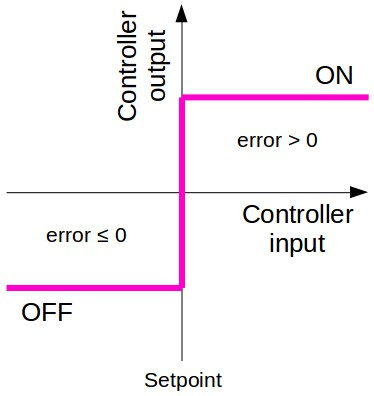

Door de actuator aan te sturen rond de setwaarde kan de schakelfrequentie snel oplopen, dit kan het systeem onnodig beschadigen.

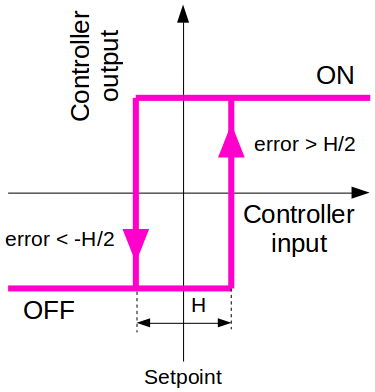

Door hysteresis toe te voegen zal de schakelfrequentie dalen.

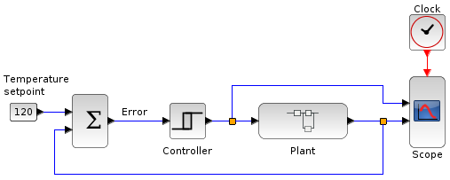

Aan/uit regelaars kunnen zo eenvoudig zijn als op de voorgaande afbeelding wat gebruik maakt naar het verschil tussen de gewenste waarde en de werkelijke waarde. Het is ook mogelijk om een PID strategie toe te passen bij het aansturen van de relais. Het (continu) uitgangssignaal van de controller maakt het opstellen van een omvormer noodzakelijk om discreet een relais aan te kunnen sturen. PWM, PPM en PAM zijn analoge technieken.

Het afstellen van een PID regelaar voor aan/uit controle is niet vanzelfsprekend.

### Continue controle

Door de actuator continue aan te sturen is de controle een stuk nauwkeuriger dan bij bijvoorbeeld aan/uit regelkringen. Een PID controller speelt hierin een grote rol.

## PID architecturen

### Voorwaardse / achterwaardse koppeling

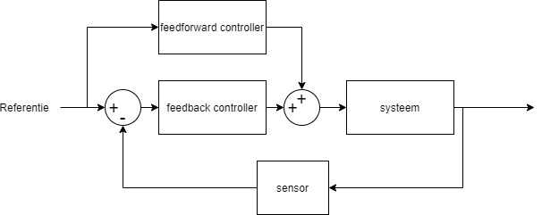

### P-regelaar

Inleiding:

* de regelaar versterkt de fout
* alle frequentiecomponenten van de fout (e) worden gelijk versterkt
* de regelaar creëert geen faseverschuiving

Formule in het frequentiedomein:

$$G(s) = \frac{U(s)}{E(s)} = K$$

Formule in het tijdsdomein:

$$u(t) = Ke(t)$$

Begrippen:

* Versterkingsfactor $K_r$: verhouding tussen uit- en ingangssignaal van een element met proportionele werking. Handig bij de analyse maar is **niet** de factor die we in de regelaar instellen.
* Meetgebied $S_i$: min-max in te stellen setwaarde.
* Uitgangsgebied: het verschil tussen de min. en max. waarde van het uitgangssignaal.
* Bias (=arbeidspunt) [$\%$]: het percentage van het uitgangssingaal dat de regelaar uitstuurt als de ingang gelijk is aan de setpoint.
* Proportionele band (=PB): het gebied dat het ingangssignaal moet doorlopen om het uitgangssignaal bij proportionele werking over heel zijn gebied te doen veranderen.

#### Ontwerpprocedure

Eerste methode:

* Starten vanuit de gewenste fasemarge (PM).
  * Stel K = 1
  * Bepaal de frequentie ($\omega_k$) waarbij L = GH een fase heeft van -180°+PM:
    * $\angle$(G($\omega_k$)H($\omega_k$)) = -180° + PM
  * Bepaal de versterking bij die frequentie:
    * |G($\omega_k$)H($\omega_k$)| = $\alpha$
  * Stel K = $\frac{1}{\alpha}$ zodat de totale versterking van GH = 1 bij $\omega_k$
  
Tweede methode

* Bepaal de nodige versterking bij 0Hz

### PD-regelaar

Inleiding:

* De regelaar houdt rekening met de verandering van de error
* Stabiliserend effect: zorgt voor een bijkomende fase (= meer fasemarge)
* De amplitude stijgt samen met de frequentie
  * hierdoor schuift de kruispulsatie naar rechts (=snellere respons)
  * Op hogere frequentie, grotere versterking van ruis
* Een zuiver derivatief netwerk kan niet gerealiseerd worden met fysische componenten
  
Formule in het frequentiedomein:

$$G(s) = K(1 + T_d s)$$

Formule in het tijdsdomein:

$$u(t) = Ke(t) + T_f \dot{e}(t)$$

Begrippen:

* Anticipatietijd ($T_d$): de controle output van de PD-regelaar anticipeert het P-gedeelte van de regelaar met tijd $T_d$

Problemen met D-regelactie:

* Filter het foutsignaal $\dot{e}(t)$

> Gebruik geen D-regelaar maar een lead-regelaar!

### Aanloopregelaar (= lead-regelaar)

Inleiding:

Zwakt de versterking af van hogere frequenties door een extra fase toe te voegen. Dit is goed voor de stabiliteit want het beperkt de versterking van ruis en vergroot de kruispulsatie.

#### Begrippen

* Kruispulsatie ($\omega_c$): is gerelateerd aan de gesloten lus bandbreedte en de stijgtijd.
  
* Fasemarge (PM): is gerelateerd aan de dempingsverhouding ($\zeta$) en de overshoot ($M_P$) in gesloten lus
  
* Versterking bij 0 rad/s: bepaalt de gesloten lus steady-state fout

De controller:

$$G(s) = K \frac{Ts + 1}{\alpha Ts +1} \text{, met } \alpha =< 1$$

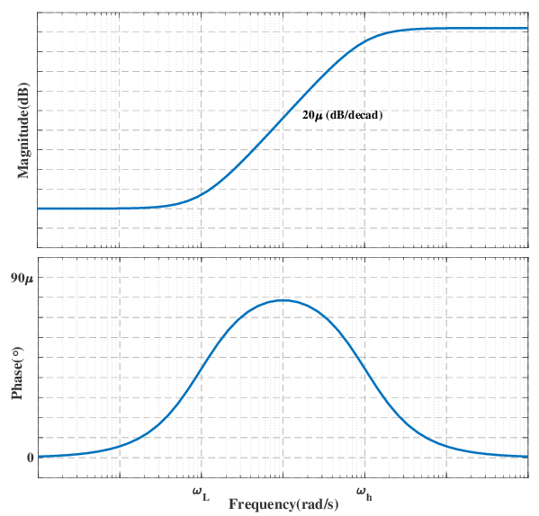

De fase van de lead regelaar:

$$ \phi (\omega) = tan^{-1} (T\omega) - tan^{-1} (\alpha T\omega) $$

De maximale fase mogelijk met een lead-regelaar:
$$\omega_{max} = \frac{1}{\sqrt{\alpha}}$$
$$\alpha = \frac{1 - sin(\phi_{max})}{1 + sin(\phi_{max})}$$

#### Vuistregels

* Stel één lead-regelaar af met een faseverschuiving van maximaal 60°.
  * Als er meer faseverschuiving nodig is, voeg een tweede lead-regelaar toe in serie.
  $$G(s) = K (\frac{Ts + 1}{\alpha Ts +1})^2$$

* Als er geen eisen zijn i.v.m. de steady-state fouten, kies dan een regelaar met een maximum toename van de bandbreedte. M.a.w. kies voor zoveel mogelijk voorijlende fase.
  
* Stel $\alpha$ = 0.1 en $\phi_{max}$ = 55° als beginwaardes.
  * Bepaal T en K zodat de kruispulsatie groter wordt.

#### Voorbeeld van een leadregelaar

Stel het systeem: $$P(s) = \frac{1}{s(s+1)}$$

De eisen:

* Steady-state fout bij een talud ingangssignaal moet kleiner zijn dan 0,1.
* De overshoot op een stapvorming ingangssignaal mag niet groter zijn dan 25%.

Methode 1:

* De steady-state fout op een talude:
$$e_{ss} = lim_{s->0} \frac{1}{1+G(s)P(s)}sR(s)$$
* waarvan:
$$ R(s) = \frac{1}{s^2}$$
* na de substitutie:
$$e_{ss} = lim_{s->0} \frac{1}{s+G(s)(\frac{1}{s+1})}R(s) = \frac{1}{G(0)}$$
* dus G(0) = K >= 10, kies K = 10

Methode 2:

* Aantal integratoren in systeem = 1

* Aantal integratoren in regelaar = 0

* Aantal integratoren in L is dus 0+1 = 1 => n = 1

* Ingang is een talude ($R = \frac{1}{s^2})$: k = 1

* In de tabel:
  $$e_{ss} = \frac{1}{K_1}$$
  
  $$K_1 = lim_{s->0}[sG(s)P(s)]$$

* Vervang de formules:
  
  $$K_1 = lim_{s->0}[sK(\frac{Ts + 1}{\alpha Ts +1})\frac{1}{s(s+1)}]$$

* Vereenvoudig:

  $$K_1 = lim_{s->0}[\frac{1}{s+1} K(\frac{Ts + 1}{\alpha Ts +1})]$$

* Wat houden we over bij de steady state ($s = 0$):
  
  $$D(0) = K$$
  
* dus:
  $$e_{ss} = \frac{1}{G(0)} = \frac{1}{K}$$
  
* Overshoot heeft gevolgen voor de fasemarge:

  * Het verband tussen overshoot en fasemarge geeft een PM van 45° aan.
  
  * Voor K = 10 is de fasemarge van K*P(s) gelijk aan PM = 18° met kruispulsatie $\omega_c = 3.08 rad/s$.

  * Er is dus nog een verschuiving van zeker 27° nodig: de lead regelaar kan hiervoor zorgen!
  
  * Kies een lead regelaar met marge, met een maximale fase (voorijling) van 40°. We nemen $\alpha$ = 1/5.
  
  * Bepaal T zodat de leadregelaar deze maximale fase heeft bij de nieuwe kruispulsatie. Hier is $|G(j\omega)P(j\omega)| = 1$. De extra amplitude van de regelaar zorgt ervoor dat de kruispulsatie verschuift.

  * Na enkele waarden te proberen bekomen we de volgende regelaar:
  $$G(s) = 10\frac{s/2 + 1}{s/10 +1}$$

  * Bij een stapvorming ingangssignaal is de overschoot 18,4% met een steady state error van 0,1.

### PI-regelaar

Inleiding:

* Deze regelaar houdt rekening met de voorgeschiedenis van de errorwaarde.
  * Dit komt dit neer op de integraal van de fout.
* Voordelen:
  * Grote versterking van het signaal bij lage frequenties. Dit werkt de steady-state fout volledig weg.
* Nadelen:
  * Onder de breekfrequentie $\omega = \frac{1}{T_i}$ is er veel naijling. Dit vermindert de fasemarge en kan leiden tot onstabiliteit. Men kiest $\frac{1}{T_i}$ vaak ver onder de breekfrequentie van het originele systeem (met P regelaar). Zo oefent het minder invloed uit op de breekfrequentie en PM.
  
Formule in het frequentiedomein:

$$G(s) = K_p + \frac{K_i}{s}$$
$$G(s) = K_c (1 + \frac{1}{T_i s})$$

Formule in het tijdsdomein:

$$u(t) = Ke(t) + \frac{K}{T_i} \int e(t)dt$$
$$K_i = \frac{K}{T_i}$$

Begrippen:

* Integratietijd ($T_i$): Bij een kleinere integratietijd zal de controller sneller reageren.

### Vertraging (lag-regelaar)

...

### Weerstand tegen storing

Ruis en externe krachten die het systeem beïnvloeden zijn beide voorbeelden van storingen.

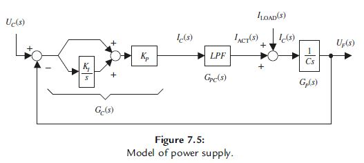

$$\frac{U_F(s)}{I_{LOAD}(s)} = \frac{1/Cs}{1+(1/Cs) (1+K_I/s) K_P LPF(s)}$$

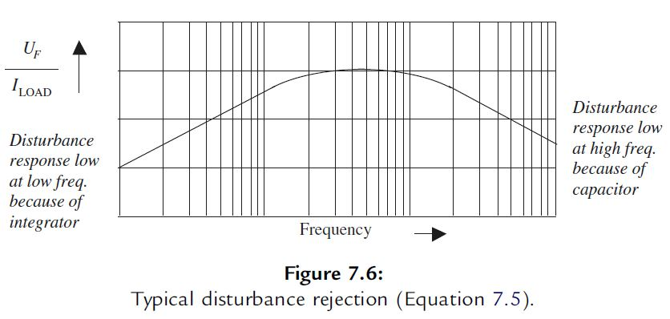

In het mid-frequentiedomein is er weinig weerstand tegen storingen. Bovenstaande afbeelding geeft de transferfunctie van een verstoringssignaal weer.

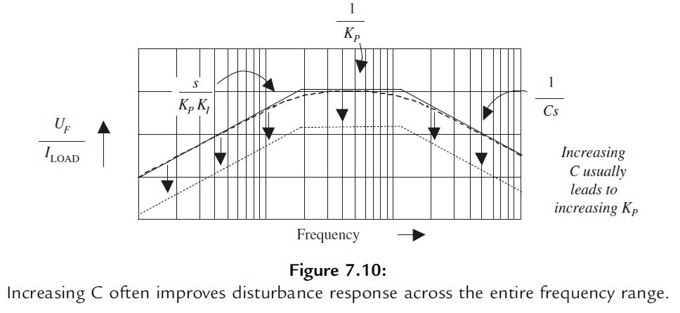

Op deze afbeelding is duidelijk te zien hoe elk onderdeel van de tranferfunctie het verstoringssignaal kan beïnvloeden.

## PID+ architecturen

### Smith predictor

Een Smith predictor is een betrouwbare techniek om processen met dode tijd te behandelen. Het presteert relatief goed wanneer dode tijd een significante rol speelt. Deze techniek is vooral aangeraden wanneer we de setpoint-tracking willen verbeteren.

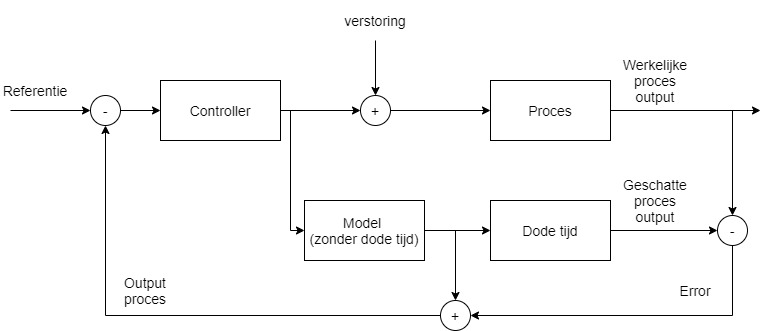

Deze controle architectuur heeft drie fundamentele eigenschappen:

1. Dode tijd compensatie

   Gesloten lus vergelijking zonder dode tijd:
   $$1+C(s)G_n(s)=0$$
   Gesloten lus vergelijking, afhankelijk van dode tijd:
   $$1+C(s)G_n(s)e^{-L_ns}=0$$
   $e^{-L_ns}$ wekt een extra fase op waardoor de fasemarge verkleint, dit zorgt voor minder stabiliteit.

2. Voorspellen

   In het schema zien we dat het uitgangssignaal voorspeld wordt door de dode tijd uit de vergelijking te halen. Hierdoor is het eenvoudiger om in te spelen op verschillen met het referentie signaal. Dit voordeel is helaas niet van toepassing op signaalverstoringen omdat deze geen deel zijn van het model.

3. Ideale dynamische compensatie

   De Smith Predictor deelt het proces op in twee delen. Een (soms) inverteerbare $G_n(s)$ en een niet-inverteerbare dode tijd $e^{-L_ns}$. Een ideale controller zou er als volgt uitzien:
   $$C'(s)=\frac{C(s)}{1+C(s)G_n(s)} = (G_n(s))^{-1}$$
   De analyse van deze vergelijking is handig om optimale prestaties met de werkelijke te vergelijken.
   Bij gebruik van deze controller, hou rekening met het open-lus gedrag tussen $t_0=0$ en $t_1=L_n$! Want door de dode tijd zal tussen $t_0$ en $t_1$ geen correcte feedback plaatsvinden. Door het openlus gedrag in deze periode zijn onstabiele processen niet aangeraden!

Voordelen:

* SP is gemakkelijk te implementeren als het model **met dode tijd** gekend is.
* Snellere setpoint-tracking (in vergelijking met PID).

Nadelen:

* Gelijkaardige prestaties bij procesverstoringen (in vergelijking met PID).
* Niet toepasbaar als het proces onstabiele eigenschappen vertoont.

Stapantwoord bij een SP controller en PID:

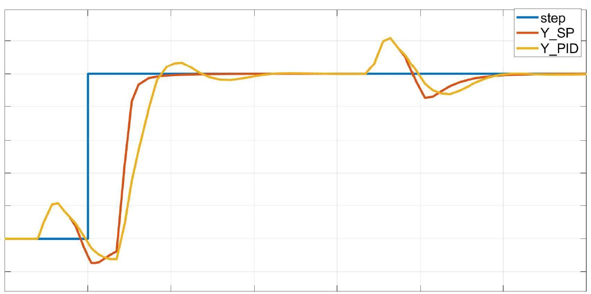

Procedure (gebaseerd op IMC):

1. Stel een (tweede orde) model op met dode tijd.
2. Onderscheid de dode tijd van het procesmodel.
3. Bouw het regelsysteem op zoals weergegeven in het schema.

Afstelregels:

| SP model | Regelaar | Filter | $K_c$ | $T_i$ | $T_1$ |
|-------------|:------------------:|------------------|-----------------------------|---------------------------------|------|
|      $\frac{K_p e^{-Ls}}{1+sT}$      |         $\frac{K_c(1+T_i s)}{T_i s}$        |        $\frac{(1+T_0 s)}{(1+T_1 s)}$       |              $\frac{T}{K_p T_0}$             |                T              |    $T_1 \text{is een waarde van de set} [T,T_0]$   |

#### Oefening: Luchtschacht controle systeem

Aan het einde van een lange schacht bevindt zich een kleine ventilator. Door een stap aan te leggen werd het model geïdentificeerd. Niet-lineaire effecten zijn verwaarloosbaar.

$$G(s)=\frac{K_p e^{-Ls}}{1+sT}$$ 
$$G(s)=\frac{1.02e^{-8.2s}}{(1+1.7s)}$$

Als er veel onzekerheid is i.v.m. de metingen, neem dan een marge. Neem bijvoorbeeld een schattingsmarge van 30% op de dode tijd.

* $T_0 = 1.7 \Delta L_{max} = 4.1s$
* $T_1 = T = 1.7s$
* De regelaar is:
  $$C(s)=\frac{K_c(1+T_i s)}{T_i s}$$
  $$C(s)=\frac{0.41(1+1.7s)}{1.7s}$$
* De voorgestelde filter:
  $$F(s)=\frac{(1+T_0 s)}{(1+T_1 s)}$$
  $$F(s)=\frac{1+4.1s}{1+1.7s}$$

### Smith predictor (gemodificeerd)

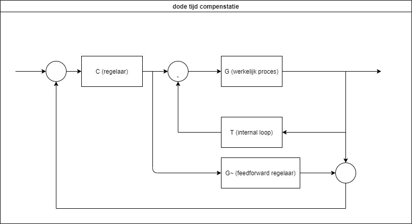

> Procesmodel verkregen uit de fase "systeem identificatie"

> Tabelwaardes invullen om de juiste controllers te bekomen

* FOPTD: First Order Pure Time Delay
  $$G(s) = k\frac{e^{-\theta s}}{\tau s + 1}$$
  Als het proces stabiel is.
  $$T(s)=0$$
  $$C(s)=k_d\frac{1}{\beta s + 1}\frac{\tau s + 1}{s(\lambda s + 1)}$$
  $$\tilde{G}(s)=k_p\frac{ks}{\tau s + 1}e^{-\theta s}$$
  Met 0 =< $\alpha$ < 1 (kies $\alpha$ = 0.4)
  $$k_p = \alpha (\theta + \beta)$$

* PTD: Pure Time Delay
  $$G(s) = ke^{-\theta s}$$
   Als het proces stabiel is.
  $$T(s)=0$$
  $$C(s)=k_d\frac{1}{\beta s + 1}\frac{\tau s + 1}{s(\lambda s + 1)}$$
  $$\tilde{G}(s)=k_p\frac{ks}{\tau s + 1}e^{-\theta s}$$

* IPTD: Integral Pure Time Delay
  $$G(s) = k\frac{e^{-\theta s}}{s}$$
  <!--
  $$1+T(s)G(s)=1+k_i\frac{k}{s}e^{-\theta s}$$
  -->
  $$T(s)=k_i$$
  $$C(s)=k_d \frac{1}{\beta s + 1} \frac{(1+\frac{0.5236}{\theta}e^{-\theta s})}{\lambda s +1}$$
  $$\tilde{G}(s)=k_pk \frac{e^{-\theta s}}{(1+\frac{0.5236}{\theta}e^{-\theta s})}$$  

* IFOPTD: Integral First Order Pure Time Delay
  $$G(s) = k\frac{e^{-\theta s}}{s(\tau s + 1)}$$
  $$T(s)=k_i\frac{\tau s+1}{\gamma s+1}$$
  $$C(s)=k_d \frac{1}{\beta s+1}\frac{\tau s+1}{\gamma s+1}(1+\frac{0.5236}{\theta s(\gamma s+1)}e^{-\theta s})$$
  $$\tilde{G}(s)=k_pk \frac{e^{-\theta s}}{(1+\frac{0.5236}{\theta s(\gamma s +1)}e^{-\theta s})(\tau s +1)}$$

* DIPTD: Double Integral Pure Time Delay
  $$G(s) = k\frac{e^{-\theta s}}{s^2}$$
  $$T(s)=k_i \frac{T_d s + 1}{(T_d/N_s + 1)s^2}$$
  * Kies N zodat $k_d/N_s$ <<1
  * $\tau = 8 \theta$
  $$k_i = \frac{0.0625}{k}\frac{1}{\theta^2}, T_d = 8 \theta$$
  $$C(s)=k_p \frac{1}{\beta s+1}\frac{s}{\gamma s+1}(1+\frac{0.0625}{\theta^2}\frac{T_d s + 1}{(s T_d/N_s + 1)s^2} e^{-\theta s})$$
  $$\tilde{G}(s)=k_p \frac{k}{s} (1+\frac{0.0625}{\theta^2}\frac{T_d s + 1}{(T_d/N_s + 1)s^2} e^{-\theta s})$$

| Proces |               $k_d$               |        $\lambda$       |            $k_i$            |  $\gamma$ |    $T_d$   |
|:------:|:---------------------------------:|:----------------------:|:---------------------------:|:---------:|:----------:|
|  FOPTD | $\frac{0.724}{k(\theta + \beta)}$ | $0.04(\theta + \beta)$ |              -              |     -     |      -     |
|   PTD  | $\frac{0.724}{k(\theta + \beta)}$ | $0.04(\theta + \beta)$ |              -              |     -     |      -     |
|  IPTD  | $\frac{0.724}{k(\theta + \beta)}$ | $0.04(\theta + \beta)$ | $\frac{0.5236}{k * \theta}$ |     -     |      -     |
| IFOPTD | $\frac{0.724}{k(\theta + \beta)}$ | $0.04(\theta + \beta)$ | $\frac{0.5236}{k * \theta}$ | $\tau$/10 |      -     |
|  DIPTD | $\frac{0.724}{k(\theta + \beta)}$ | $0.04(\theta + \beta)$ | $\frac{0.5236}{k * \theta}$ |     -     | 8*$\theta$ |

> Kies zelf een geschikte afstelparameter $\beta$ < 1. Hoe groter $\beta$, hoe trager de gesloten lus stapreactie maar hoe robuuster de regeling.

[1]: https://www.scielo.br/j/lajss/a/NKgm4g5yJMtjYSF9WhTmBNC/?lang=en

#### Oefening: eerste orde met dode tijd

$$G(s) = \frac{0.5}{1.5s+1}e^{-9s}$$

We stellen $\beta$ gelijk aan 0.1. Uit de tabel zijn de waarden $k_d$ = 0.159 en $\lambda$ = 0.364 af te leiden. Stel hiermee de volgende regelaar op.

$$C(s)=k_d\frac{1}{\beta s + 1}\frac{\tau s + 1}{s(\lambda s + 1)}$$

$$C(s)=0.159\frac{1}{0.1 s + 1}\frac{1.5 s + 1}{s(0.364 s + 1)}$$

### Integrator anti-windup

Integrator windup (= error windup = controller windup) treedt op wanneer fysische systemen tegen hun grens lopen (= saturatie). Het veroorzaakt een ongecontroleerde stijging van de controllerwaarde.

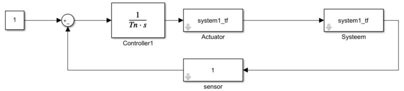

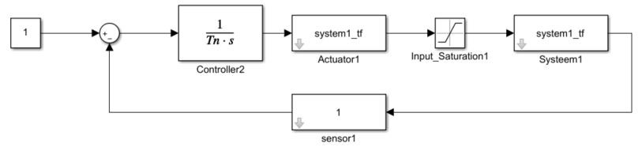

Wat kan je doen:

* De setwaarde verhogen
* De integratiewaarde veranderen
* De integratiefout resetten in geval van saturatie
* De integrator uitschakelen, dus de input naar de integrator op nul zetten
* De integratiefout beperken met boven- en ondergrenzen
* De integratiewaarde berekenen a.d.h.v. het uitgangssignaal

Anti-windup schema:

Vergelijken van uitgangssignalen:

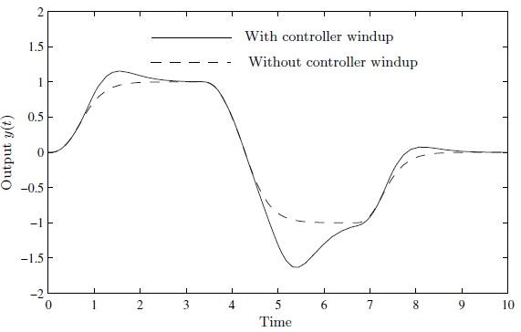

## Performantie

Bepaal de prestaties van een regelsysteem:

* Tijdsdomeincriteria
  * Stijgtijd
  * Overshoot
  * Stabiliseertijd
* Frequentiedomeincriteria
  * Steady state prestaties
  * Bandbreedte of kruispulsatie
  * Stabiliteit

## Stabiliteit

Stabiliteit valt op verschillende manieren te analyseren waarvan we de meest gebruikte methodes zullen behandelen. Het is belangrijk om het verschil te kennen tussen absolute en relatieve stabiliteit.

* *Absolute stabiliteit* kijkt of een systeem na een verstoring convergeert naar een evenwicht.
* *Relatieve stabiliteit* geeft aan in welke mate een verstoring mag optreden vooralleer dit het systeem destabiliseert.

### Absolute stabiliteit

Nyquist is één van de vele methodes om absolute stabiliteit bij teruggekoppelde systemen te bekijken. Het stabilisatiecriterium van **Nyquist** is gebaseerd op de open lus versterking. Een systeem is stabiel wanneer de curve in een Nyquistplot het punt (-1,0) **niet** omcirkelt.

### Relatieve stabiliteit

Een maatstaf die de 'speling' tussen onstabiel en stabiel gedrag weergeeft geeft een idee hoe betrouwbaar het systeem is en maakt het mogelijk om (berekende/gesimuleerde) systeemprestaties met elkaar te vergelijken. **De afstand tot het punt (-1,0)**, in een Nyquistplot, is een bekende techniek hiervoor.

Uit een Bodeplot of een Nyquistplot halen we twee maten: fasespeling en winstspeling.

De fasespeling (PM) geeft het faseverschil weer tussen de fasehoek van het systeem ($\angle$L($\omega_c$)) en de 'onstabiele' fasehoek (-180°).

$$PM = 180° - (\angle L(\omega_c))$$

Een fasespeling kan men kiezen maar is vaak afhankelijk van de situatie. _Een PM van 45° is een goed startpunt._

De winstspeling (GM) geeft de verhouding van de systeemamplitude ($\rvert L(\omega_{-180})\rvert$) tot amplitude 1 ($\rvert L \rvert$ = 1) weer.

$$GM = \frac{1}{\rvert L(\omega_{-180})\rvert}$$

Een manier om de fasespeling (PM) en winstspeling (GM) gemakkelijk af te lezen is opstellen van een bode plot. Een bode plot toont de fase en amplitude weer in functie van de frequentie.

* Fasemarge is gerelateerd aan de demping van het gesloten systeem, de overschoot en bijgevolg de stabilisatietijd.
* De kruispulsatie $\omega_c$ van een open systeem is gerelateerd aan de bandbreedte en de stijgtijd van het gesloten systeem.

## Model Predictive Control

MPC is een geavanceerde regelaar die in de industriële setting weinig wordt gebruikt desondanks de veel voordelen. De gebrek aan adaptatie ligt vooral aan de complexiteit. De keuze tussen PID en MPC is zeker het overwegen waard. De volgende illustratie kan helpen in deze beslissing.

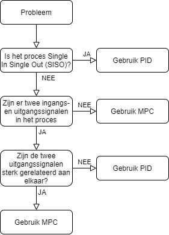

## Bibliografie

[1]G. Ellis, ‘Feed-Forward’, in Control System Design Guide, Elsevier, 2012, pp. 145–163. doi: 10.1016/B978-0-12-385920-4.00008-4.

[2]‘Figure 2. Block diagram of SG-PID controller. Gain scheduling VI in...’, ResearchGate. https://www.researchgate.net/figure/Block-diagram-of-SG-PID-controller-Gain-scheduling-VI-in-LabVIEW-software-is-the_fig4_276198616 (geraadpleegd mrt. 11, 2021).

[3]G. Ellis, ‘Filters in Control Systems’, in Control System Design Guide, Elsevier, 2012, pp. 165–183. doi: 10.1016/B978-0-12-385920-4.00009-6.

[4]G. Ellis, ‘Four Types of Controllers’, in Control System Design Guide, Elsevier, 2012, pp. 97–119. doi: 10.1016/B978-0-12-385920-4.00006-0.

[5]Á. Ò. Èó, ‘Norwegian University of Science and Technology’, p. 585.

[6]A. N. Gündeş, A. N. Mete, en A. Palazoğlu, ‘Reliable decentralized PID controller synthesis for two-channel MIMO processes’, Automatica, vol. 45, nr. 2, pp. 353–363, feb. 2009, doi: 10.1016/j.automatica.2008.08.014.

[7]Y. Jiang en J. Ma, ‘The Research of PID and Bang-Bang Controllers Based on the dSPACE’, p. 8.

[8]G. Ellis, ‘Tuning a Control System’, in Control System Design Guide, Elsevier, 2012, pp. 31–60. doi: 10.1016/B978-0-12-385920-4.00003-5.
