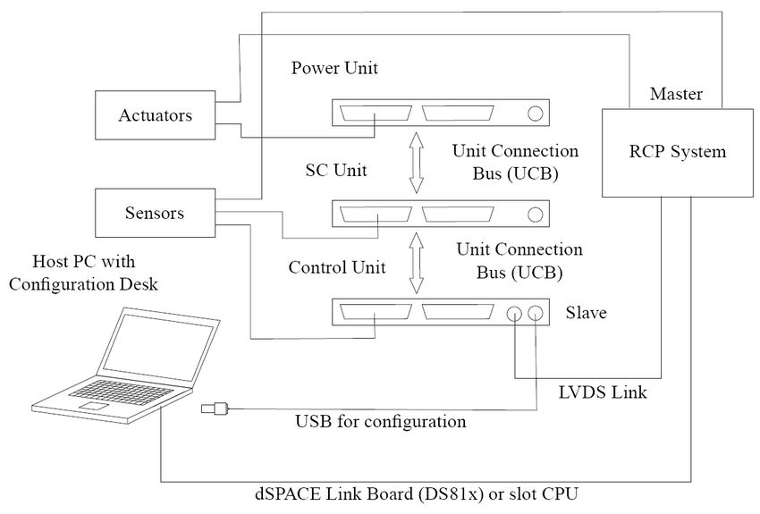
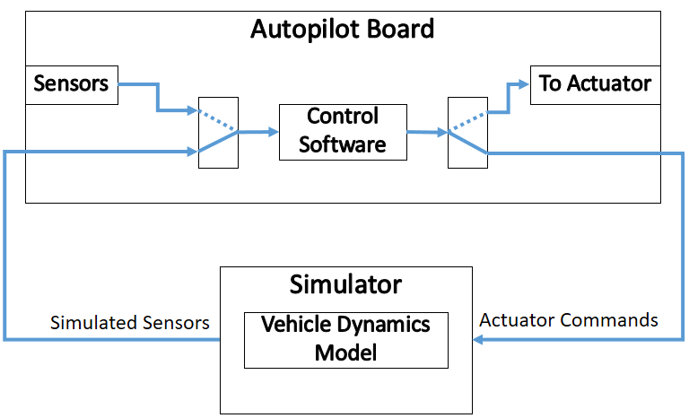
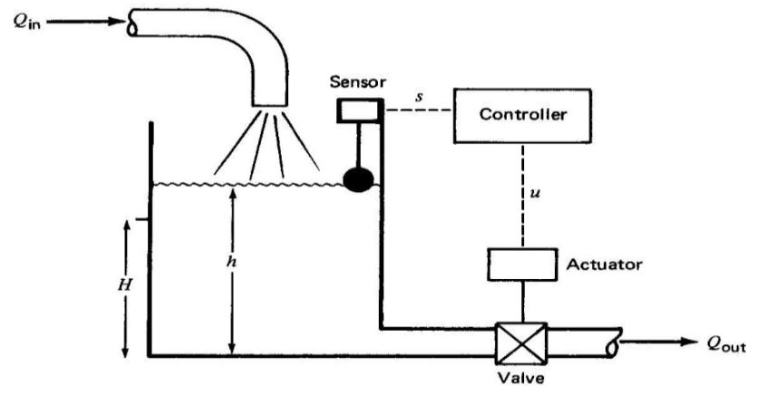
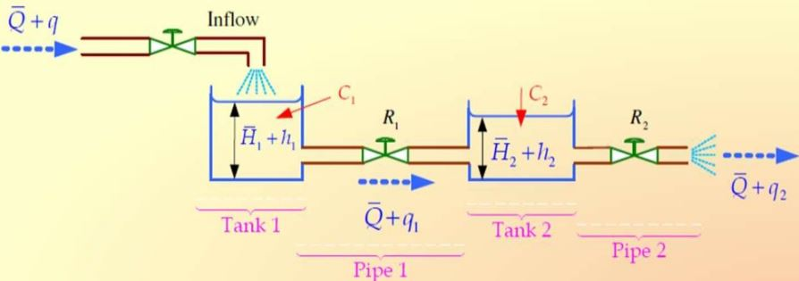
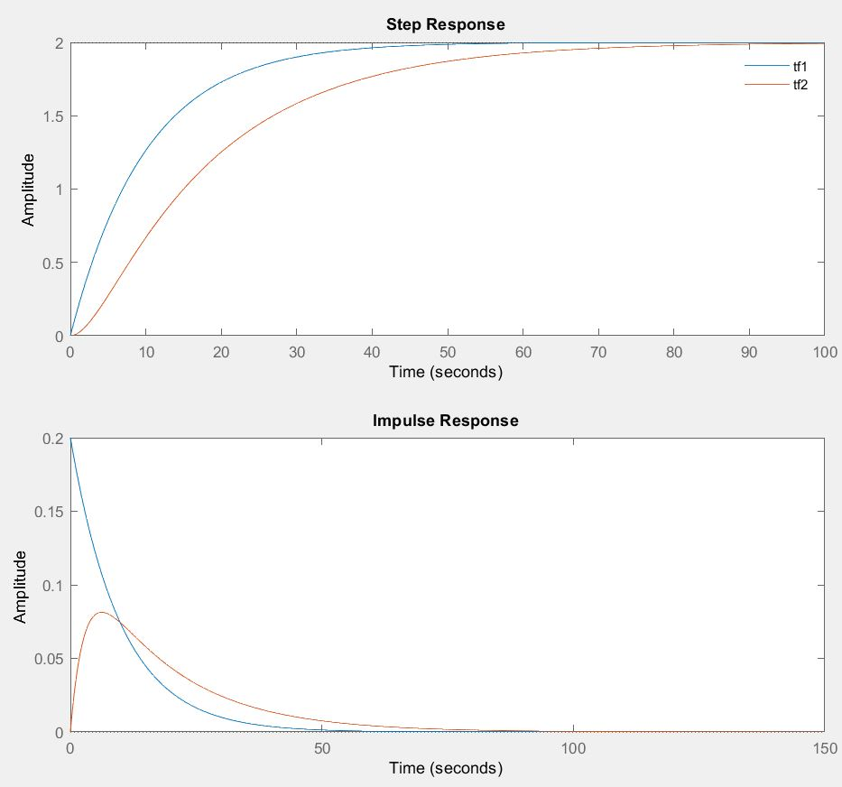
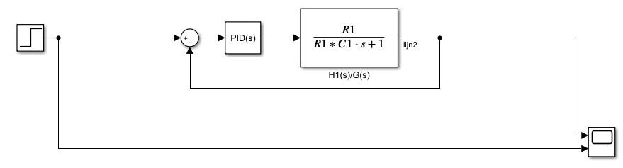
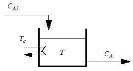
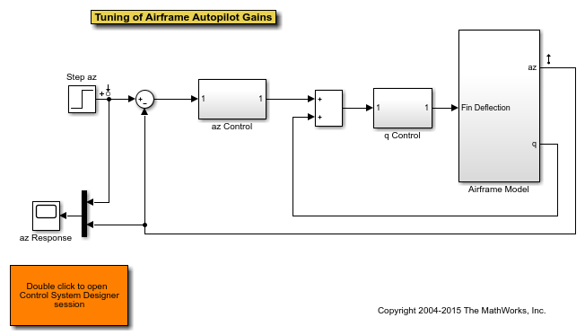

# Implementatie

Van simulatie naar implementatie. Hier staat beschreven op welke wetenschappelijke manier(en) de prestaties en nauwkeurigheid van een model te analyseren valt. Het is de bedoeling om kort maar duidelijk de stappen weer te geven zodat deze zonder modificatie toepasbaar zijn in de industrie.

Validatie: het berekenen van de verschillen tussen werkelijke waarden en geschatte waarden. De geschatte waarden zijn directe uitkomsten van een gemodelleerd proces. 

## Doel

Door volgens een bepaalde strategie te werken is **foutopsporing een pak eenvoudiger** dan bij directe omschakeling van simulatie naar hardware. 

## Rapid Control Prototyping (RCP)

Plan van aanpak:
1. Volledige simulatie
   Het volledige systeem (proces en controller) wordt ontworpen en gesimuleerd in een virtuele omgeving. Dit laat snel ontwerpen van verschillende opstellingen toe.
2. Vervangen 
   Wissel het gesimuleerd proces met het werkelijke proces. De ontworpen regelaar draait virtueel maar stuurt de werkelijke installatie in real-time aan. 
3. Verifieer
   Tijdens de testen, voldoet de gesimuleerde regelaar aan alle eisen? Dan mitigeert ook deze naar de hardware van de werkelijke installatie.

Bij het uitvoeren van control strategieën in real-time zijn verschillende zaken belangrijk. 
Als eerste is het bezitten van voldoende rekenkracht een must om de meet- en stuurfrequentie van de installatie te evenaren.

## Hardware In The Loop (HIL)

HIL lijkt het omgekeerde van RCP. De combinatie van het systeem (feedback, proces, omvormer) in de simulatie en de regelaar op de werkelijke installatie maakt validatie van het model mogelijk. Door de regelaar te valideren in het begin van de ontwerpfase is meer informatie beschikbaar over de effectieve werking en kan men vergelijkingen maken met de regelaar uit de simulatie. Een handeling dat softwareveranderingen kan onderzoeken, ookwel gekend als 'regressie testen'.

Voordelen:
* Het uitvoeren van testen vergt minder inspanning en vertaalt zich naar een **reductie in kost**.
* Verlaagt risico's bij eventuele fouten wat van groot belang is bij veiligheidskritische processen.
* **Versnelde ontwikkeling** bij machine- of procesontwerp. Wanneer de gekozen regelaar beschikbaar is kan het ontwerpen van controlewetten met HIL al starten vooralleer de fysieke installatie toegankelijk is.
* Maakt testen mogelijk van **variërende installaties** die bijvoorbeeld verschillen in vermogen, temperatuur, afstand of gewicht. Het stelselmatig testen van elke uitvoering is tijdsintensief. Door data te capteren van, stel de grootste en de kleinste uitvoering, dan bestaat de mogelijkheid om  alle tussenmodellen te testen via HIL zonder alles fysiek te gaan uitmeten.
* Het is mogelijk om gericht te testen naar onstabiele 'states' of naar 'fault modes'.   

<!--

## Oefeningen

In dit hoofdstuk focussen we ons op het toepassen van de theorie op een aantal veelvoorkomende oefeningen met het doel om inzicht en vaardigheden te verwerven. 

\cite{Instrumentation and control systems}

## Controlle over het waterniveau

### Doelstelling
   
Stel een controller op om het vloeistofniveau in de watertank te beheersen.

### Werkwijze

Beschrijf het systeem met behulp van fysische wetten.

$$Q = k_l H$$

Q: het steady-state debiet [$\frac{m}{s^3}$]

$k_l$: constante [$\frac{m}{s^2}$]

H: steady-state hoogte [m]

$$R_l = \frac{dH}{dQ} = \frac{h}{q_o}$$

$R_l$: de weerstand

$$C = \frac{dV}{dH}$$
V: het opgeslagen volume

C: de capaciteit

$$\frac{dV}{dt} = q_i - q_o = C \frac{dh}{dt}$$

Door de formules te substitueren bekomt men één formule waarin zowel het manipuleerbare ($q_i$) als de te controleren variabele ($H$) zit.
$$C \frac{dh}{dt} = q_i - \frac{h}{R}$$
$$RC \frac{dh}{dt} + h = R q_i$$
Om het oplossen van differentiaalvergelijkingen te omzeilen maken we gebruik van de Laplace transformatie.
$$RCsH(s) + H(s) = R Q_i(s)$$
De transfer functie van het proces wordt bekomen door de manipuleerbare variabele in de teller en de te controleren variabele in de noemer te plaatsen.
$$\frac{H(s)}{Q_i(s)} = \frac{R}{(RCs + 1)}$$

### Cascade van vaten

Een veelvoorkomende opstelling in de industrie is een cascade van systemen. In dit voorbeeld staan twee watervaten na elkaar verbonden met een klep. De vaten hebben een invloed op het waterniveau van het tegenovergestelde vat.

Beschrijf opnieuw de verschillende onderdelen van het proces in een formule vorm met de hulp van fysische wetten.
De eerste tank:
$$C_1 \frac{dh_1}{dt} = q - \frac{h_1 - h_2}{R_1}$$

De tweede tank:
$$C_2 \frac{dh_2}{dt} = \frac{h_1 - h_2}{R_1} - \frac{h_2}{R_2}$$

Leiding 1 beschrijven we als volgt.
$$q_1 = \frac{h_1 - h_2}{R_1}$$

Leiding 2:
$$q_2 = \frac{h_2}{R_2}$$
Let op het verschil tussen de formules.
$$C_1 \frac{dh_1}{dt} + \frac{h_1}{R_1} = q + \frac{h_2}{R_1}$$
$$C_2 \frac{dh_2}{dt} + \frac{h_2}{R_1} + \frac{h_2}{R_2} = \frac{h_1}{R_1}$$
De initiële conditie zal voor de eenvoud gelijk gesteld worden aan nul. ($h_1(0) = 0, h_2(0) = 0$)

De differentiaalvergelijking wordt opnieuw met Laplace getransformeerd.
$$(C_1s + \frac{1}{R_1}) H_1(s) = Q(s) + \frac{1}{R_1} H_2(s)$$
$$(C_2s + \frac{1}{R_1} + \frac{1}{R_2}) H_2(s) = \frac{1}{R_1} H_1(s)$$

Uit de eerste vergelijking bekomen we:
$$H_1(s) = \frac{R_1Q(s) + H_2(s)}{R_1C_1s +1}$$

Door deze vergelijking de substitueren in de tweede formule bekomen we:
$$(C_2s + \frac{1}{R_1} + \frac{1}{R_2}) H_2(s) = \frac{1}{R_1} \frac{R_1Q(s) + H_2(s)}{R_1C_1s +1}$$

We weten dat:
$$H_2(s) = R_2Q_2(s)$$
Hieruit leiden we de volgende formule af:
$$\frac{Q_2(s)}{Q(s)} = \frac{1}{R_2C_1R_1C_2s^2 + (R_1C_1 + R_2C_2 + R_2C_1)s + 1}$$
Deze vergelijking geeft de verhouding weer tussen het ingaande debiet en het debiet dat in het tweede vat binnenstroomt. Het model, welke de werkelijkheid representeert, wordt verder ingevuld met de werkelijke parameters.

Via het software pakket 'Matlab' is het mogelijk om waardevolle tijdsdomeinkarakteristieken weer te geven zoals risetime, settlingtime, overshoot en piekwaarde. De transferfunctie voor een systeem met één vat zal sneller reageren dan twee vaten in serie.

* Stijgtijd: 22s
* Stabilisatietijd: 39s
* Overshoot: 0%
* Piek: 2

Dit is merkbaar wanneer we de stijgtijd en stabilisatietijd met elkaar vergelijken.

* Stijgtijd: 38.5s
* Stabilisatietijd: 70s
* Overshoot: 0
* Piek: 2

Bepaal, met behulp van deze cursus, de P, I en D parameterwaarden  voor een robuust en efficiënt systeem.

https://www.slideshare.net/shekharanku/water-level-controller-42584772
https://nl.mathworks.com/help/slcontrol/ug/passive-control-of-water-tank-level.html

## Continuous Stirred Tank Reactor (CSTR)

Dit is een mooi voorbeeld om gain-scheduled PID control of MPC uit te werken.

In de tank komen exotherme processen voor. M.a.w., de reacties creëren warmte. Hiervoor zijn de volgende differentieelvergelijkingen gegeven.

$$\frac{dC'_A}{dt} = a_{11}C'_A + a_{12}T' + b_{11}T'_c + b_{12}C'_{Ai}$$
$$\frac{dT'}{dt} = a_{21}C'_A + a_{22}T' + b_{21}T'_c + b_{22}C'_{Ai}$$

De ingangen van het proces:

$C_{Ai} [kgmol/m³]$ is de concentratie van het ingaande product A. $T_c [°C]$ is de temperatuur van de reactorkoeling.

De uitgangen van het proces:

$C_{A} [kgmol/m³]$ is de concentratie van het uitgaande product A. $T [°C]$ is de temperatuur van de reactor.

Metingen:

* We hebben controle over de temperatuur van koeling $T_c$. Dit is een manipuleerbare variabele.

* De concentratie van het ingaand reagent A kan wisselen tussen verschillende batches. In dit experiment is de concentratie niet gekend. Daarom is $C_{Ai}$ een niet-meetbare verstoring.

* Metingen van het uitgangssignaal $T$ is beschikbaar.

* Metingen van het uitgangssignaal $C_A$ zijn **niet** beschikbaar.

Stel nu het state space model op:

...

## Vloeistof verwarmer

Informatie volgt.

bron: cursus Frederik

## Stuuroppervlak van een vliegtuig

Informatie volgt.

## Servomotor sturing

Stel met behulp van 'First principals' de differentiaalvergelijkingen op en reken deze om naar het frequentiedomein met Laplace. Bestudeer de polen en nullen.
Hoe zal het systeem reageren in het frequentiedomein bij een stap, impuls en sinusoïdaal ingangssignaal.

...

## Hydraulische kleppen

Hier letten we op het niet-lineair gedrag van de kleppen. Is het mogelijk om een robuuste lineaire regelkring te maken door de niet-lineaire kenmerken rond het werkingspunt te lineariseren?

-->

## Referenties

[1]G. Ellis, ‘Basics of the Electric Servomotor and Drive’, in Control System Design Guide, Elsevier, 2012, pp. 313–349. doi: 10.1016/B978-0-12-385920-4.00015-1.

[2]‘CSTR Model - MATLAB & Simulink - MathWorks Benelux’. https://nl.mathworks.com/help/mpc/gs/cstr-model.html (geraadpleegd feb. 17, 2021).
