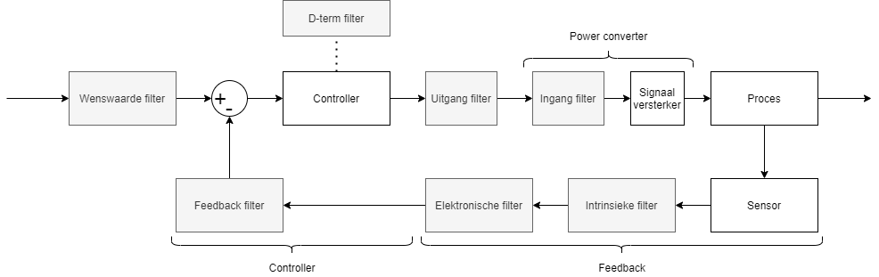
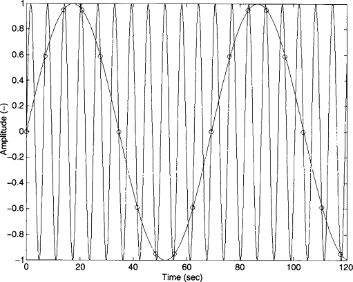
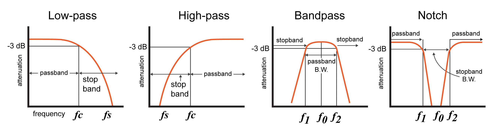
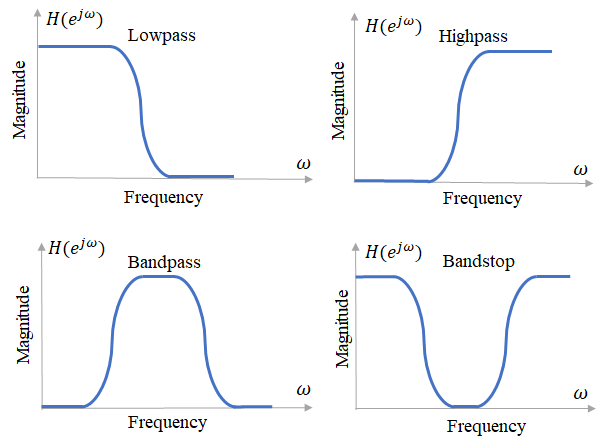
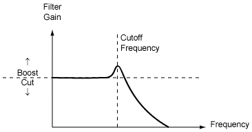
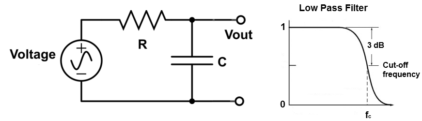
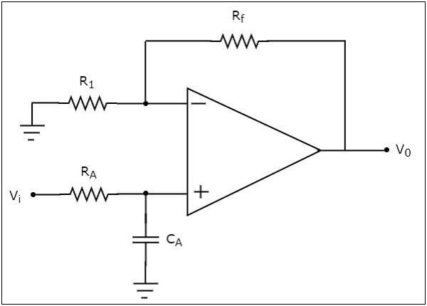

# Filters

Filterimplementatie is sterk afhankelijk van het soort controlestrategie. Hier geven we een voorbeeld van een veelvoorkomende controle feedback structuur met filters.

**In controllers** zijn filters, hoofdzakelijk laagdoorlaat filters, aangewezen om verschillende niet-gewenste effecten te minimaliseren. Fenomenen zoals ruis, resonantie en aliasing hebben een negatieve invloed op de performantie van het systeem.
Ook in **versterkers** en **feedback lussen** zijn filters te vinden.

De meest simpele vorm is een **eerste orde laagdoorlaat filter**. Het is capabel om hoogfrequente ruis te reduceren. Wanneer een systeem een *resonantiefrequentie* heeft rond de systeemfase 180° dan heeft dit gevolgen voor de marge van de versterking (GM). De resonantiefrequentie is herkenbaar op een bodeplot bij een frequentie met hoge amplitude. Als de versterking door ruis of resonantie varieert kan deze de stabiliteitsmarge overschrijden. Wat tot een onstabiel systeem zal leiden.

## Aliasing

**Aliasing** is een fenomeen waarin hoogfrequente signalen ($f_{SIGNAL}> 0.5*f_{SAMPLE}$) lijken op een signalen met lagere frequenties.

Een antialiasfilter bestaat uit een laagdoorlaatfilter met een cutoff-frequentie die groter is dan de gesloten lus bandbreedte van het controlesysteem.

Heel vaak gebruikt men de volgende vuistregel:

$$5 \omega_b =< f_{SAMPLING}*2\pi =< 100 \omega_b$$

$\omega_b$ is de bandbreedte van het gesloten lus systeem. 
$f_{SAMPLING}$ is de samplingfrequentie. 

Een voorbeeld:

Een systeem met een sampling frequentie van 1kHz (= 1000 metingen per seconde) zal ruis met een frequentie van 100001 Hz aanzien als een signaal van 1Hz. Zelfs met zwakke ruis (lage amplitude) zal dit een merkbaar effect hebben op het controle systeem.

> Belangrijke feiten:
> 
> - Filters creëren dode tijd.
> 
> - Filters in de feedbacklus zorgen voor een fase verschuiving. Wat kan zorgen voor onstabiliteit.

**Filters in de terugkoppeling** kunnen zowel expliciet als impliciet van aard zijn. Fysische sensoren zoals thermokoppels hebben een ingebouwde traagheid door hun thermische inertie waardoor ze zich gedragen als een laagdoorlaatfilter.

> De fabrikant van de sensor is een interessante bron in het verstrekken van informatie over eht frequentie antwoord.

## Shannon-Nyquist sampling

De Shannon-Nyquist sampling regel geeft aan dat de samplefrequentie (minstens) twee keer dat van de gewenste signaalfrequentie moet bedragen. Dit laat toe om het samengestelde signaal in zijn frequentiespectrum te bestuderen. Om de amplitude en de vorm van het gewenste signaal te representeren is een grotere samplefrequentie nodig. Vaak 10 tot 20 groter.

$$ f_{SAMPLING} = f_{SIGNAL} * 2 $$

## Vuistregels

* Stel een meetfrequentie in die 10 à 20 keer groter is dan de gewenste signaalfrequentie.
* Gebruik de Butterworth filter voor periodische/oscillerende signalen.
* Gebruik de Bessel filter voor stap/impuls signalen.

## Procedure

1) Start met het signaal op te meten met de hoogst mogelijke samplingfrequentie.
2) Zet de filter op het meettoestel uit om een onvervormd beeld te krijgen van het signaal.
3) Voer een Fourier analyse uit op de opgemeten data.
4) Baken het specifieke frequentie bereik af.

## Filtertypes

We verdelen filters hoofdzakelijk in vier categorieën.

1. Laagdoorlaat filters
2. Bandsper (notch) filters
3. Hoogdoorlaat filters
4. Banddoorlaat filters

In regelsystemen zijn **laagdoorlaat en bandsper** filters de meestgebruikte.

### Laagdoorlaatfilters

Laagdoorlaatfilters hebben een karakteristieke bandbreedte waarvan de frequentie op het -3dB punt ligt. Dit punt werd gekozen omdat dit een halvering van de signaalsterkte voorstelt. (-3dB staat gelijk aan een versterking van ong. 0.5)

De meest eenvoudige laagdoorlaat filters bestaan enkel uit polen. Een eerste orde laagdoorlaat filter heeft er één.

$$T(s) = \frac{K}{s+K}$$

De tijdsconstante ($\tau$) is gelijk aan 1/K, dus:

$$T(s) = \frac{1}{\tau s+1}$$

We kunnen een tweede orde filter maken door twee eerste orde filters in serie te plaatsen. Dit geldt ook voor hogere orde filters.

Een tweede orde laagdoorlaat filter heeft twee polen die reëel of complex kunnen zijn.

$$T(s) = \frac{\omega N^2}{s^2 + 2\xi \omega Ns + \omega N^2}$$

$\omega _N$: de natuurlijke frequentie

$\xi$: de dempingsverhouding

* Als de dempingsverhouding kleiner is dan 1, dan zijn de polen complex. **Hoe lager de dempingsverhouding, hoe groter de overshoot.**
* Een dempingsverhouding onder de 0.707 veroorzaakt een piek in de versterking van de filter. Dit is niet altijd gewenst.
* De reden waarom vaak lage dempingsverhoudingen gekozen worden ligt aan het feit dat ze minder faseverschuiving veroorzaken bij lagere frequenties, wat belangrijk is voor de stabiliteit!

Het komt neer op het zoeken van een evenwicht. We wensen hoge frequenties te verzwakken zonder grote faseverschuivingen te veroorzaken bij lage frequenties.

Voorbeeld:

Stel een tweede orde filter voor met een verzwakking van minstens 20 dB voor alle frequenties boven de 200 Hz. De faseverschuiving op 20 Hz moet zou klein mogelijk blijven.

$$\begin{array} {|r|r|r|r|r|}\hline \text{Filter orde} & \text{Dempingsverhouding} & \text{Bandbreedte [Hz]} & \text{Verzwakking bij 200 Hz [dB]} & \text{Fase verschuiving bij 20 Hz [°]} \\ \hline 1 & Nan & 21 & 20 & 43 \\ \hline 2 & 1 & 66 & 20 & 33 \\ \hline 2 & 0.7 & 63 & 20 & 26 \\ \hline 2 & 0.4 & 60 & 20 & 16 \\ \hline  \end{array}$$

Bij een tweede orde filter zal een dempingsverhouding < 0.707 resulteren in een piek op de afhaakfrequentie (=cutoff). Let op: een te grote piek kan de versterkingsmarge verkleinen! Een waarde tussen de 0.4 en 0.707 is een goed startpunt.

### Bandsperfilter

Een bandsperfilter is een tweede orde filter met twee polen en twee nullen. Het alleen in een bepaald frequentiegebied waardoor er minder faseverschuiving optreedt dan bij laagdoorlaatfilters. Zeer handig voor het verminderen van specifieke ruis (bv. 50-60Hz bij elektrische voeding). Het instellen gebeurt naar gelang de aanwezige ruis of resonantie in het systeem. Digitale systemen zijn veel nauwkeuriger ten opzichte van analoge want passieve componenten in analoge toepassingen kunnen variëren (in functie van de tijd, temperatuur,...). Dit is correct voor individuele filters maar ook voor controlesystemen.  

$$T(s) = \frac{s^2 + \omega _N^2}{s^2+2\xi\omega_N s + \omega _N^2}$$

> Een grotere dempingsverhouding zorgt voor een scherpere afbakening tussen de bandbreedte en af te zwakken deel.
> 
> Een grotere dempingsverhouding zorgt voor een kleinere faseverschuiving.

## Implementatie van filters

In werkelijkheid zien we opnieuw vijf verschillende filter categorieën:

* Passieve analoge filters
* Actieve analoge filters
* Wisselende capacitieve filters
* Oneindige impuls reactie (IIR) digitale filters
* Eindige impuls reactie (FIR) digitale filters

1) $\underline{\text{Passieve (analoge) filters}}$ zijn zeer eenvoudig en bestaan hoofdzakelijk uit een weerstand en een condenstator. Voor filters met hogere ordes (>2) zijn actief analoge of digitale technieken aangeraden. De filternauwkeurigheid van analoge filters hangen af van de tolerantie van de gebruikte componenten.

    R: weerstand [$\Omega$]

    C: capaciteit [F]

    $f_c$: afsnijfrequentie (= cutoff)

$$f_c = \frac{1}{2\pi RC}$$

1) $\underline{\text{Actieve (analoge) filters}}$ maken gebruik van een actieve component (meestal een versterker) in hun filterschakeling. Ze zijn in staat om het signaal te versterken door energie toe te voegen aan het signaal. In tegenstelling tot passieve filters die geen energieverhoging kunnen veroorzaken.

3) $\underline{\text{Wisselende capaciteit filters (=SCF)}}$ maken gebruik van schakelaars en op-amps. Zo vermijden ze het tolerantieprobleem en temperatuurafhankelijk effect van analoge/passieve componenten. Er zijn passieve elementen aanwezig maar in mindere mate.

4) $\underline{\text{Oneindige impuls reactie (IIR) digitale filters}}$ is een recursieve filter. Het berekent het uitgangssignaal aan de hand van de ingangssignalen **en** de voorgaande uitgangswaarden. De reactie van de filter op een impuls ingangsignaal zal hoog zijn in het begin maar zal langzaam aan dalen richting nul. Deze zal echter **nooit** nul raken.

* Een eerste orde laagdoorlaat IIR filter:

$$T(z) = z(1- e^{-\omega T})/(z- e^{-\omega T})$$

  * Voorbeeld:

    Een filter met een bandbreedte van 200Hz is gewenst bij een sampling snelheid van 4kHz.

    $\omega$ = $2\pi f$ = $2\pi 200$ = 1256 rad/sec
    T = $1/f_{sampling}$ = 1/4000 = 0.00025 sec

    De resulterende transferfunctie:

$$T(z) = z(0.2696)/(z- 0.7304)$$

5) $\underline{\text{Eindige impuls reactie (FIR) digitale filters}}$ is een niet-recursieve filter. Het uitgangssignaal is **enkel** afhankelijk van de voorgaande ingangssignalen. Een 'moving average' filter is een voorbeeld van een FIR filter en is zeer intuïtief.

$$T(z) = (1+\frac{1}{z}+\frac{1}{z^2}+...+\frac{1}{z^M})/(M+1)$$

## Kalman filter

Het is haast onmogelijk om te werken met controle en datacaptatie zonder de naam 'Kalman' tegen te komen. De Kalman filter is een techniek vanuit de jaren 60' die relevant blijft zelf tot op de dag van vandaag. Het vergt tijd en oefening om de basisprincipes onder de knie te krijgen maar de praktische meerwaarde is de inspanning zeker waard.

De onderstaande link geeft een fantastisch uitleg over de werking van Kalman filters, waarvoor geen voorkennis nodig is. 

[Wat is een Kalman filter?](https://www.kalmanfilter.net/default.aspx)

<!--
theorievragen
zie pagina 59 in HS3 control system design guide
-->

## Bibliografie

[1]M. S. Fadali en A. Visioli, ‘Chapter 12 - Practical issues’, in Digital Control Engineering (Third Edition), M. S. Fadali en A. Visioli, Red. Academic Press, 2020, pp. 567–614. doi: 10.1016/B978-0-12-814433-6.00012-0.

[2]G. Ellis, ‘Filters in Control Systems’, in Control System Design Guide, Elsevier, 2012, pp. 165–183. doi: 10.1016/B978-0-12-385920-4.00009-6.

[3]‘Getting the Sample Rate and Filter Right!’, HBM, dec. 02, 2020. https://www.hbm.com/en/9339/getting-the-sample-rate-and-filter-right/ (geraadpleegd feb. 12, 2021).
