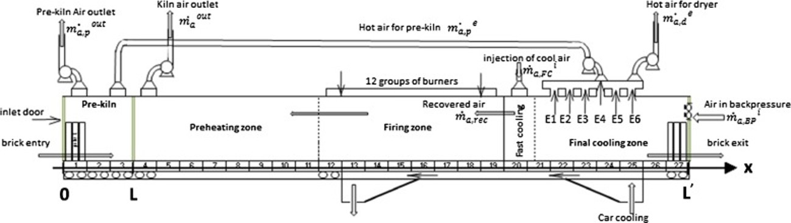
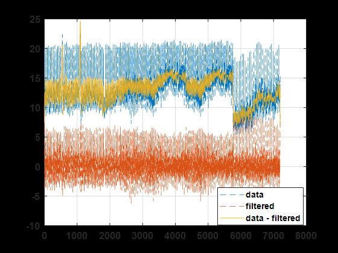
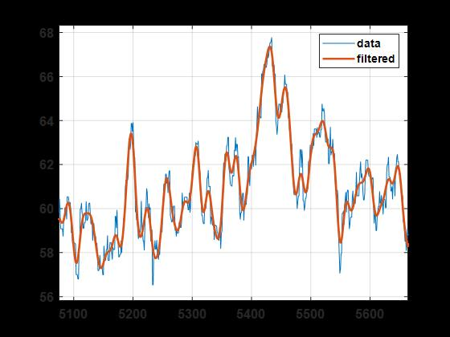
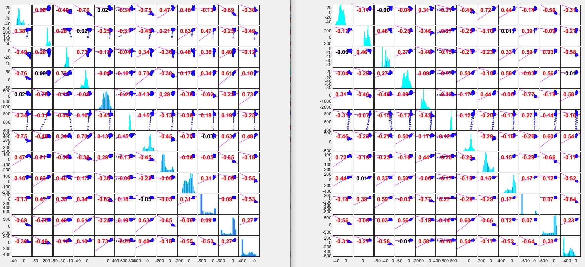
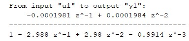
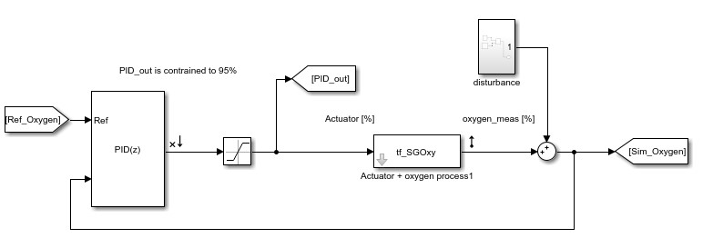
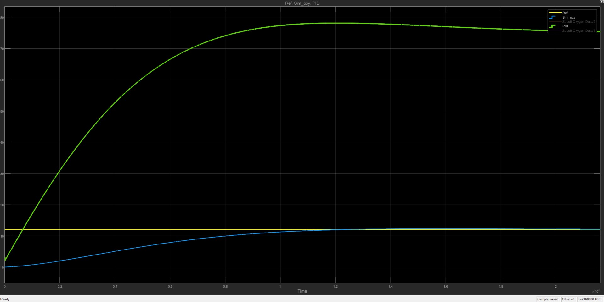

# Case 1

## Probleemomschrijving

Zuurstofregeling in een veiligheidskritische oven voor gevelsteenproductie 

### Wat is het probleem

* Informeel:
  * Het globale energieverbruik minimaliseren aan de hand van verbeterde PID parameters. 
  * Een nieuwe regeling implementeren voor zuurstofcontrole.
  * (Warmte naar drogerij beter benutten)

* Formeel:
  * De te controlleren variabele is zuurstof
  * Het onnodig aansturen van de rookgasventilator verminderen
    * sensitiviteit verminderen
    * robuustheid vergroten
    * 'overshoot' verminderen
  * Extra PID regelaar toevoegen

* Veronderstellingen

  * Verstoringen:
    * variaties warmtecapaciteit van product
    * variaties in productmassa 
    * openen en sluiten van oven sluis
    * variaties in brandstoftoevoer naar branders
  * Systeem:
    * Niet-lineair
    * Dode tijd
    * Variabel in functie van de tijd

* Gelijkaardige probleemstellingen

[1]Y. V. P. K. Y V Pavan Kumar, ‘Cascaded PID Controller Design for Heating Furnace Temperature Control’, IOSR-JECE, vol. 5, nr. 3, pp. 76–83, 2013, doi: 10.9790/2834-0537683.

[2]H. Zhang, ‘Simulation of Furnace Cascade PID Control System Based on Matlab / Simulink’, in 2011 International Conference on Computer and Management (CAMAN), mei 2011, pp. 1–3. doi: 10.1109/CAMAN.2011.5778784.

### Vereisten

...

### Hoe oplossen

Cascade PID biedt mogelijkheden. Want:
* lange dode tijden
* niet-lineaire procesdynamica
* grote externe verstoringen


## Het proces

Gevelstenen bewegen volgens de figuur van links naar rechts waarbij de warme lucht van rechts naar links stroomt. Branders in 12 groepen zorgen voor de temperatuurbeheersing die volgens een specifiek patroon moet lopen. De luchtstroom is afhankelijk van drie ventilatie eenheden. De rookgasventilator in het begin van de oven, de verse lucht ventilator op het einde van de oven en de ventilator naar de drogerij. We verwaarlozen de lucht die wordt ingeblazen door de branders. 




## Data

De invloeden van externe verstoringen en sensorruis hebben een negatief effect tijdens de identificatie van processen.
Door een **laagdoorlaat filter** zullen signalen met een lage frequentie een groter aandeel in het resulterende signaal bekleden. Signalen met een hoge frequentie (zoals sensorruis) worden gedempt in amplitude en zullen dus minder merkbaar zijn.

Het gebruik van een hoogdoorlaat filter heeft dezelfde functie maar zal hoogfrequente signalen doorlaten. Hiermee kunne ruis en hoogfrequente verstoringen gescheiden worden van het basissignaal.
De cut-off frequentie geeft aan wanneer de scheiding tussen hoge en lage frequenties wordt ingezet. Bij een sampling rate van 1/30 [Hz] leek een cut-off van 1/1500 [Hz] goede resultaten op te leveren.





Niet alle verbanden die we vinden zijn oorzakelijke verbanden. De **‘corrplot’ functie** in Matlab maakt het berekenen van de R-waarden gemakkelijker. Er bestaan verschillende methodes met hetzelfde doel. Een cijfer geven dat de sterkte aangeeft van het verband tussen twee varabelen. Wij gebruiken het Pearson correlatie coëfficiënt R. Als R < 0, dan is er een negatief verband. Gelijk aan nul, dan kunnen we niet spreken van een merkbaar verband. Als R > 0, dan zien we een positief verband. Zowel positief als negatief is R begrensd tot -1 en +1. Hoe dichter bij absoluut 1, hoe sterker de relatie. 

 ```bash
% function modelR = corr_model(data,Th,num_par,Order)

data:     Dataset (aantal observaties x aantal variabelen)
Th:       Threshold
Num_par:  Number of parameters
order:    Model order
```


Een lokale dataset geeft de set weer waarin één type steen de oven in- en uitgaat. Door **correlatiecurves** tussen globale en lokale sets te vergelijken kunnen we enkele conclusies omtrent betrouwbaarheid bekomen.

De illustratie aan de linker zijde stelt de correlatiematrix van de lokale set voor en de rechter zijde de globale set. We zien in het algemeen een daling van de R-waarden wat de voorspellen was. Een grotere set heeft een grotere spreiding en de R-waarde is een maat voor de afstand van alle datapunten tot de gefitte curve. Voor veel verbanden tussen parameters zal dit dus een vermindering van R-waarde betekenen. Wat niet wilt zeggen dat het model niet correct is.



## Analyse

### Systeem identificatie

<!--
In veel situaties is een dynamisch representatie van het systeem niet beschikbaar. Een oplossing is het verkrijgen van een dynamisch model door identificatie. Het systeem verandert van staat door in te grijpen in het proces. De ingangssignalen en uitgangssignalen verzamelen we in een input-output dataset en bouwen hiermee transfer functie of state-space modellen. State-space modellen worden als volgt voorgesteld:

dx/dt = A x(t) + B u(t) + K e(t)

y(t) = C x(t) + D u(t) + e(t)

De matrices A, B, C, D en K worden door de computer berekend om zo nauwkeurig mogelijk de punten in de dataset te benaderen.
In dit geval gaf een state-space model een nauwkeurigheid ($R^2$) van 98% op de validatiedataset. Een complex (maar precies) model om met de Matlab 'PID Tuner' Toolbox PID regelaars te ontwerpen. 
-->

|Parameter|   |
|-------|-------|
|Actuator|rookgasventilator|
|Controlled Variable(CV)|zuurstof|
|Modelstructuur|transferfunctie|
|Frequentieverdeling|discreet|
|Modelfrequentie (Ts)|60 [$s$]|
|Identificatie methode|Random input|
|Trainset|van x tot y|
|Validatieset|van y tot z|

|Resultaat|Waarde|
|-------|-------|
|$R^2$|92%|
|Tijdsconstante|...s|



|Parameter|   |
|-------|-------|
|Actuator|zuluftventilator|
|Controlled Variable(CV)|zuurstof|
|Modelstructuur|transferfunctie|
|Frequentieverdeling|discreet|
|Modelfrequentie (Ts)|60 [$s$]|
|Identificatie methode|Random input|
|Trainset|van x tot y|
|Validatieset|van y tot z|

|Resultaat|Waarde|
|-------|-------|
|$R^2$|92%|
|Tijdsconstante|...s|


### Controle design

#### Rookgas-zuurstof

Het blokschema, zoals te zien in Simulink, ziet er als volgt uit.



Zie het hoofdstuk regeltechniek om verschillende prestatieparameters van de regelkring te genereren en te bestuderen.




## Besluit

1) De cyclustijd van de toegepaste PLC is belangrijk voor verdere analyses.
<!--Evelien zal dit bekijken-->
2) Door het grote verschil in traagheid tussen temperatuur en zuurstof zijn filters op het zuurstofsignaal aanbevolen
3) Bij sturing van het zuurstofgehalte in de oven worden de volgende aspecten voorgesteld.

De regelaar heeft parameters P (), I() en D() parameters waarbij het ingaande signaal de (gefilterde) zuurstofmetingen bevat en de rookgasventilator aanstuurt om het proces te sturen.

De oven heeft een aanleg voor meer geavanceerde sturing door zijn eigenschappen om meerdere controlevariabelen, inherente verstoringen (productvariatie), verschillende actuatoren met gekoppelde effecten en veiligheidskritische aspecten zoals temperatuurslimieten te bezitten. 

## Validatie

Een 