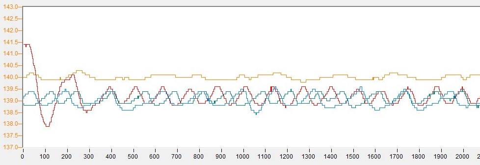
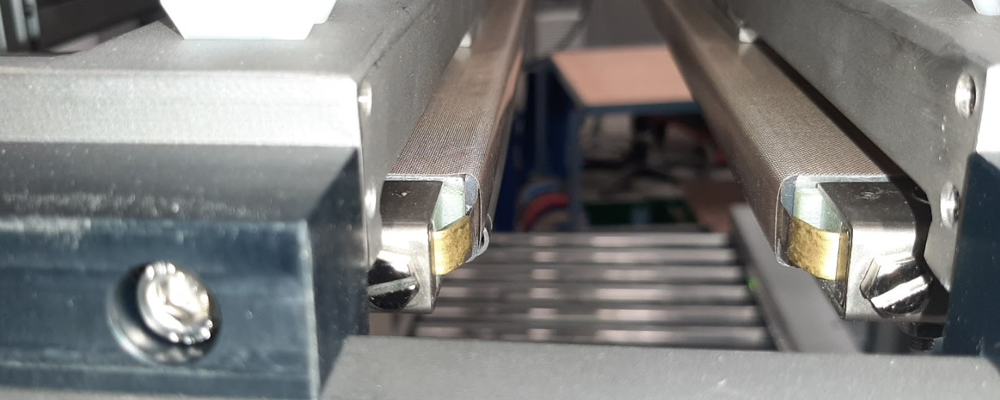
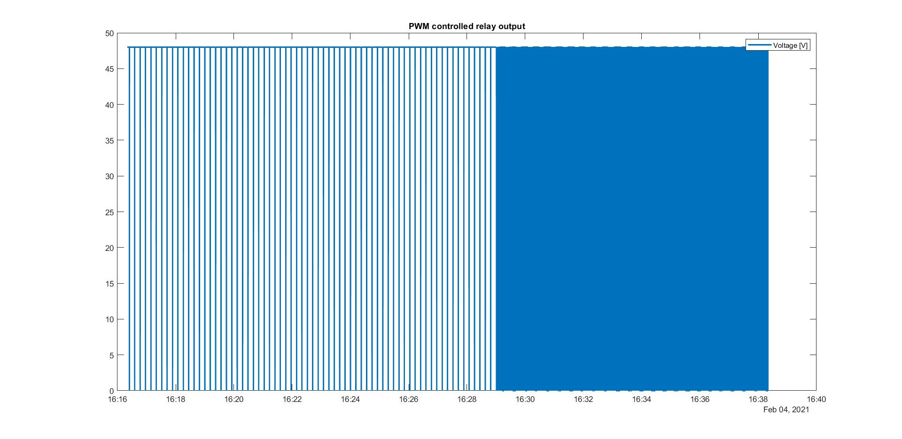
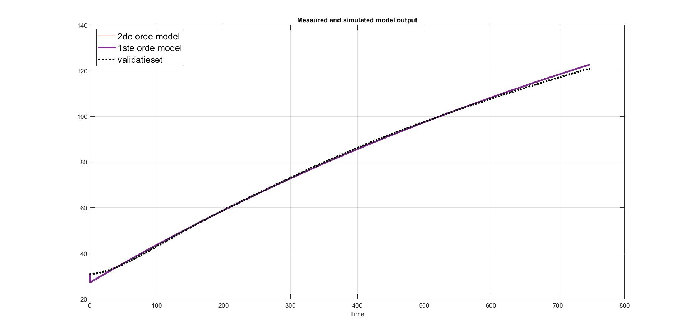
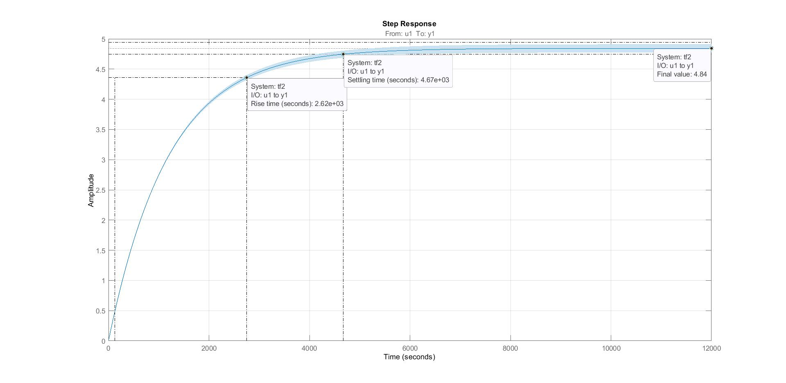
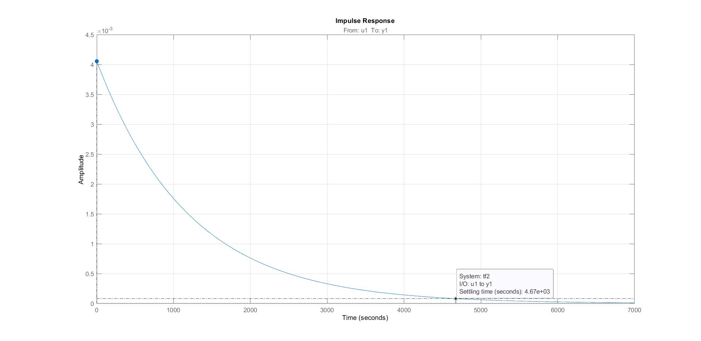
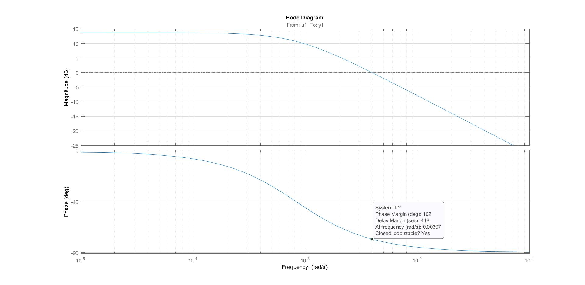
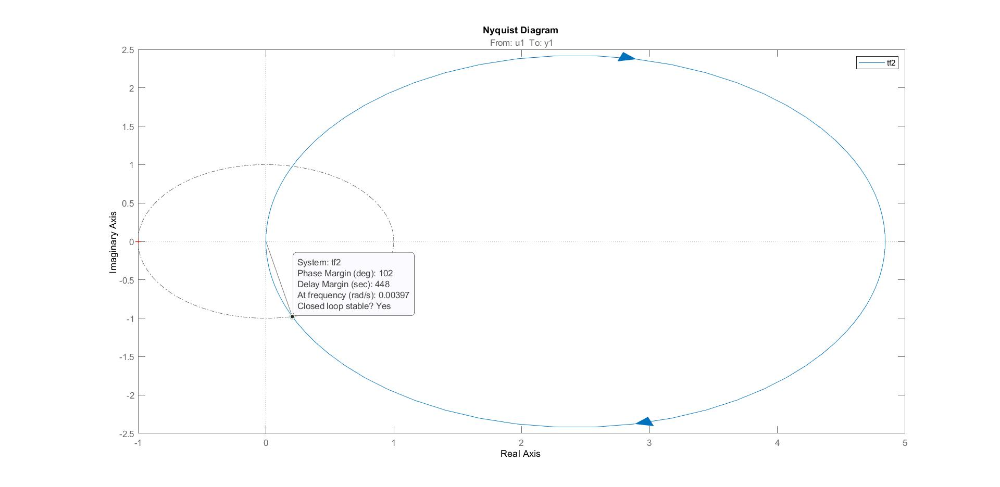
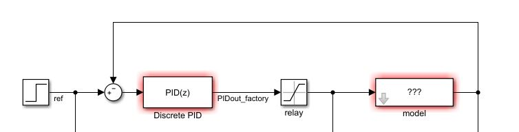
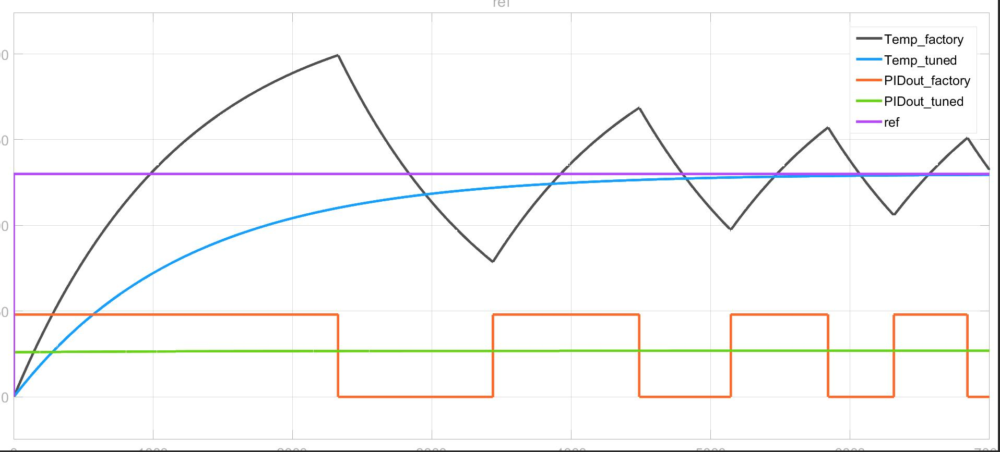

# Case 2

## Doelstelling

Aansturing van weerstandspatronen voor het dichtsmelten van plastiek verpakkingen.

Uit voorgaande experimenten is er een oscillatie zichtbaar rond de setwaarde. We gaan aangeven wat de oorzaak en de oplossing hiervan is. De doelstelling is het verbeteren van de setpoint-tracking karakteristieken volgens de procedure(s) die in deze cursus beschikbaar zijn.

## Probleemomschrijving

### Wat is het probleem

* Informeel:
  
Teveel schommelingen

* Formeel:

Temperatuursturing stabiliseren.

* Veronderstellingen
  * Omgevingstemperatuur heeft weinig invloed op het proces
  * De sensor (thermokoppel J) is voldoende nauwkeurig 

### Waarom bestaat het probleem?

* Motivatie

Wat is het uiteindelijke doel door het probleem op te lossen? Zijn er bijvoorbeeld persoonlijke redenen om technieken bij te leren door ze toe te passen? Zijn er doelstellingen die door het management opgelegd worden?

* Voordelen

Wat is de gecreëerde meerwaarde door het probleem op te lossen? Verhoogt het productiecapaciteit, veiligheid, kwaliteit, et cetera? 

* Levensduur

Denk aan het onderhouden van een gevonden oplossing. Als er een programma werd geschreven (of gebruikt). Hoelang zal het duren voorleer deze opnieuw nodig zal zijn? Moet het herschreven worden met updates? Je wilt een oplossing dat lang meegaat en gemakkelijk is om up-to-date te houden.

### Vereisten

Opstarttijd binnen 30 minuten.
Overshoot mag niet meer dan 0.1 °C.

### Hoe oplossen

* Start met datacaptatie via identificatie experimenten (stapingang, bloksignaal, sinusoïdaal,...) 
* Bouw modellen en verifieer
* Ontwerp regelaar prototypes en pas toe 

## Totale systeem

Met behulp van een SSR (solid state relay) zal een PID regelaar de spanning over de weerstandspatronen controleren om uiteindelijk een correcte temperatuur te gaan opmeten..

Enkele eigenschappen:

* De sensor is een thermokoppel type J.
* De actuatoren zijn weerstandspatronen, werkende op 48V.
* De krachtomvormer is een transformator en een SSR.
* PID controller:
  * $K_p$ : de versterker (P-gain) van de controller
    * 12 
  * $K_i$ : de integratieversterker (I-gain) van de controller
    * /
  * $T_i$ : de integratietijd (integrator) van de controller
    * 160 s 
  * $K_d$ : de afgeleide versterker (D-gain) van de controller
    * /
  * $T_d$ : de afgeleide tijd (derivative) van de controller
    * 35 s 
  * ddt : filtercoëfficiënt van de D-parameter (= damping time)
    * 10 s
  * Cyclustijden
    * PLC programma
      * frequentie: 200 Hz
    * Pulse Width Modulation (PWM) uitgangssturing
      * frequentie: 1 Hz
  
  

## Data

### Opstart (historisch)

Bij een relatief simpel proces kan het een hulp zijn om de verschillende variabelen te visualiseren. De PID regelaar stuurt een PWM signaal uit naar de SSR. 

Met de volgende temperatuurscurve als resultaat. De gewenste temperatuur bedraagt 130°C.  

## Analyse

Er werd slechts in één situatie data gecapteerd. Bij opstart én met één bepaalde setwaarde. Het is aan te raden een stap-ingang experiment (zoals hier bij opstart) verschillende malen opnieuw uit te voeren.

### Experiment

Regelaar #1
* P: 12
* I: 160 s
* D: 35 s
* Ddt: 10 s
  
Regelaar #2
* K_p: 12
* T_i: 160 s
* T_d: 0 s
* Ddt: 0 s

Regelaar #3 (gebaseerd op fout model)
* K_p: 0.2
* T_i: 1194 s
* T_d: 0 s
* Ddt: 0 s

### Experiment Douglas

> Let op: enkel toepassen op stabiele processen.
 
1. Laat de versterking ($K_c$) toenemen tot het uitgangssignaal begint te oscilleren met een vaste amplitude en fase. 
2. Meet de frequentie ($f_c$) van dit sinusoïdaal signaal op.
3. De formule $2\pi f_c$ geeft je de hoekversnelling $\omega_c$.

$$\tau_I = \frac{5}{\omega_c}$$
$$\tau_D = \frac{1}{\omega_c}$$
$$\omega_c = 2\pi f_c$$

De setpoint werd vastgelegd op 140 °C en de $K_p$ stillaan verhoogd naar 60. Het oscillerend signaal heeft een periode van 127.6 seconden. De frequentie is 0.0078554595443833 Hz. De resulterende hoekversnelling $\omega_c$ is $2\pi f_c$, dus gelijk aan **0,0493322859387274** rad/s. 

$$\tau_I = \frac{5}{0,0493322859387274} = 101,35 \text(seconden)$$ 
$$\tau_D = \frac{1}{0,0493322859387274} = 20.27 seconden$$

Met prop. versterking van 60 oscilleert het uitgangssignaal. Door te verlagen naar 12 kwamen we een settlingtime van ong. 20 minuten uit.

### Systeem identificatie

In de dataset is de zien dat in de opstarten van het proces de SSR bekrachtigd blijft (= zet een spanning van 48V over de lasdraden). Dit komt overeen met een stapingang. De totale set bedraagt 12000 datapunten, met een samplefrequentie van ongeveer 9Hz. Deze lage frequentie valt te verantwoorden door de traagheid van het (thermisch) proces.  

Het model is gebaseerd op het input-output perspectief dus het volgende is duidelijk:

- Manipulatieve parameter (input): spanning [V] over de weerstand
- Controle parameter (output): temperatuur [°C] gemeten door de thermokoppels

Het is een goede gewoonte om de parametereenheden mee te nemen in de benaming.

Doorloop de systeem identificatie flowchart. Filters en uitmiddelen zijn in dit geval niet noodzakelijk. Om de workflow te vereenvoudigen splitsen we de originele dataset op en gebruiken enkel de eerste 6800 datapunten. In dit gebied reageert het proces puur op de stapingang zonder invloeden van de schakelende SSR. 

De aangepaste dataset splitsen we opnieuw in een trainingset (1 tot 5500) en een validatieset (5501 tot 6800). Tijdens de validatie zijn de modelprestaties zichtbaar op datapunten die niet werden gebruikt om het model te trainen. De validatiefase dient als maatstaf voor de modelbetrouwbaarheid.

De Matlab 'System Identification Toolbox' maakt het fitten van een continue transferfunctie mogelijk. Door het duidelijke eerste orde karakter bij het waargenomen stapantwoord is een enkele pool zonder nullen een goede initiële keuze. 

De software geeft het volgende model weer met een fit ($R^2$) van 97.57%. 

$$G(s) = \frac{0.004055}{s + 0.0008372} = \frac{4.84}{1194s + 1}$$

Uit de systeem identificatie is het mogelijk om waardevolle informatie te extraheren. 

K (versterking) = 4.84

$\tau$ (tijdsconstante) = 1194.5

,vaak ook een indicatie van de dode tijd.

Het is een goede gewoonte om het bekomen model zowel in het tijds- en frequentiedomein te bekijken.

Het stapantwoord:

Het impulsantwoord:

Bode:

Nyquist:

### Controle ontwerp

De werkelijke opstelling gebruikt een aan/uit schakeling om het weerstandspatroon op te warmen. Het is mogelijk om dit te vereenvoudigen en de uitsturing van de PID regelaar te zien als directe aansturing maar continu in de plaatst van discreet. De relay blok in de illustratie stelt de saturatiespanning van 48V voor.

Uit de dataset werd de controle frequentie op 0.5 Hz geschat wat in de simulatie werd meegenomen. Op de illustratie zijn twee verschillende regelingen te zien. 'factory' slaat op de oorsponkelijke regeling met de parameters: P = 12, Ti = 160s en Td = 35. Het nieuwe parameterstartpunt werden berekend aan de hand van de IMC procedure.

<!--
Met dode tijd:
$$G(s) = \frac{4.84}{1194s + 1} * e^{-40s}$$
-->

Het procesmodel:
$$G(s) = \frac{4.84}{1194s + 1}$$
De controllerversterking:
$$K_c = \frac{1}{K} = 0.2 \text{ (afgerond)}$$ 
De integratietijd:
$$\tau_I = \tau = 1194 s$$
De integratieversterking:
$$K_i = \frac{K_c}{\tau_i} = \frac{0.2}{1194} = 1,67*10^{-4}$$

## De simulatie

## Validatie

Stel een experiment op om de uiteindelijke oplossingen te testen in een industriële omgeving. Zijn de verwachtingen gelijk aan de werkelijke resultaten bij het toepassen van de vooropgestelde oplossingen?

Mogelijke technieken: [RCP, HIL](docs\guide\05_praktische_aanpak\README.md), et cetera

Constructie en implementatie:
* Zorg voor aansluitende hardware en software
* Bouw het systeem virtueel op

Systeem integratie:
* Test de subsystemen
* Voer HIL simulatie uit
* Verbeter en fine-tune
* Test de veiligheid en betrouwbaarheid

Veldtest:
* Pas een test scenario toe
* Integreer testen tijdens het standaard werkschema van de installatie (prestaties onder verschillende condities)
* Analyseer (statistisch) en verbeter prestaties

Productie:
* Draag virtuele componenten over naar hardware

## Besluit

Een PID-regelaar ontwerpen is mogelijk gebleken door kennis uit te buiten van één dataset bij een stapantwoord experiment. Het filteren van de signalen is niet noodzakelijk door het gebruik van de juiste meetfrequentie en het intrinsiek traag karakter van het proces. 

De initiële vraag was tweeledig. 

1. Welke methodologie moeten werknemers volgen om succesvol regeltechnische systemen te analyseren en procesparameters te schatten. 
2. Hoe kunnen we slingering voorkomen die merkbaar is bij de opstelling van een thermische proces. 

De online cursus, welke vrij toegankelijk is, is een antwoord op de eerste vraag. Duidelijke stappenplannen zijn verkrijgbaar welke variëren in de noodzakelijke voorkennis en performantie eisen. 

Het antwoord op de tweede vraag valt af te leiden uit het opstartproces dat gesimuleerd werd in punt 6. De versterkende parameter in de oorspronkelijke regelaar stond te hoog ingesteld waardoor de regelaar overcompenseert. 

Verdere verbeteringen zijn zeker mogelijk. De aan/uit schakeling is een goedkoop en robuust systeem maar zal regeltechnisch snel op grenzen stoten. Frequentieomvormers bijvoorbeeld laten continue aansturing van de spanning toe en maken nauwkeurige regelsystemen mogelijk. Een andere, minder ingrijpende, verandering is het toevoegen van een anti-windup schakeling om oplopende regeluitsturingen te voorkomen.  
