# Case 3

## Probleemomschrijving

### Wat is het probleem

* Informeel:

Twee destillatie kolommen staan in serie met elkaar geschakeld waardoor uitgaand product van de eerste kolom (K202) de toevoer wordt van de tweede kolom (K600). Er treden schommelingen op bij het regelen van het productniveau in elke kolom. Deze oscillaties wenst men te vermijden in de toekomst.

* Formeel:

Het implementeren van nieuwe PID-parameters welke robuustheid en stabiliteit van de productniveauregeling verhoogt. Ook de mogelijke meerwaarde van meer geavanceerde control zal aan bod komen.

* Veronderstellingen:

  * Traagheid van de actuatoren (kleppen) zijn verwaarloosbaar
  * Temperatuur- en drukvariaties verstoren de niveauregeling
  * Er zijn enkel niveaumetingen beschikbaar
  * De hardware beperkt zich tot het opstellen van traditionele PID regellussen
  * De hydraulische pompen werken steeds op hetzelfde toerental
  * De hydraulische pompen zorgen voor een constant debiet (zonder fluctuaties)
  
* Gelijkaardige opstellingen

[1]‘Comparison PID and MPC Control, applied to a binary distillation column’, vol. 3, nr. 6, p. 5, 2016.

[2]A. P. Singh, S. Mukherjee, en M. Nikolaou, ‘Debottlenecking level control for tanks in series’, Journal of Process Control, vol. 24, nr. 3, pp. 158–171, mrt. 2014, doi: 10.1016/j.jprocont.2013.12.002.

### Waarom bestaat het probleem?

* Motivatie

Verhogen van betrouwbaarheid.

* Voordelen

Betere voorspelbaarheid.

* Levenduur

Verschillende setpoints zullen de samenstelling van het product en dus een andere procesdynamica teweeg brengen. Dit brengt andere controller instellingen met zich mee.

### Vereisten

* Overshoot niet groter dan 0%
* Oscillaties niet groter dan 5%

## Het proces

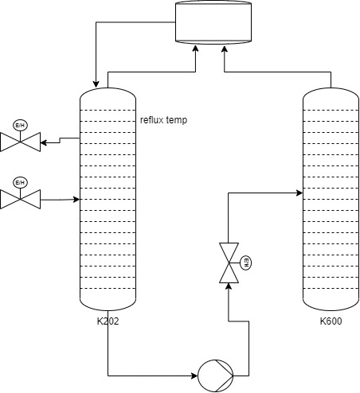

Omschrijf de omgeving waarin de installatie zich bevindt.
Omschrijf het proces in een blokschema
- open-lus testen van het proces
- het begrijpen van de actuator dynamica
- sensor specificaties

Bespreek de componenten en hun limitaties:

* Controle hardware
  * PI
  * Type PLC:
  
* Destilatiekolom K202
  * 30 roosters
  * Schema
  
* Destillatiekolom K600
  * 25 roosters
  * Schema
  
* Klep 432 
  * Meeteenheid: [$\%$]
  * Type/merk:
  * Aandrijving:
  * Resolutie:
  * Locatie: voor K202
  * Bediening: peilregeling
  * Functie: manipuleert productdebiet naar K202 

* Niveausensor K202
  * Meeteenheid: [$\%$]
  * Type/merk:
  * Resolutie:
  
* Klep 614 
  * Meeteenheid: [$\%$]
  * Locatie: 
  * Bediening: peilregeling
  * Functie: manipuleert productdebiet van K202 naar K600

* Niveausensor K600
  * Meeteenheid: [$\%$]
  * Type/merk:
  * Resolutie:

* Klep 638 
  * Meeteenheid: [$\%$]
  * Locatie: afsluiter PSA boven B605
  * Bediening: werd niet opgenomen in een regelkring en is manueel manipuleerbaar (indien noodzakelijk)
  * Functie: voert bovenproduct weg
  
* Debietsensor 644 
  * Meeteenheid: [$m^3/h$]
  * Locatie: top kolom
  * Functie: meet debiet reflux naar de kolom

### Bestaande regellussen

* Peilregeling K202 (432)
  * setpoint: 60%
  * niveausensor [$\%$]
  * klep [$\%$]
  * $K_P$: 0.8
  * $K_I$: 12
  * $K_D$: 0

* Vacuumregeling K202 (436)
  * setpoint: 150 mbar

* Peilregeling K600 (614)
  * setpoint: 55%
  * niveausensor [$\%$]
  * klep [$\%$]
  * $K_P$: 0.5
  * $K_I$: 20
  * $K_D$: 0

## Data

In de eerste dataset is de samplingfrequentie (= $F_s$) 0.1 Hz. De reden van deze zeer lage frequentie ligt bij het feit dat het proces zeer traag verloopt. Dit weten we door ervaring maar bij het analyseren van het procesmodel zullen we het zelfs zonder enige voorkennis kunnen afleiden.

Er zijn drie belangrijke datasets. De gewenste waarde, de uitsturing van de klep en de gemeten waarde van de sensor (die in dit geval het productniveau weergeeft). 

## Preprocessing

* Zoek naar anomalieën zoals verloren datapunten, pieken, verandering in gemiddelde, ...
* Een correlatieplot kan helpen om verbanden tussen variabelen te visualiseren. We leren bijvoorbeeld dat het productniveau in de eerste kolom gerelateerd is aan het productniveau in de tweede kolom. Dit is een logische conclusie want in werkelijkheid staan de twee kolommen in serie met elkaar verbonden.

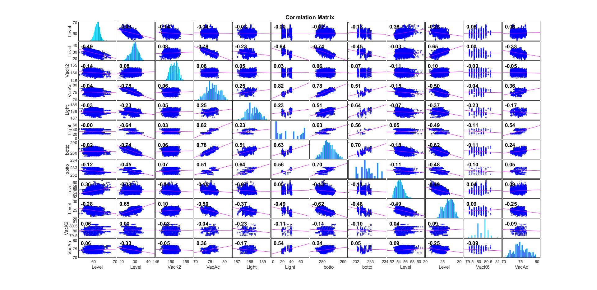

### Features

Welke variabelen bevatten waardevolle informatie over de 'state' van het proces?

K202:
* klep
* niveausensor

K600:
* klep
* klep
* niveausensor
* debiet

## Analyse

Uit literatuur weten we dat vanaf een bepaalde grens de verstoring ervoor zorgt dat de fluctuaties niet meer te regelen zijn met de klassieke PI feedback regelkring.

### Fast Fourier Transform (FFT)
Onderzoek het signaal met de Fourier analyse.

* Baken een frequentie interval af waarin de meeste actieve frequenties in voorkomen.

### Filter
Ontwerp een laagdoorlaatfilter. Gebruik het voorgaande frequentie interval om de cutoff frequentie te bepalen.

* Visualiseer het gefilterd signaal met het oorspronkelijk signaal.
* Doe dit voor elke dataset met ruis.

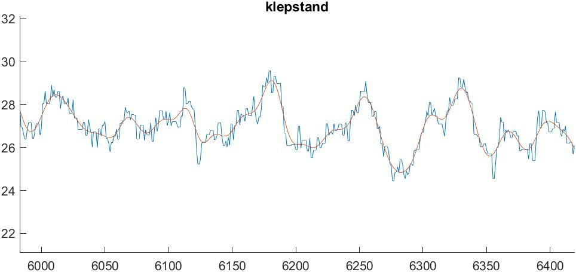

### 'Detrend'

Verminder elke dataset met zijn gemiddelde. Dit maakt modelidentificatie gemakkelijker. (Vergeet het gemiddelde bij de simulatie niet terug toe te voegen aan het model!) In de figuur worden de stapantwoorden weergegeven met en zonder wegnemen van het gemiddelde. 
   
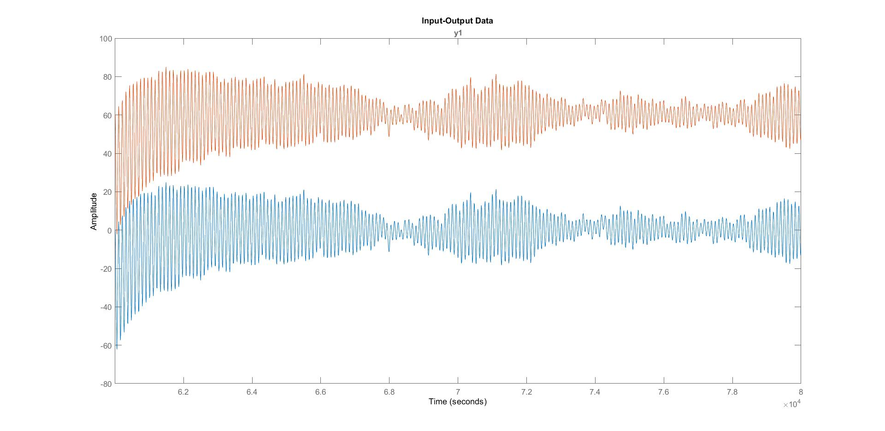

### Modelidentificatie

Verdeel de datasets in een training- en validatieset.

Door gebrek aan diepgaande proceskennis werden data-gedreven methodes gebruikt om modellen te berekenen. 

Met Matlab werd het volgende bekomen:

Twee discrete modellen, één transfer functie en één state space model, gaven nauwkeurige voorspellingen van het proces. Een Bode plot (en Nyquist plot) geeft ons meer informatie over de karakteristieken van de modellen.

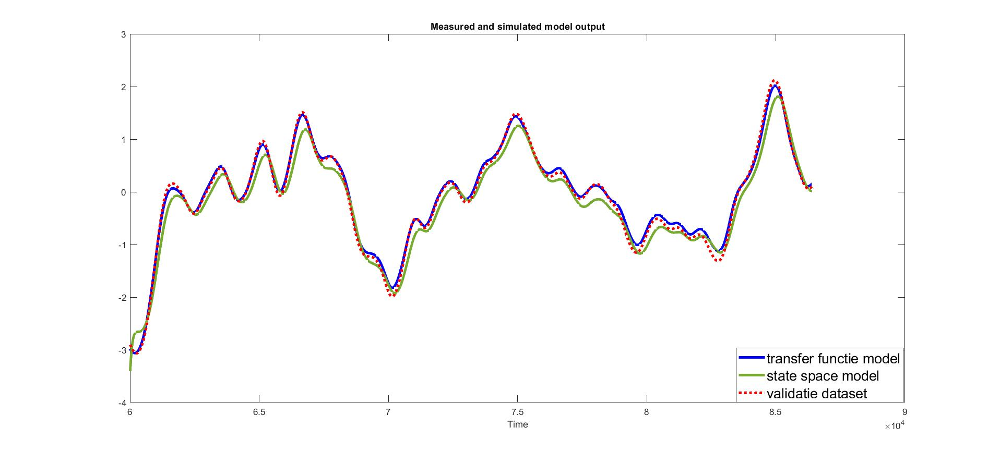

De transfer functie:

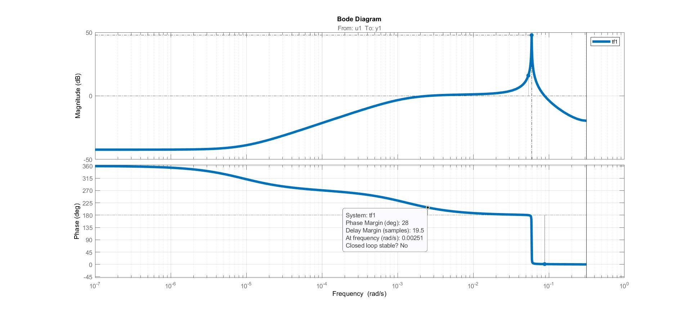

Het state space model:

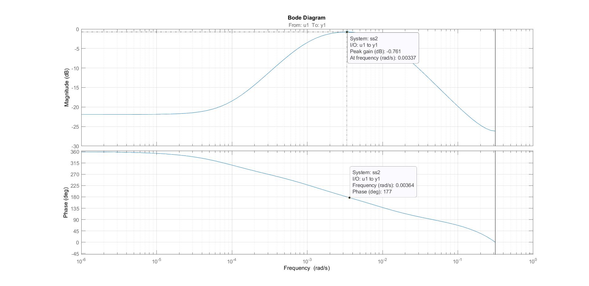

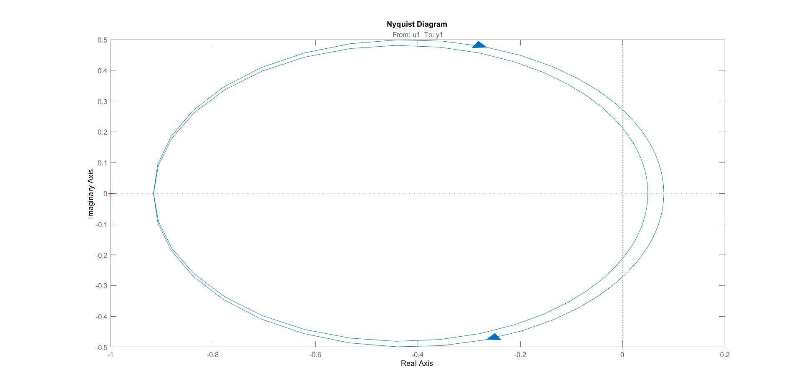

De transferfunctie heeft zeer onstabiel kenmerkend gedrag waardoor snel oscillaties ontstaan. Door deze misfit met de werkelijkheid werd voor het tweede model (state space) gekozen.

Met SIPPY (Python) werd het volgende bekomen:

<!--

* stap response van SS model uit processignaal uit filter
* bereken SS model uit processsignaal zonder filter
* VERIFIEER MODELLEN OP ANDERE DATASETS
  * let op voor initiële conditie
  * let op voor samplefrequentie
-->

### Controle ontwerp (PID)
   
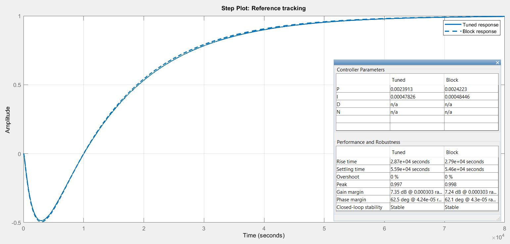

### Controle ontwerp (MPC)
  
Distillatiekolommen komen voor als toepassing in MPC literatuur omdat Model Predictive Control gebruik maakt van een model die de dynamica van het proces met meerdere in- en uitgangen. Het model stellen we op met de twee klepstanden als input en de twee product niveau als output. Het model zal dus de vorm aannemen van een 2x2 (of groter) matrix.

$$\begin{bmatrix} y_1 \\ y_2 \end{bmatrix} = \begin{bmatrix} tf_{11} & tf_{12} \\ tf_{21} & tf_{22} \end{bmatrix} \begin{bmatrix} u_1 \\ u_2 \end{bmatrix}$$

Als eerst stap ontwerpen we een MPC met de MPC design Toolbox. De grenzen van zowel de klep als het niveau [0%-100%] zijn belangrijk om in het ontwerp mee te nemen. Een stapantwoord zien we in de volgende figuur.

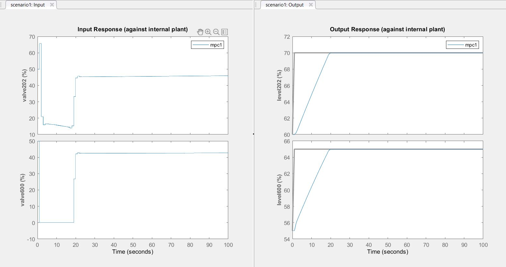

Zoals de grafieken weergeven houdt het algoritme rekening met het serie-karakter van het systeem. Om beide niveaus te doen stijgen zullen beide kleppen meer debiet doorlaten maar de kracht van MPC ligt in het voorspellen van het effect op het niveau. Daarom zal de MPC de klep van de eerste distillatiekolom minder open zetten (ong. 15%) tenopzichte van de tweede klep (0%). Want overtollig product in de eerste kolom zal teveel product in de tweede kolom veroorzaken. 

### Simulatie

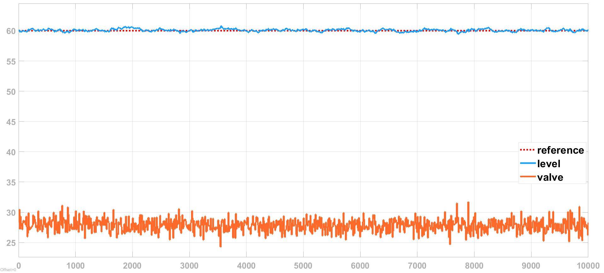

## Validatie

Stel een experiment op om de uiteindelijke oplossingen te testen in een industriële omgeving. Zijn de verwachtingen gelijk aan de werkelijke resultaten bij het toepassen van de vooropgestelde oplossingen?

Mogelijke technieken: [RCP, HIL](docs\guide\05_praktische_aanpak\README.md), et cetera

Constructie en implementatie:
* Zorg voor aansluitende hardware en software
* Bouw het systeem virtueel op

Systeem integratie:
* Test de subsystemen
* Voer HIL simulatie uit
* Verbeter en fine-tune
* Test de veiligheid en betrouwbaarheid

Veldtest:
* Pas een test scenario toe
* Integreer testen tijdens het standaard werkschema van de installatie (prestaties onder verschillende condities)
* Analyseer (statistisch) en verbeter prestaties

Productie:
* Draag virtuele componenten over naar hardware

## Besluit

Formuleer een (of meerdere) oplossingen om betere procescontrole te bekomen.
- oplossingen
- veranderingen
- aanbevelingen

## Economische analyse

Maak een kosten/baten analyse. Vergelijke de verwachte en de reële resultaten.  

