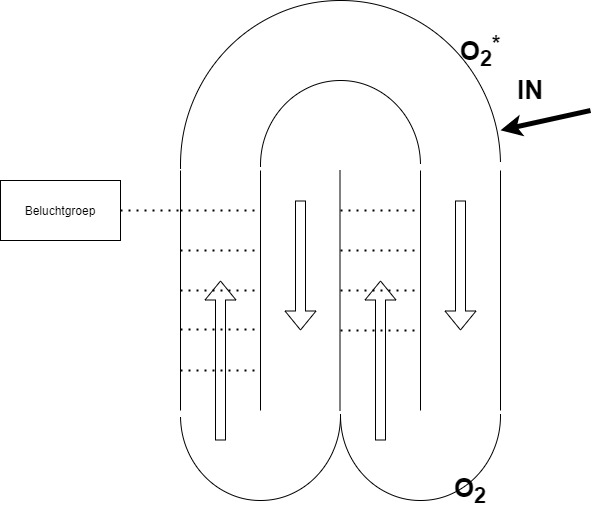
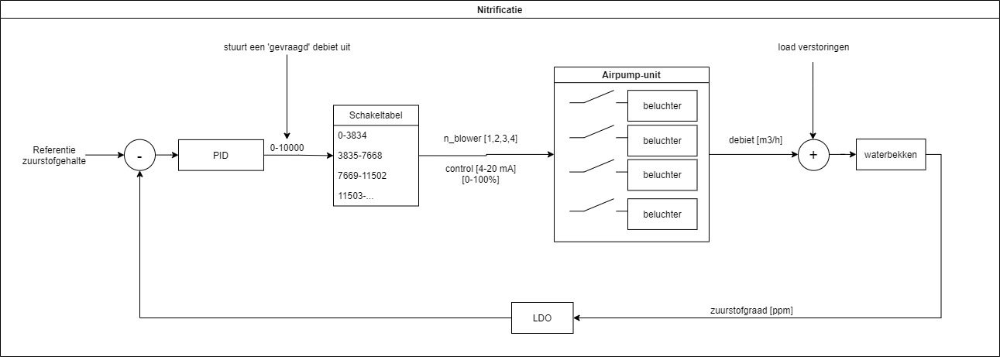
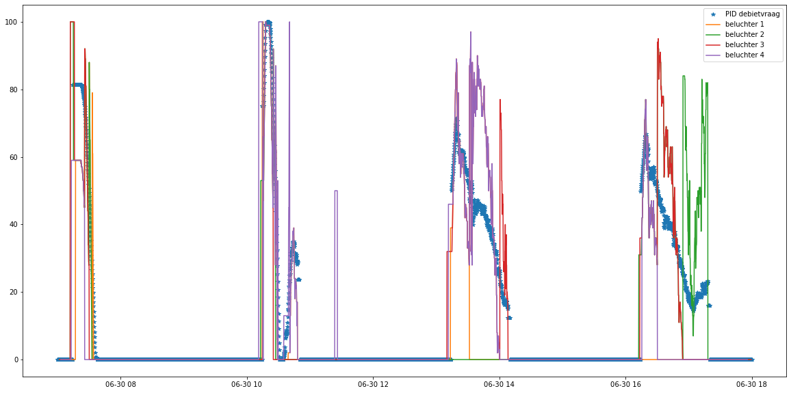
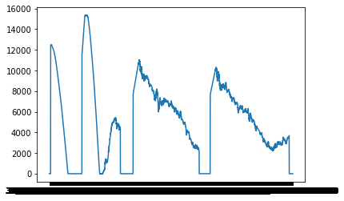
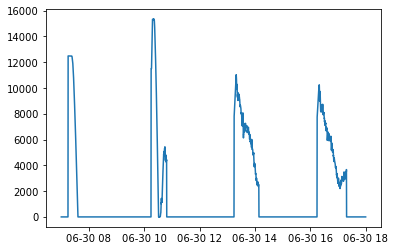

# Zuurstofsturing bij waterzuivering

## Probleemomschrijving

### Wat is het probleem

Informeel:
  
Het instellen van PID parameters gebeurt ad-hoc, er is weinig tijd voor verdere analyses. Externe factoren en de chemische samenstelling van het water hebben een grote invloed op de procesdynamica waardoor procesvariaties optreden. Bij opstart is de chemische samenstelling van het water anders. Er is nood aan duidelijke instelprocedures.

Formeel:

- Welke invloed heeft het verplaatsen van de zuurstofsensor?
  - Welke procedure volgen om tot optimale PID parameters te bekomen?
- In welke mate hebben externe factoren invloed op de te controleren variabele?
- Hoe meten we de dode tijd van het proces?
- Kunnen we het proces regelen met grote dode tijden?
- Is een snelle opstart mogelijk zonder overshoot?
- Zijn er verschillende regelaars nodig voor lage en hoge belasting?
  
Veronderstellingen:

- De nitrificatie-berekening geeft correct de optimale beluchtingstijd weer
- De concentraties aan micro-bacteriele organismen in het water is homogeen
- De instroom van vuil water via het riool brengt meer ammonium in het proces waardoor zuurstofconsumptie toeneemt
- De instroom van regenwater verdunt het water
- Nitrificatiesnelheid is een indicatie voor micro-bacteriele activiteit
- Temperatuur heeft een invloed op de micro-bacteriele werking, wat opnieuw een invloed heeft op de zuurstofconsumptie
- De dode tijd is constant
- Fluctuaties in luchtdruk binnen de beluchtbuizen is verwaarloosbaar
- De blazers zijn stuurbaar tussen 35%-100%

Gelijkaardige problemen:

> [1]I. Santín, M. Barbu, C. Pedret, en R. Vilanova, ‘Dissolved Oxygen Control in Biological Wastewater Treatments with Non-Ideal Sensors and Actuators’, Ind. Eng. Chem. Res., vol. 58, nr. 45, pp. 20639–20654, nov. 2019, doi: 10.1021/acs.iecr.9b02572.

> [2]G. Harja, I. Nascu, C. Muresan, en I. Nascu, ‘Improvements in Dissolved Oxygen Control of an Activated Sludge Wastewater Treatment Process’, Circuits Syst Signal Process, vol. 35, nr. 6, pp. 2259–2281, jun. 2016, doi: 10.1007/s00034-016-0282-y.

### Waarom bestaat het probleem?

* Motivatie

Standardisatie doorvoeren in verschillende vestigingen waar gelijksoortige installaties aanwezig zijn zal resulteren in betere processtabiliteit en energieminimalisatie.

* Voordelen

Door duidelijke richtlijnen te volgen zal het instellen van huidige regelaars sneller verlopen. Ook zal de procesregeling stabieler verlopen met verhoogde kwaliteit en tijdswinst tot gevolg.

* Levensduur

*Denk aan het onderhouden van een gevonden oplossing. Als er een programma/regelaar werd gebruikt. Hoelang zal het duren voorleer deze opnieuw nodig zal zijn? Moet het herschreven worden met updates? Je wilt een oplossing dat lang meegaat en gemakkelijk is om up-to-date te houden.*

Variaties in concentraties, actuatoren en omgeving zijn redenen om elk subsysteem duidelijk in kaart te brengen en regelmatig te valideren met de werkelijkheid. Een aanpassing of variatie in het proces maakt de vorige controlewet minder effectief waardoor deze mee moet evolueren. 

### Hoe oplossen

1) Beschrijf het proces
2) Verzamel gegevens en toets af op literatuur
3) Verwerk datasets en transformeer
4) Controleer veronderstellingen
5) Analyseer (subsystemen)
   * Systeem identificatie
   * Controle ontwerp
6) Validatie
   * Plan prototypes en experimenten. 
   * Implementeer 

## Het proces

Het regelproces draait rond het sturen van het zuurstofgehalte in een waterbekken bedoelt voor waterzuivering. Er is één zuurstofsensor ($O_2$) aanwezig. Een nieuwe locatie ($O_2^*$) wordt onderzocht. Vier beluchters, welke gecombineerd worden tot één toevoer van luchtstroom, zorgen voor een externe bron van zuurstof. Naast regenwater is er een instroom (IN) van water uit de riolering.

Merk op dat de beluchting lokaal gebeurt waardoor er altijd een fysische afstand is tussen de sensor en de beluchting. Dit creëert een procesvertraging, wat belangrijk is in het ontwerpen van een regellus. Hou rekening met de weerstand die de beluchters creëren. Bij hoge belasting remmen de luchtbubbels de waterstroom wat de dode tijd doet variëren.

In waterzuivering komen verschillende chemische fases voor waarin de samenstelling van het te zuiveren water verandert. Vervuild water bevat $NH_4$ wat door het beluchten van het water (oxideren)zuurstof-atomen zal opnemen en omvormen naar nitraat ($NO_3$). Micro-organismen vormen deze nitraten om naar stikstofgas ($N_2$). Hierbij is echter geen zuurstof gewenst waarbij deze fase geen beluchting vereist.

Door de huidige opstelling is de invloed van toegevoerd rioleringswater op het opgemeten zuurstofgehalte groot. Stel de voglende situatie voor, de beluchting is actief en stuurt zuurstofrijke vloeistof langs de uitgang van het rioleringswater. Het $NH_4$ rijke rioolwater heeft tijd om restzuurstof op te nemen en $NO_3$ te vormen vooralleer deze de sensor bereikt, wat resulteert in een lager opgemeten zuurstofgehalte.

Bij warm weer is duidelijk een verhoogde activiteit van micro-organismen te zien, zie nitrificatie-snelheid. Hoe sneller de organismen werken, hoe groter het voorgaand beschreven effect is.

Bespreek de componenten en de limitaties:
* PID regelaar
  * K_p: 10
  * T_i: 240 s
  * T_d: 170 s
  * Merk: Schneider PLC
* Actuator
  * Vier beluchters  
  * Type:  
  * Vermogen: 75 kW
  * Maximaal debiet: 3834 $m^3/h$
  * Nominaal debiet: 3525 $m^3/h$
  * Frequentiegestuurd tussen 35%-100%
* Zuurstofsensor
  * Type: LDO
  * Meetbereik: 0-200% verzadiging
  * Reatietijd: 60s
  * Meetnauwkeurigheid: +-2% van meetbereik
  * Temperatuurnauwkeurigheid: +- 0.2°C
  * Herhaalbaarheid: +- 0.5% van meetbereik
  * Gevoeligheid: +- 0.5% van meetbereik
* Waterreservoir
  * Schema
  
Omschrijf het proces in een blokschema:
- open-lus testen van het proces
- het begrijpen van de actuatordynamica
- kennis hebben van sensor specificaties

Uit het schema is duidelijk dat een opzoektabel (lookup-table) de gewenste aansturing doorgeeft aan de actuatoren. Deze gewenste aansturing is de setwaarde bij een tweede regelkring welke de drivers van de beluchtmotoren beslaat. Het effect van de opzoektabel is zichtbaar op de volgende figuur. Bij een laag gevraagd luchtdebiet zal de aansturing van alle actuatoren zich vertalen in een laag rendement. Om dit te vermijden worden ze stelselmatig uitgeschakeld.

Bespreek de (minimale) veiligheid en de gewenste betrouwbaarheid: 

Onder welke condities moet het systeem werken?

* Er zijn twee aparte regelingen:
    - Lage belasting (geen eisen, lage debieten)
    - Hoge belasting (direct naar 100% beluchting, zo snel mogelijk stabiliseren)

* Geef de referentiesignalen wat het proces moet volgen
  * Tijdens nitrificatie is het zuurstofgehalte in het bassin in het ideale geval gelijk aan 1.6 mg/l. 

* Geef de verschillende setpoints
  * Zuurstof heeft twee wenswaardes (gelinkt aan hoge en lage belasting). We bekijken het proces tijdens hoge belasting.

## Data

### Eerste bevindingen

Onregelmatig en onoverzichtelijk. Nood aan FAIR-principes.

### Variabelen

Welke gegevens zijn er voorhanden?
- Variabelen
  - luchtvraag
  - PID output $[0-10000]$
  - Zuurstofgehalte $[mg/l]$
  - Nitraat $[mg/l]$
  - Ammonium
  - Nitrificatie $[\text{boolean}]$
  - Aansturing beluchter 1 $[\%]$
  - Aansturing beluchter 2 $[\%]$
  - Aansturing beluchter 3 $[\%]$
  - Aansturing beluchter 4 $[\%]$
- Meetfrequentie:
  - Varieert per waarde
  - (Loggen 30 seconden)
- Datatype:
  - Excel
 
<!--

## Preprocessing

* Vorm de dataset om naar een bruikbaar formaat.
* Selecteer de juiste variabelen (=features)
* Filter/verwerk de dataset

## Transformeer

Vorm bruikbare dataset voor de systeem identificatie fase. 

## Analyse

Beschrijf wat de gebreken zijn in het systeem in vergelijking met de status quo.

Onderbouw aan de hand van verschillende analyses waarom een bepaalde conclusie wordt getrokken.

### Systeem identificatie

Stel een procesmodel op, indien noodzakelijk. Maak gebruik van een blok diagram met de verschillende ingangen en uitgangen. Maak het onderscheid tussen niet-gemeten verstoringen (UD), gemeten verstoringen (MD), manipuleerbare variabelen (MV) en gemeten uitgangen (MO).

Identificeer de verschillende onderdelen:
* het process
* de omvormer (power converter)
* de feedback (sensor)
* de controller

Kies het tijds- of frequentiedomein.

### Controle ontwerp

* Kies een controlestrategie. 
* Simuleer de controller
* Ontwerp controleparameters voor gewenst systeemgedrag

## Validatie

Stel een experiment op om de uiteindelijke oplossingen te testen in een industriële omgeving. Zijn de verwachtingen gelijk aan de werkelijke resultaten bij het toepassen van de vooropgestelde oplossingen?

Mogelijke technieken: [RCP, HIL](docs\guide\05_praktische_aanpak\README.md), et cetera

Constructie en implementatie:
* Zorg voor aansluitende hardware en software
* Bouw het systeem virtueel op

Systeem integratie:
* Test de subsystemen
* Voer HIL simulatie uit
* Verbeter en fine-tune
* Test de veiligheid en betrouwbaarheid

Veldtest:
* Pas een test scenario toe
* Integreer testen tijdens het standaard werkschema van de installatie (prestaties onder verschillende condities)
* Analyseer (statistisch) en verbeter prestaties

Productie:
* Draag virtuele componenten over naar hardware

## Besluit

### Sampling

Bij het analyseren van eender welk proces is een vaste sample frequentie noodzakelijk om een onvervormd beeld te krijgen.

Dit is bijvoorbeeld geen correcte sampling (samplefrequentie ligt niet vast).

Dit is het werkelijke signaal over een evenredig verdeelde tijdschaal.

### ...

Formuleer een (of meerdere) oplossingen om betere procescontrole te bekomen.
- oplossingen
- veranderingen
- aanbevelingen

## Economische analyse

Maak een kosten/baten analyse. Vergelijke de verwachte en de reële resultaten.  

-->
